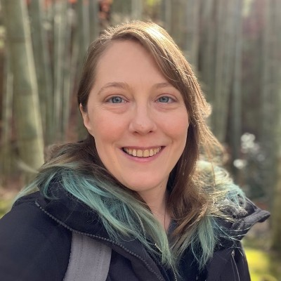
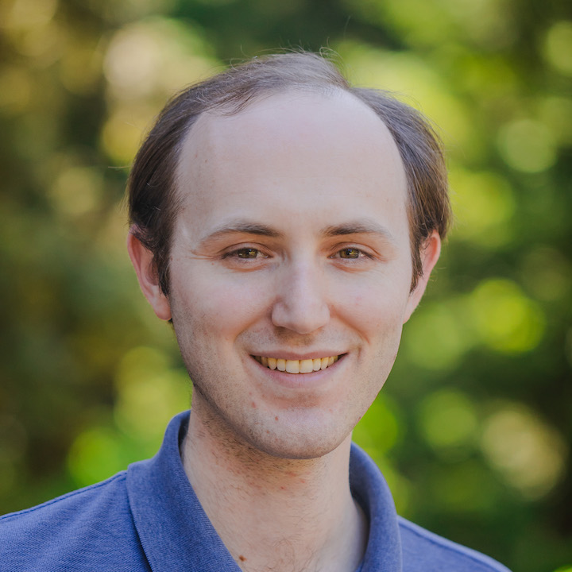
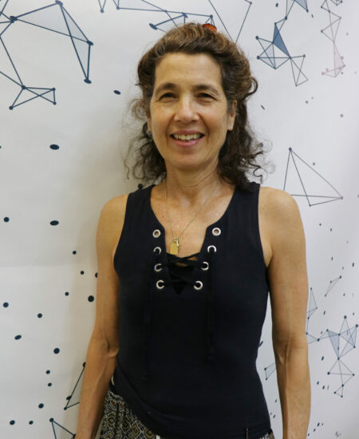
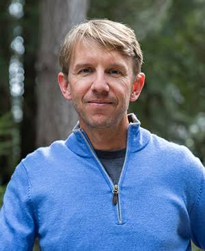

UCSC faculty discuss how open source ecosystems create pathways for university research to reach broader impact.

## Speakers

  
  
<strong>Emily Lovell</strong> (Moderator) is Associate Director of the UC Santa Cruz Open Source Program Office. Her research and teaching invite broader participation in computing, focusing on newcomers to open source. She previously taught open source contribution at Berea College and holds a PhD from UC Santa Cruz.

  
  
<strong>Daniel Fremont</strong> is an Associate Professor of Computer Science and Engineering at UC Santa Cruz, where he applies formal methods to make software, hardware, and cyber-physical systems more reliable. His open-source Scenic language is widely used in academia and industry to test and train autonomous systems.

  
  
<strong>Leilani Gilpin</strong> is an Assistant Professor of Computer Science and Engineering at UC Santa Cruz, where she leads the AI Explainability and Accountability Lab. Her research develops methods for autonomous systems to explain their behavior, supporting robust decision-making, debugging, and accountability. She holds a PhD from MIT.

  
  
<strong>Katia Obraczka</strong> is a Professor at UC Santa Cruz's Baskin School of Engineering and campus director of CITRIS and the Banatao Institute at UCSC. An IEEE Fellow, she is recognized for contributions to energy-efficient protocols and routing in wireless networks, and her research spans computer networks and distributed systems.

  
  
<strong>J. Xavier Prochaska</strong> is a Distinguished Professor of Astronomy and Astrophysics at UC Santa Cruz. An observational astrophysicist, he studies gas within, around, and between distant galaxies. He co-leads development of PypeIt, an open-source, community-developed Python pipeline for reducing astronomical spectroscopic data.

