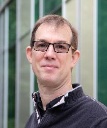
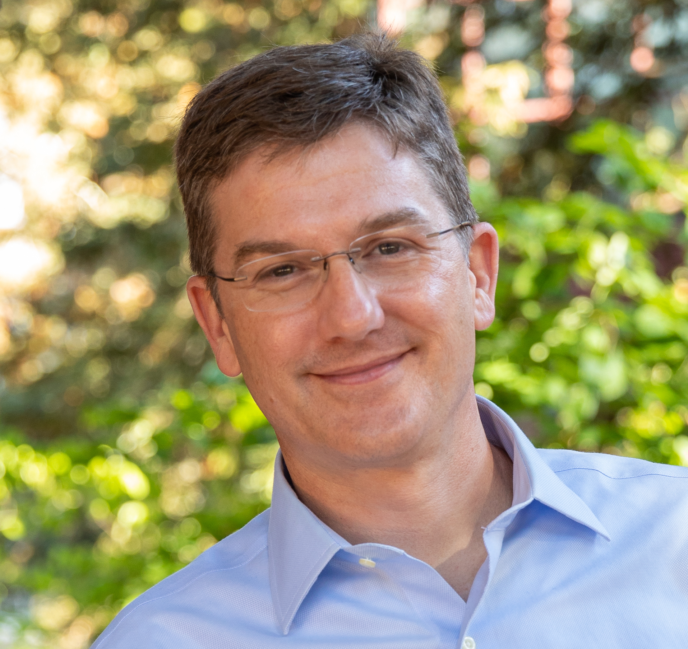
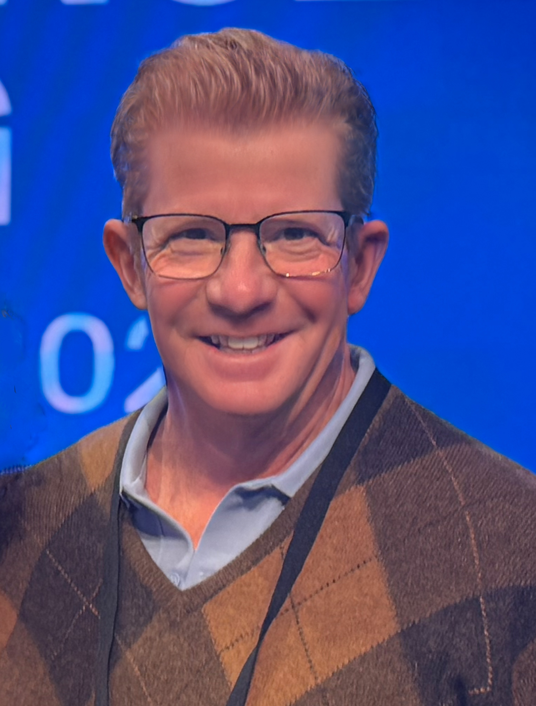

Sustainable open source that has impact outside the university requires infrastructure: specialized centers, dedicated staff, and institutional support that most research grant funding does not cover. For universities, creating this infrastructure is a direct investment in research impact and can produce widely adopted tools, high-profile collaborations, and follow-on funding, all of which strengthen a campus's research standing and its ability to compete for major grants and partnerships. For external partners — including industry — healthy open source infrastructure on campus means direct access to emerging tools and talent, making it a high-leverage place to invest, partner, and recruit.

This panel brings together leaders from campus research centers and infrastructure programs to discuss what it takes to build and resource this kind of support, and what funders — from university administration to industry partners — stand to gain by getting behind it.

## Speakers

  
  
<strong>James Davis</strong> (Moderator) is a Professor of Computer Science and Engineering at UC Santa Cruz and Faculty Director of the Center for Research in Open Source Software (CROSS). His research spans computer graphics, machine vision, and applying technology to global social issues.

  
  
<strong>Stephanie Lieggi</strong> is Executive Director of the Center for Research in Open Source Software (CROSS) and the UC Santa Cruz Open Source Program Office, and Chair of the UC OSPO Network. She previously worked in nonproliferation research at the James Martin Center for Nonproliferation Studies.

  
  
<strong>Jason Nielsen</strong> is a Professor of Physics at UC Santa Cruz and Director of the Santa Cruz Institute for Particle Physics (SCIPP). An experimental particle physicist, he collaborates on the ATLAS experiment at CERN's Large Hadron Collider.

  
  
<strong>Benedict Paten</strong> is a Professor of Biomolecular Engineering at UC Santa Cruz and associate director of the UCSC Genomics Institute, where he directs the Computational Genomics Lab. He is a PI on genomics efforts including NHGRI AnVIL, the Human Cell Atlas, and the Human Pangenome Reference Consortium.

  
  
<strong>Jeffrey D. Weekley</strong> is Director of Research IT at UC Santa Cruz, leading HPC and research cyberinfrastructure for roughly 1,100 researchers, and brings over 30 years of HPC and networking experience. A PhD student in Computational Media at UCSC, he studies generative AI for neurodiverse STEM learners.

