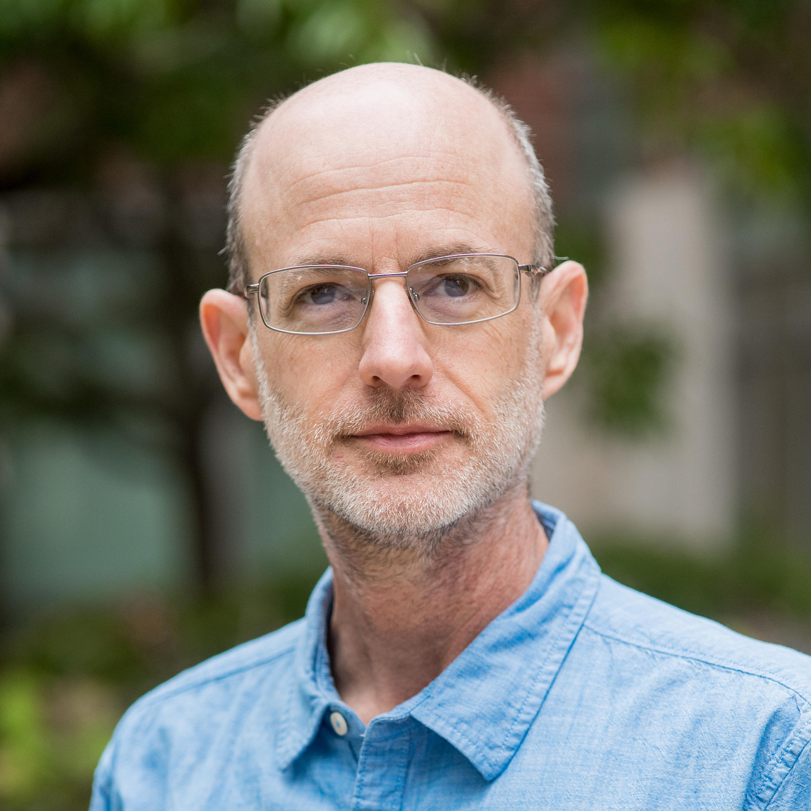

## Speaker

  
  
<strong>Daniel S. Katz</strong> is Research Professor at the University of Illinois Urbana-Champaign and Chief Scientist at the National Center for Supercomputing Applications (NCSA). Previously at NSF, JPL, and Cray Research, he co-founded the Journal of Open Source Software, US-RSE, and the Research Software Alliance.

