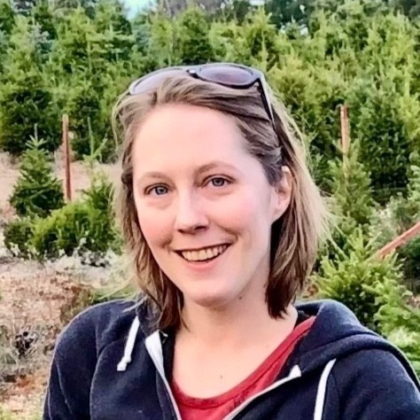

# Overview

The Open Source Incubator Fellowship, funded through through the UCSC Open Source Program Office (OSPO), supports the work of postdoctoral scholars aiming to create and grow productive open source contributor communities around innovative research prototypes in order to amplify the impact of their research. A successful application includes (1) a research prototype with significant open source software or hardware infrastructure typically created as part of the applicant’s Ph.D. project and (2) strong evidence that the proposed project would be met with great interest by at least one well-established open source community.

Incubator Fellows play the role of "open source ambassadors" at UC Santa Cruz by displaying exemplary open source project and community management practices and by sharing their experience via mentorship and classroom instructions so students learn how to productively engage in open source projects. Ideal incubator fellows are inclusive, comfortable reaching across different scientific disciplines, and run compelling projects that have broad interdisciplinary appeal.

# Current Incubator Fellows

Thanks to the Alfred P. Sloan Foundation the OSPO can currently fund up to two incubator fellows. The OSPO is in the process of raising more funding to expand the Incubator Fellowship within UC Santa Cruz and across other UC campuses. Please welcome the inaugural 2022 cohort:

## Dr.-Ing. Oskar Elek

Dr.-Ing. {} works on the project "Polyphorm + PolyPhy: An open source software platform for learning and visualizing connectivity patterns in complex datasets." For more information, please see his [website](https://elek.pub/). 

## Dr. Emily Lovell

Dr. Emily Lovell works on "Strengthening Underserved Segments of the Open Source Pipeline". For more information, please see her [website](https://users.soe.ucsc.edu/~emme/).

# Eligibility/Requirements

- A mentor who is a member of UC Santa Cruz faculty
- Completion of Ph.D. (Ph.D. must be in hand at time of appointment)
- Ph.D. dissertation or equivalent level of research that includes an innovative open source prototype (software or hardware)
- Experience with teaching or mentoring undergraduates preferred
- Experience with open source community management preferred

# Timeline (current academic year)

- Begin reviewing applications on March 15, 2022; positions open until filled

# Fellowship Terms

- Number of positions: three (3)
- Resident fellowship based at UC Santa Cruz
- Salary commensurate with qualifications and experience. Minimum annual salary rates are made based on the individual’s Experience Level, which is determined by the number of months of postdoctoral service at any institution. See current salary scale for Postdoctoral Titles at https://apo.ucsc.edu/compensation/salary-scales/index.html,
- Anticipated start: as early as April 2022
- Postdoctoral Scholar appointments are full-time; the initial appointment is for a minimum of one year, with the possibility of reappointment. Reappointment will be contingent upon positive performance review and availability of funding. 

# Application Structure

All applications should include:

- Project Title
- Background, overview & objectives
- Expected time needed to meet objectives
- Brief explanation of the relevant experience / previous work of project lead 
- Description of Diversity and Inclusion efforts/plans for project

- Detail on the project roadmap and strategy for sustainability after fellowship ends
- Risk assessment due to dependencies on any organization
- Details related to project infrastructure and community engagement, including when applicable:
     - Software project name and homepage URL
     - Main code repository
     - Documentation or other publication(s) describing project
     - Name and affiliation of those with commit rights to the code repositories
     - Names and affiliations of other maintainers/contributors
     - Open source license
     - Primary main programming language and other relevant language(s)
     - List of scholarly papers citing or mentioning the software project
     - Current number of unique users/contributors
     - Number of software projects that depend on the software project
     - Estimate of the potential number of users who could adopt this software project
     - List of upstream, downstream, or related software projects that you are contributing to or receiving contributions from.
     - Provide links to:
          -  End-user documentation
          -  Issue tracker
          -  Community engagement or on-boarding forum
          -  Contribution/coding guidelines

# Other Application Material to be included in proposal:

- CV of postdoctoral applicant
