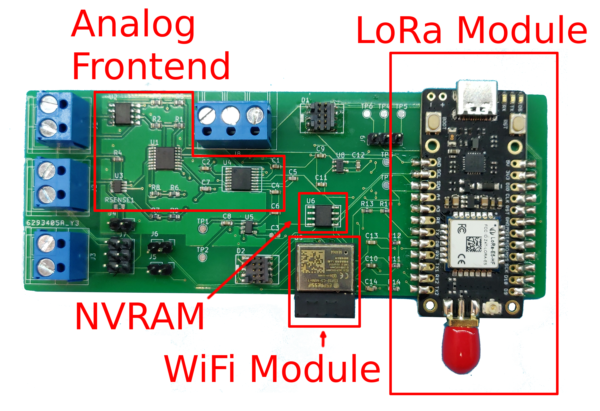

### Open Sensing Platform I: Software to enable large scale outdoor sensor networks

Open Sensing Platform (OSP) is a new initiative expanding from our prior project DirtViz, a data visualization web platform for monitoring microbial fuel cell sensors (see [GitHub](https://github.com/jlab-sensing/DirtViz)). The mission is to scale up the current platform to support other researchers or citizen scientists in integrating their novel sensing hardware or microbial fuel cell sensors for monitoring and data analysis. Examples of the types of sensors currently deployed are sensors measuring soil moisture, temperature, current, and voltage in outdoor settings. The focus of the software half of the project involves building upon our existing visualization web platform, and adding additional features to support the mission. A live version of the website is available [here](https://dirtviz.jlab.ucsc.edu/).

- **Deliverables:**
  - Create a system for remote collaborators/citizen scientists to set up their sensors and upload securely, eg. designing user flow to create sensors
  - Craft an intuitive navigation system so that data from deployment sites around the world can be easily viewed, eg. designing experience/system to locate deployment sites.
  - Refine our web-based visualization tools to add additional features for users to analyze collected data, eg. lazy loading out-of-range data or caching queried data.
  - Document the tool thoroughly for future maintenance
- **Topics:** Data Visualization, Backend, Web Development, UI/UX, Analytics
- **Skills:**
  - *Required:* React, Javascript, Python, SQL, Git
  - *Nice to have:* Flask, Docker, CI/CD, AWS, Authentication
- **Difficulty:** Medium
- **Size:** Large (350 hours)
- **Mentors:** {}, [John Madden](mailto:jtmadden@ucsc.edu), [Aaron Wu](mailto:awu70@ucsc.edu)

### Open Sensing Platform II: Hardware to enable large scale outdoor sensor networks

The Open Sensing Platform hardware aims to be a general purpose hardware platform for outdoor sensing (e.g. agriculture, ecological monitoring, etc.). The typical use case involves a sensor deployment in an agricultural field, remotely uploading measurements without interfering with farming operations. The current hardware revision ([Soil Power Sensor](https://github.com/jlab-sensing/soil_power_sensor)) was originally designed for monitoring power output of microbial fuel cells using high fidelity voltage and current measurement channels, as well as auxiliary sensors such as the SDI-12 [TEROS-12 soil moisture sensor](https://metergroup.com/products/teros-12/). The primary activities of this project will involve low-level firmware design and implementation, but may also incorporate hardware design revisions if necessary. We are looking to expand functionality to other external sensors, as well as optimize for power consumption, via significant firmware design activities. 

Long-range, low-power wireless communication is achieved through a LoRa capable STM32 microcontroller with in-lab experiments using an ESP32 microcontroller to enable the simpler WiFi interface. Both wireless interfaces communicate upload measurements to our data visualization dashboard, **Open Sensing Platform I**. The combined goal across both of these projects is to create a system that enables researchers to test and evaluate novel sensing solutions. We are looking to make the device usable to a wide range of researchers which may not have a background in electronics, so are interested in design activities that enhance user friendliness.

In total there will be 2-4 people working on the hardware with progress being tracked on GitHub. Broader project planning is tracked through a Jira board. We intend to have weekly meetings to provide updates on current issue progress along with assigning tasks. Please reach out to [John Madden](mailto:jtmadden@ucsc.edu) if there are any questions or specific ideas for the project.

- **Deliverables:** Contribution via commits to the GitHub repository with documentation on completed work. A changelog of contributions to the firmware.
- **Topics:** Embedded system, wireless communication, low-power remote sensing
- **Skills:**
  - *Required:* C/C++, Git, Github, Platformio
  - *Nice to have:* PCB design and debugging experience, STM32 HAL, ESP32 Arduino, protobuf, python, knowledge of standard communication protocols (I2C, SPI, and UART)
- **Difficulty:** Hard
- **Size:** Large (350 hours)
- **Mentors:** {}, [John Madden](mailto:jtmadden@ucsc.edu), [Stephen Taylor](mailto:sgtaylor@ucsc.edu)