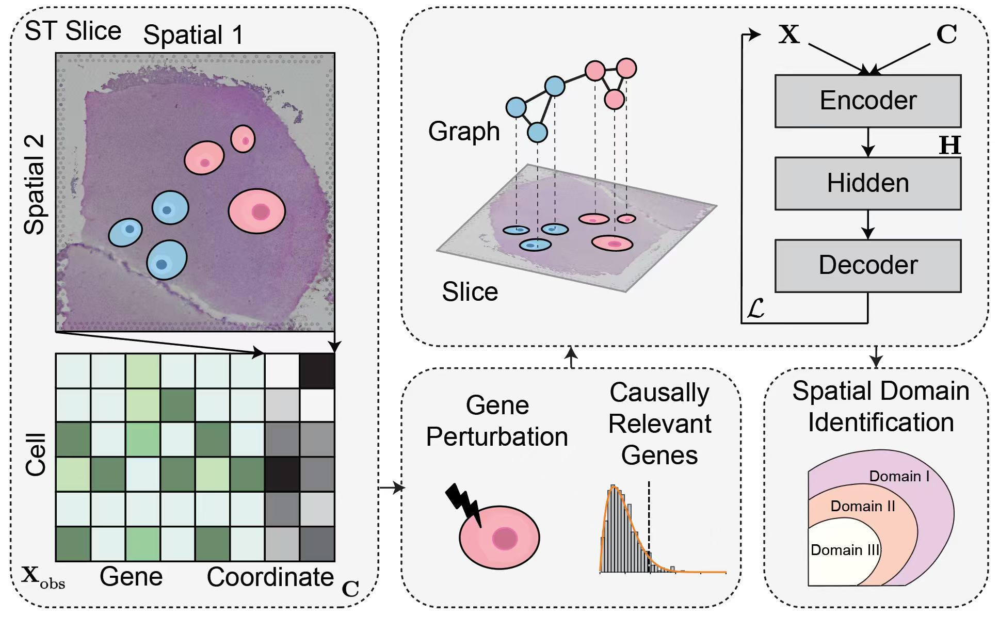

- **Topics:** spatial transcriptomics, spatial domain identification, causal inference, gene intervention
- **Skills:**
  - **Programming Languages:** Python (PyTorch preferred)
  - **Machine Learning:** causal inference, representation learning, clustering
  - **Data Analysis:** spatial transcriptomics preprocessing and evaluation (ARI, cross-slice generalization)
  - **Bioinformatics Knowledge (preferred):** spatial transcriptomics, scRNA-seq, gene perturbation analysis
- **Difficulty:** Advanced
- **Size:** Large (350 hours)
- **Mentors:** {} (contact person)

### **Project Idea Description**

Spatial domain identification is a core task in spatial transcriptomics (ST), aiming to segment tissue sections into biologically meaningful regions based on spatially resolved gene expression profiles. These spatial domains often correspond to anatomical layers, functional niches, or microenvironmental states, and are widely used as the basis for downstream biological interpretation.

Despite strong empirical performance, most existing spatial domain identification methods rely on **purely correlational gene signals**. Genes are selected or weighted based on association with spatial patterns, without distinguishing whether they *causally drive* domain formation or merely reflect downstream or confounded effects. As a result, current models often suffer from limited robustness and poor generalization across tissue sections or donors.

### **Problem: Correlation-Driven Gene Usage and Limited Generalization**

In standard pipelines, gene expression features are typically used wholesale or filtered using heuristic criteria (e.g., highly variable genes). However, many genes that are strongly correlated with spatial domains are not causally responsible for domain structure. Including such non-causal or confounded genes can:

- Reduce robustness across slices and donors
- Obscure true domain-driving biological signals
- Limit interpretability of spatial domain assignments

Empirically, domain identification performance often degrades substantially in cross-slice or cross-donor evaluation settings, underscoring the need for causally informed feature selection.

### **Proposed Solution: CauST**

This project proposes **CauST**, a **Causal Gene Intervention framework** for robust spatial domain identification.

CauST aims to identify **domain-driving genes** by estimating their causal influence on spatial domain assignments via **in-silico gene interventions**. Instead of relying on observational correlations, CauST approximates counterfactual gene knockouts by perturbing individual gene expressions while controlling for confounding factors.

In addition, CauST leverages **cross-slice invariance** as a practical criterion for causal gene discovery, prioritizing genes whose effects on spatial domain identification remain stable across tissue sections and donors.

By filtering or reweighting genes based on estimated causal influence, CauST improves the robustness, generalizability, and interpretability of spatial domain identification models.

### **Project Objectives**

1. **Causal Gene Effect Estimation**
   - Design in-silico intervention strategies to estimate gene-level causal effects on spatial domain assignments.
2. **Invariant Effect Analysis**
   - Identify genes with stable effects across tissue sections or donors.
3. **Causal Gene Filtering**
   - Develop filtering or reweighting schemes based on estimated causal influence.
4. **Integration with Existing Methods**
   - Integrate CauST into state-of-the-art spatial domain identification pipelines.
5. **Evaluation and Validation**
   - Benchmark robustness, cross-slice generalization, and interpretability on public spatial transcriptomics datasets.

### **Project Deliverables**

1. **CauST Framework Implementation**
   - Open-source Python implementation compatible with common spatial transcriptomics toolchains.
2. **Causal Gene Benchmarks**
   - Quantitative evaluation of causal gene filtering and its impact on domain identification.
3. **Visualization Tools**
   - Tools for visualizing gene interventions, causal scores, and spatial effects.
4. **Documentation and Tutorials**
   - Clear examples enabling adoption of CauST by the broader community.

### **Impact**

CauST introduces a causally grounded perspective to spatial domain identification by explicitly modeling gene-level interventions. By shifting from correlation-driven gene usage to causal gene selection, this project improves robustness, generalizability, and biological interpretability in spatial transcriptomics analysis. CauST has the potential to serve as a foundational framework for integrating causal reasoning into spatial omics representation learning.
