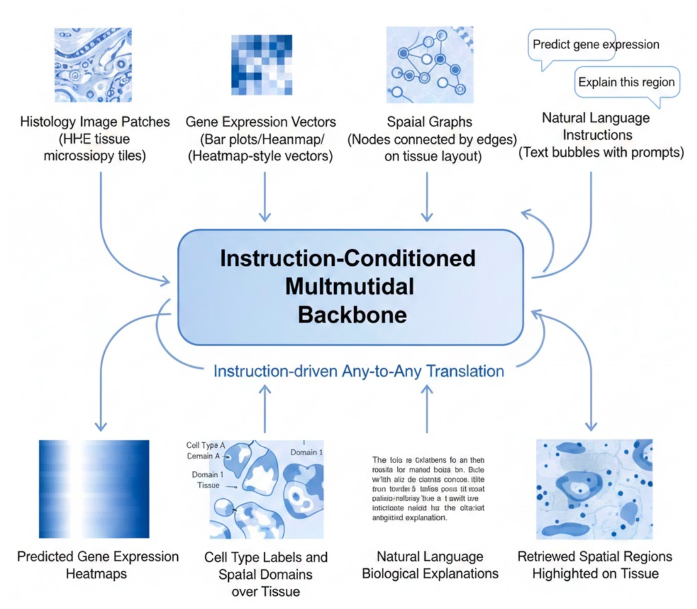

## Project description

Spatial transcriptomics (ST) integrates spatially resolved gene expression with tissue morphology, enabling the study of cellular organization, tissue architecture, and disease microenvironments. Modern ST datasets are inherently multimodal, combining histology images (H&E / IF), gene expression vectors, spatial graphs, cell annotations, and free-text pathology descriptions.

However, most existing ST methods are task-specific and modality-siloed: separate models are trained for image-to-gene prediction, spatial domain identification, cell type classification, or text-based interpretation. This fragmentation limits cross-task generalization and scalability.

**Omni-ST** proposes a single **instruction-driven any-to-any multimodal backbone** that treats each spatial transcriptomics modality as a “language” and formulates all tasks as:

**Instruction + Input Modality → Output Modality**

Natural language is elevated from auxiliary metadata to a **unifying interface** that specifies task intent, target modality, and biological context. This paradigm enables flexible, interpretable, and extensible spatial reasoning within a single model.

---

### Project Idea: Instruction-Driven Any-to-Any Modeling for Spatial Transcriptomics

**Topics:** spatial transcriptomics, multimodal learning, instruction tuning, computational pathology  
**Skills:** PyTorch, deep learning, Transformers, multimodal representation learning  
**Difficulty:** Hard  
**Size:** 350 hours  

**Mentor:**
- **Xi Li** — <mailto:xil43@uci.edu>

**Essential information:**
- Design a unified multimodal backbone with lightweight modality adapters for histology images, gene expression vectors, spatial graphs, and text.
- Use natural language instructions to condition model behavior, enabling any-to-any translation without task-specific heads.
- Support core tasks including image → gene expression prediction, gene expression → cell type / spatial domain identification, region → text-based biological explanation, and text-based spatial retrieval.
- Evaluate the model across multiple spatial transcriptomics tasks within a single framework, emphasizing generalization and interpretability.
- Develop visualization and interpretation tools such as spatial maps and language-grounded explanations.

**Expected deliverables:**
- An open-source PyTorch implementation of the Omni-ST framework.
- Unified multitask benchmarks for spatial transcriptomics.
- Visualization and interpretation tools for spatial predictions.
- Documentation and tutorials demonstrating how to add new tasks via instructions.
