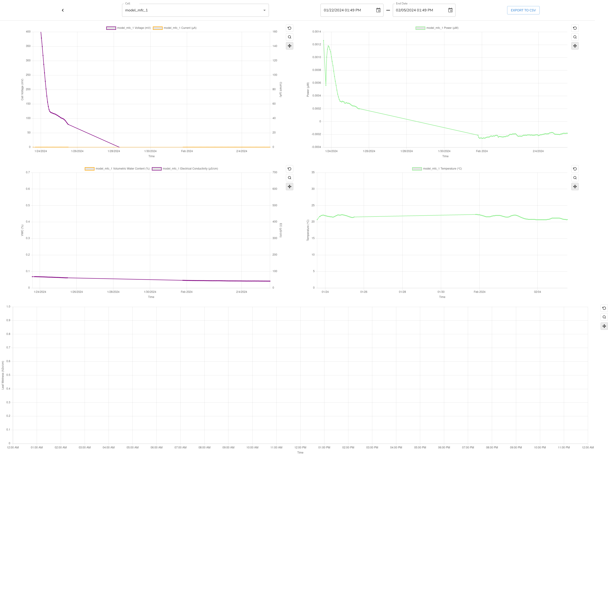

### ENTS I: Usability improvements for visualization dashboard

- **Topics:** Data Visualization, Backend, Frontend, UI/UX, Analytics
- **Skills:**
  - *Required:* React, Javascript, Python, SQL, Git
  - *Nice to have:* Flask, Docker, CI/CD, AWS, Authentication
- **Difficulty:** Medium
- **Size:** Large (350 hours)
- **Mentors:** {}, [Alec Levy](mailto:alevy1@ucsc.edu), [John Madden](mailto:jtmadden@ucsc.edu)

The Environmental NeTworked Sensor (ENTS) platform, formally Open Sensing Platform (OSP), implements data visualization website for monitoring microbial fuel cell sensors (see [GitHub](https://github.com/jlab-sensing/ENTS-backend)). The mission is to scale up the current platform to support other researchers or citizen scientists in integrating their novel sensing hardware or microbial fuel cell sensors for monitoring and data analysis. Examples of the types of sensors currently deployed are sensors measuring soil moisture, temperature, current, and voltage in outdoor settings. The focus of the software half of the project involves building upon our existing visualization web platform, and adding additional features to support the mission. A live version of the website is available [here](https://dirtviz.jlab.ucsc.edu/).

Below is a list of project ideas that would be beneficial to the ENTS project. You are not limited to the following projects, and encourage new ideas that enhance the platform:
- Drag and drop charts functionality
- Creation of unique charts by users (with unique equations)
- Customizable options of charts (color, line width, datapoint/line style, axis labels)
- Exportable charts (with customizable options)
- Saving layouts via url

### ENTS II: Migration to TockOS

- **Topics:** Embedded system, operating system
- **Skills:**
  - *Required:* Rust, C/C++, Git, Github
  - *Nice to have:* STM32 HAL, python
- **Difficulty:** Hard
- **Size:** Large (350 hours)
- **Mentors:** {}, [John Madden](mailto:jtmadden@ucsc.edu)

The current version of the hardware firmware is implemented in baremetal
through the use of STM hardware abstraction layer (HAL) drivers. We are
interested in porting the firmware implementation to an operating system (OS)
to allow for additional functionality to support environmental data logging.
[TockOS](https://tockos.org/) is an embedded operating system designed for
running multiple concurrent, mutually distrustful applications on low-memory
and low-power microcontrollers that will be used. TockOS allows for OTA
updates, dynamic app loading, hardware multiplexing, and more. We envision
multiple users utilizing shared ENTS hardware that provides communication and
measurement capabilities. Thus, the initial cost of deploying wireless sensor
networks is reduced.

The TockOS kernel is written in [Rust](https://rust-lang.org/) to enhance
security. Userspace apps can be written in either C, C++, or Rust. Development
will be done through a remote development server to access the hardware. See
the following repos for the current status of the project:

- Userspace library: [libtock-c](https://github.com/jlab-sensing/libtock-c)
- Kernel: [tock](https://github.com/jlab-sensing/tock)
- Baremetal: [ENTS-node-firmware](https://github.com/jlab-sensing/ENTS-node-firmware)

Scope of work:
- Writing kernel peripheral drivers.
    - Done entirely in Rust.
    - Low-level understanding of microcontroller 
    - Basic kernel functionality knowledge.
- Porting baremetal components to userland apps.
    - Involves porting STM HAL calls to TockOS syscalls.
    - Primarily done in C.
    - Understanding of syscalls.
