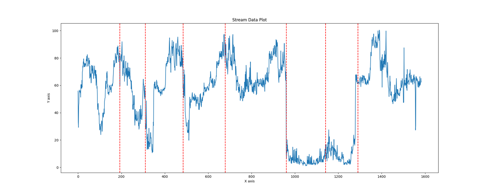
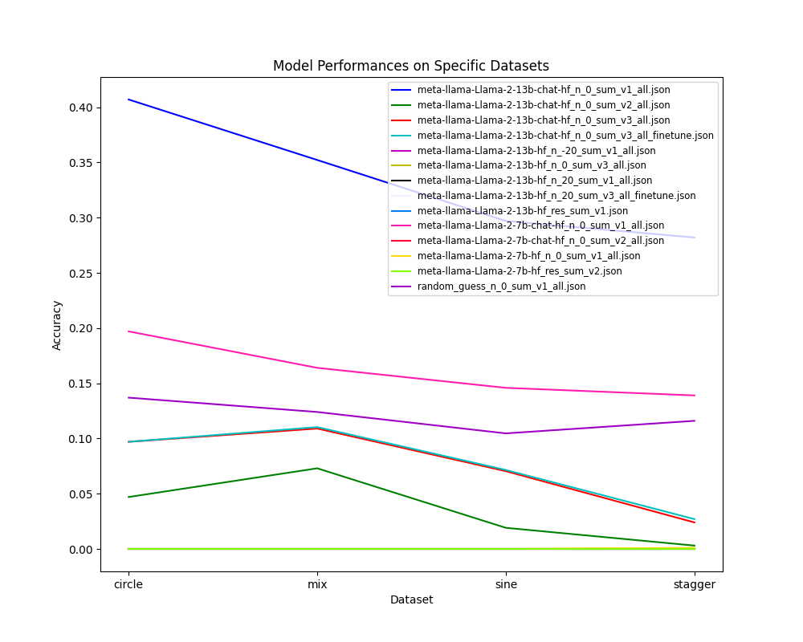

Greetings everyone, I'm Kangrui. Over the past few weeks, we've dedicated our efforts and have consequently made significant progress in our drift detection methods. Now, I'm excited to present to you a detailed elaboration on how we prompted and fine-tuned Llama2 to efficiently carry out the drift detection task.

## Motivation

### Why LLM in drift detection method?

The use of large language models (LLMs) in drift detection methods presents numerous benefits that place it as a prominent solution in this domain.

1. **Rapid Development:** LLMs are in the vanguard of technological advancement. This field is evolving rapidly with continuous enhancements in model architecture, training techniques, and data handling. With every new version, these models are showing an increasing capacity to understand and generate human-like text, pushing the limits of what is achievable in Natural Language Processing (NLP) and Artificial Intelligence (AI) as a whole.

2. **Superior Performance:** Traditional drift detection methodologies such as Page-Hinkley, EDDM, and HDDM have their merits and have found success in numerous scenarios. Even Deep Learning (DL) techniques, like training a predictive model based on error rates, have made significant strides in the field. However, when handling complex, high-dimensional, and real-time data, LLMs have demonstrated exceptional results. They are not only able to effectively predict and respond to drifts but also adapt to new trends more swiftly. Our experiments using LLMs like GPT-3.5-turbo have yielded impressive results, notably outperforming other methods.



*Fig. 1: Concept dirfts detected by GPT-3.5-turbo in Cori dataset*

3. **Flexibility:** One of the major advantages of using LLMs is their flexibility in dealing with different types of input and output. In contrast to traditional methods, which are confined to single feature concept drift detection and can only process numerical values, LLMs can handle a range of input types including text, numbers, and more complex data structures. This capability allows them to detect multi-feature concept drifts, thereby broadening the scope and complexity of problems they can tackle. Moreover, the generation capability of LLMs can provide rich and detailed output, facilitating more comprehensive insights into the detected drifts.

## Why Llama2 in drift detection method?

Llama2 presents a series of advantages that make it an excellent choice for applying llm in drift detection. Here's a breakdown of the key reasons:

1. **Performance Guarantee:** As a newly released model, Llama2 has undergone extensive development and testing, providing a reliable guarantee of performance. It represents the cutting edge in AI technology, having benefited from the latest research and advancements in language model design.

2. **Accessibility Guarantee:** One significant advantage of Llama2 is that it is open-source. It is readily accessible on HuggingFace, which also provides a range of mature tools to fine-tune and deploy the model. 

3. **Flexibility for Fine-Tuning:** Llama2 comes in different sizes, such as 7B, 13B, and 75B parameters, which allows for flexibility in model selection based on the task's requirements and computational resources.

## Data

### Dataset

In our study, we employed [Synthetic data streams](https://github.com/alipsgh/data-streams) for the fine-tuning of Llama2. Synthetic data streams serve as an invaluable resource for controlled experiments in the domain of drift detection. These curated datasets encompass varied types of drifts, providing us with the capability to assess the efficacy of our detection algorithms under diverse scenarios. 

Here is a brief introduction to the synthetic datasets we used:

1. **Sine1 & Sine2:** These datasets induce abrupt concept drift within a two-dimensional feature space. The classification rule, a sine function, dictates the instance labels, which are flipped at every drift point.

2. **Mixed:** This dataset, characterized by its combination of numeric and boolean features, uses a composite classification rule. The abrupt concept drift is simulated via a periodic reversal of class labels.

3. **Stagger:** This categorical dataset incorporates abrupt concept drift by periodically altering the classification rules tied to the features.

4. **Circles & LED:** These datasets are designed to simulate gradual concept drift. In Circles, the classification of instances is determined by their spatial relation to specific circles. LED imitates a seven-segment digit display, introducing drift by interchanging the pertinent attributes.

Typically, the synthetic datasets contain 100,000 or 1,000,000 instances. The concept drift happens every 25000 or 33333 instances each portraying either abrupt (with drifting period of 50 instances) or gradual concept drifts (with drifting period of 500 instances). 

### Data Preprocessing and Metrics

Given the token limit of Llama2 and the specific requirements of our project, we needed to transform the data into an appropriate format.

As such, we processed each data stream into three sections: the 'undrifted' period, the 'drifting' period, and the 'drifted' period. All instances in each section were randomly and independently drawn from the original data stream, summing up to a maximum of 100 instances. The number of instances for the undrifted and drifted periods ranged from 20 to 50, and for the drifting period, it ranged from 10 to 20.

For instance, let's consider a dataset containing 100,000 instances where the concept drift occurs every 25,000 instances, causing abrupt concept drift. To format a data point, we could draw 20 to 50 instances from the first 25,000 as the undrifted period. Then, we could draw 10 to 20 instances from the 25,001st to 25,050th instance as the drifting period. Finally, we would draw 10 to min(100 - num(undrifted period) - num(drifting period), 50) from the 25,051st to 50,050th instance as the drifted period. This newly formatted data stream would then be fed into Llama2.

We also included some additional information to assist Llama2's inference process. A typical data point in our processed dataset includes:

```python
{
    "before_period": [0, 31],
    "transition_period": [32, 38],
    "after_period": [39, 59],
    "before_index": [196, 19963],
    "transition_index": [20002, 20030],
    "after_index": [20310, 39984],
    "meta": "Dataset: MIXED\n\tv's type is nominal, range is ('False', 'True')\n\tw's type is nominal, range is ('False', 'True')\n\tx's type is numeric\n\ty's type is numeric\n\tclass's type is nominal, range is ('p', 'n')\n",
    "data_stream": ... 
}
```
From this dictionary, the "meta" and "data_stream" entries are fed into Llama2. The "transition_period" serves as the criterion: if Llama2's answer lies within the "transition_period", we deem it correct.

## Llama2

### Inference

We experimented with three variations of prompts during the inference phase.

**Prompt Version 1:**

```text
[INST] <<SYS>>
    You are a helpful, respectful, and honest assistant. Always provide the most helpful responses possible while ensuring safety. Ensure that your responses are socially unbiased, positive, and free from harmful, unethical, racist, sexist, toxic, dangerous, or illegal content. If a question lacks coherence or sense, explain why instead of providing incorrect information. If you are uncertain about an answer, refrain from sharing false information.
    <</SYS>>
    Your task is to identify the index in a given data stream where the relationship between the features and labels begins to change. The data stream is formatted as a list, with each element being a two-element list: the first represents the features (also a list), and the second is the label. If your answer is 'x', it indicates that the data pattern starts shifting at the xth data point in the stream. 
    Here's an example of the data's metadata: Dataset: SINE1
        x's type is numeric
        y's type is numeric
        class's type is nominal, range is ('p', 'n')
    
    The given data stream is: [[[0.7, 0.07], 'p'], [[0.45, 0.78], 'n'], ..., [[0.64, 0.45], 'n']]
    Your task is to respond with a single index. No additional information is required.
[/INST]
```

**Prompt Version 2:**

The same as Prompt 1, but with a specific range for the index response:

```text
Please provide an index ranging from 0 to 96. No additional information is required.
```
**Prompt Version 3:**

This prompt uses an instruction-input-output design, which we adopted for fine-tuning:

```text
Below is an instruction paired with an input that provides further context. Write a response that appropriately completes the request.
### Instruction:
Identify the index in a given data stream where the relationship between features and labels begins to change. The data stream is formatted as a list, each element being a two-element list: the first represents the features (also a list), and the second is the label. For instance, if the response is 'x', it means that the data pattern starts shifting at the xth data point in the stream. Only respond with an index, no further information is necessary.

### Input:
Meta Data:
Dataset: SINE1
    x's type is numeric
    y's type is numeric
    class's type is nominal, range is ('p', 'n')

Data stream:
[[[0.7, 0.07], 'p'], [[0.45, 0.78], 'n'], .., [[0.64, 0.45], 'n']]

### Response:
```

Despite minor differences between Prompt Version 1 and Version 2, both suggested by Meta, the results varied significantly, a topic we will delve into in the following section. Prompt Version 3, employing the instruction-input-output structure, was used during our fine-tuning process.

### Fine-Tuning

We utilized the tools provided by [llama-recipes](https://github.com/facebookresearch/llama-recipes) to fine-tune Llama2. The key command used to initiate the fine-tuning process is illustrated below:

```shell
python llama_finetuning.py --use_peft \
  --peft_method lora \
  --quantization \
  --model_name meta-llama/Llama-2-13b-chat-hf \
  --output_dir ./fine_tuned_model/Llama-2-13b-chat-hf-test_finetune \
  --dataset alpaca_dataset \
  --batch_size_training 40 \
  --num_epochs 1
```

Some explaination about the parameters:

```text
--use_peft: This flag indicates the use of the Parameter-Efficient Fine-Tuning (PEFT) method. PEFT allows us to fine-tune the model more efficiently.
--peft_method lora: Here, we specify that the Lora (Layer-wise Optimal Brain Surgeon with Relevance-based Adjustment) method should be used for PEFT.
--quantization: The quantization flag is used to reduce the memory footprint of the model during the inference stage. It does so by reducing the precision of the model's weights.
--dataset alpaca_dataset: Specifies the dataset setting used for fine-tuning, in this case, the 'alpaca_dataset' indicates the instruction-input-output structure for fine-tuning.
```

## Results

The performance of various models and prompt versions is depicted in Fig. 2.



*Fig. 2: Performance comparison of different models and prompt versions.*

It is evident from the results that the design of the prompt has a significant impact on Llama2's performance. Furthermore, due to computational resource constraints, we have only managed to fine-tune Llama2 on a portion of our dataset (approximately 1,000 instances). The entire training set consists of 19,000 instances, and the test set includes 5,000 instances. Despite these limitations, a performance increase is noticeable after fine-tuning.


