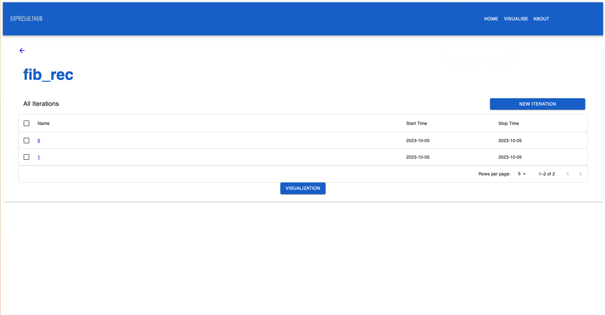
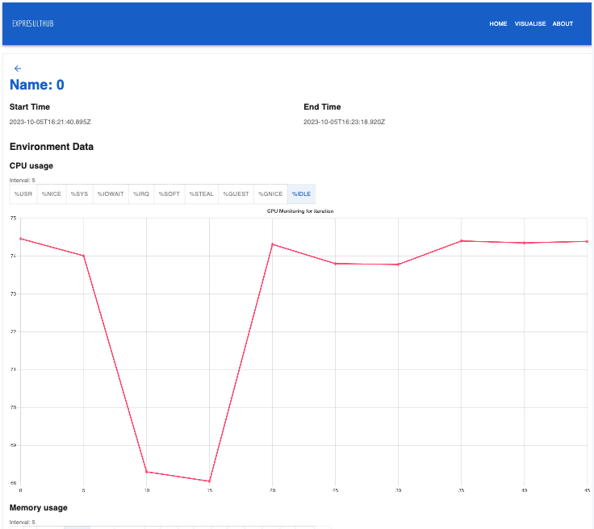

​
Hola Amigos!
​
As we draw the curtains on our project titled [Public Artifact and Data Visualization](/project/osre23/intel/artifactviz) we're thrilled to present the incredible advancements we've achieved since our mid-term update. Our mission has been to foster a deeper understanding of data and empower users to make informed decisions. Let's delve into the remarkable evolution of our project.

## Unveiling New Functionalities

1. Modular Architecture: Your Way, Your Choice

- At the core of our project is a modular architecture designed to cater to your unique preferences. We firmly believe that choice empowers users. Thus, we've given you the option to select between a Graphical User Interface (GUI) and a Command-Line Interface (CLI). It's about providing a platform that adapts to your specific requirements and style of interaction.

2. Real-time Backend Environment Monitoring: Data as it Happens

- Real-time monitoring of backend environment data is at the heart of our project. It's not just about collecting data; it's about providing continuous insights into system performance. This feature empowers you to make real-time, data-driven decisions—an essential capability in today's fast-paced computing landscape.

3. Visualizing Environment Variables: Clarity Amidst Complexity

- We've placed a strong emphasis on user-friendly data visualization. Our enhancements enable you to navigate through detected variables effortlessly and compare iterations within different buckets. The result is a visual representation of complex data, making it easier to comprehend and analyze.

4. Predefined Monitoring Commands: Your Head Start

- We understand that monitoring can be a daunting task. To simplify the process, we've introduced predefined monitoring commands such as mpstat and iostat. These templates serve as a launchpad for monitoring common system metrics, helping you get started quickly and efficiently.

5. Comprehensive Customization: Tailoring the Experience

- Recognizing that every user has unique needs, our platform now offers extensive documentation. This documentation serves as a guide, enabling users to fine-tune their monitoring commands. It's about tailoring the platform to match your specific requirements and preferences. The power to customize is firmly in your hands.

6. Import and Export Functionality: Seamless Collaboration

- In an era where collaboration and data management are essential, we've introduced the capability to import and export environment data. This feature simplifies data management and supports collaborative efforts, making it easy to share monitoring data and conduct analysis across various environments.

## Exploring Our Repositories

​
As mentioned earlier, we have completed the core functionalities of our platform, and we would love to have you try it out and provide us with valuable feedback. Here are the links to our repositories where you can explore and experiment with our platform:
​

1. [GUI Repository](https://github.com/PublicExperimentDatabase/PublicExperimentGUI) and [CLI Repository](https://github.com/PublicExperimentDatabase/PublicExperimentCLI)
   - The journey begins with a choice. Our repositories cater to a diverse range of user preferences. Inside the README.md file of the GUI repository, you'll find meticulous installation instructions to guide you through setting up the Graphical User Interface (GUI). It's your portal to a user-friendly experience
2. [Sample Repository](https://github.com/PublicExperimentDatabase/test-experiment)
   - For those eager to embark on their monitoring journey, our Sample Repository is a valuable resource. It provides scripts that not only enable you to run our program but also serve as templates. These templates are designed to simplify the monitoring of your own programs, tailored to your unique requirements.
     ​

## Project Demo

​
To provide you with a glimpse of what our project can do, here are some demo images showcasing the capabilities and features of "Public Artifact and Data Visualization."
​

​

​

​

## Thank You for Joining Us

​
We appreciate your support and participation in this journey of data visualization and empowerment. Our commitment to enhancing the world of data comprehension remains unwavering. As we mark the end of this chapter, we eagerly anticipate the exciting future that awaits in the realm of data visualization. The path doesn't end here; it's just the beginning of a new chapter in our collective exploration of data's potential.`
​
