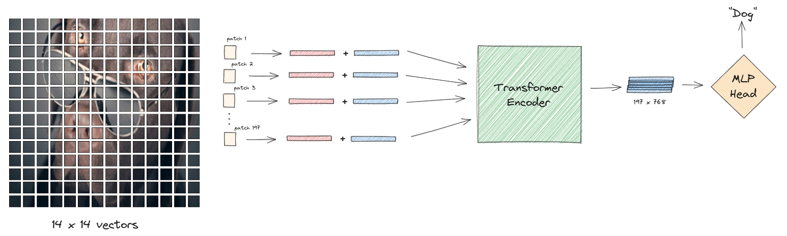
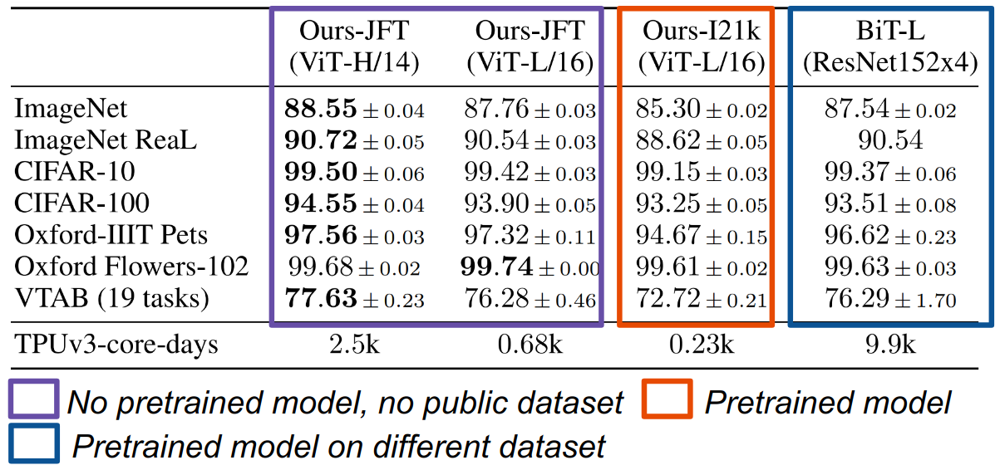

Hello again!

In this blog post, I will be discussing the second material I created for the 2023 Summer of Reproducibility Fellowship. As you may recall from my [first post](/report/osre23/nyu/eduml/20230601-msaeed), I am working on the [Using Reproducibility in Machine Learning Education](/project/osre23/nyu/eduml) project with {} as my mentor. My goal is to create interactive open-source educational resources that teach reproducibility and reproducible research in machine learning (ML), as outlined in my [proposal](https://drive.google.com/file/d/13HnCMZawpabiLdBoOiaJFF2mNXIPLCVJ/view?usp=sharing).

In this post, I will share with you my second material, and how it can be helpful in machine learning class to teach students about vision transformers and reproducibility at the same time. If you haven't seen my first work, be sure to check out my [previous blog post](/report/osre23/nyu/eduml/20230802-msaeed). Without further ado, let's dive in!

## Reproducing “An Image is Worth 16x16 Words: Transformers for Image Recognition at Scale”

This material is a reproduction of Dosovitskiy et al.‘s 2020 paper, [“An Image is Worth 16x16 Words: Transformers for Image Recognition at Scale”](https://arxiv.org/abs/2010.11929). This paper introduces the Vision Transformer (ViT), a novel architecture that applies the transformer model, originally designed for natural language processing tasks, to image recognition. The ViT model achieves state-of-the-art performance on several image classification benchmarks, demonstrating the potential of transformers for computer vision tasks.

The figure illustrates the key idea behind ViT, which is to treat an image as a sequence of patches, similar to how a transformer treats a sentence as a sequence of words. Each patch is flattened into a vector and fed into the transformer encoder, which learns to capture the complex relationships between these patches. The resulting representation is then fed into an MLP head, which produces a final prediction for the image. This approach allows ViT to handle large input images and capture both global context and fine-grained details. ViT models can also be pre-trained on large datasets and fine-tuned on smaller datasets for improved performance.

To reproduce this paper, I followed a systematic approach to ensure reliable results:

- Critically analyze the paper's qualitative and quantitative claims.
- Identify the necessary experiments to verify each claim.
- Determine the required data, code, and hyperparameters for each experiment.
- Utilize pre-trained models for validating claims that require high computational resources.
- Investigate resources shared by the authors, such as code, data, and models.
- Assess the feasibility of verifying different types of claims.
- Design new experiments for validating qualitative claims when certain models or datasets are unavailable.

I utilized [Chameleon](https://chameleoncloud.org/) as my platform for conducting and documenting my reproduction experiments. Chameleon is a large-scale, reconfigurable experimental environment that supports computer science systems research. It enables users to create and share Jupyter notebooks capable of running Python code on Chameleon’s cloud servers. For this work, a GPU with 24GB or more memory is required to run the notebooks on GPU, which Chameleon offers in its variety of GPUs.

I have set up a [GitHub repository](https://github.com/mohammed183/re_vit) where you can access all of my reproduction work. The repository contains interactive Jupyter notebooks that will help you learn more about machine learning and the reproducibility of machine learning research. These notebooks provide a hands-on approach to understanding the concepts and techniques presented in my reproduction work.

## Challenges

Reproducing a paper can be a challenging task, and I encountered several obstacles during the process, including:

- The unavailability of pretraining datasets and pretrained models
- Inexact or unspecified hyperparameters
- The need for expensive resources for some hyperparameters
- The use of different frameworks for baseline CNNs and Vision Transformers

These issues posed significant difficulties in replicating the following table, a key result from the Vision Transformer paper that demonstrates its superiority over prior state-of-the-art models.

To overcome these challenges, I used the same models mentioned in the paper but pretrained on different datasets, experimented with various hyperparameter combinations to achieve the best results, and wrote my own code to ensure that both the baseline and Vision Transformer were fine-tuned using the same framework. I also faced other challenges, which I discussed in my notebooks along with the solutions I applied.

## How to use this material?

This material consists of a series of notebooks that guide you through the paper, its claims, experiments, and results. You will learn how to analyze, interpret, and validate the authors' claims. To get started, I recommend briefly skimming the [original paper](https://arxiv.org/abs/2010.11929) to gain an understanding of the main ideas and public information. This will help you see how the authors could have been more transparent and clear in certain sections. The notebooks provide clear instructions and explanations, as well as details on how I addressed any missing components.

## Conclusion

In this blog post, I've walked you through the contents of this material and the insights users can gain from it. This material is particularly intriguing as it replicates a paper that has significantly influenced the field of computer vision. The interactive nature of the material makes it not only educational but also engaging and enjoyable. I believe users will find this resource both fun and beneficial.

I hope you found this post informative and interesting. If you have any questions or feedback, please feel free to contact me. Thank you for reading and stay tuned for more updates!