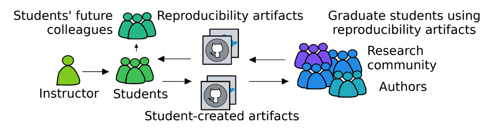
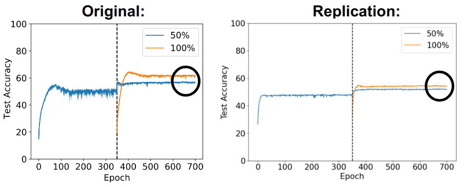
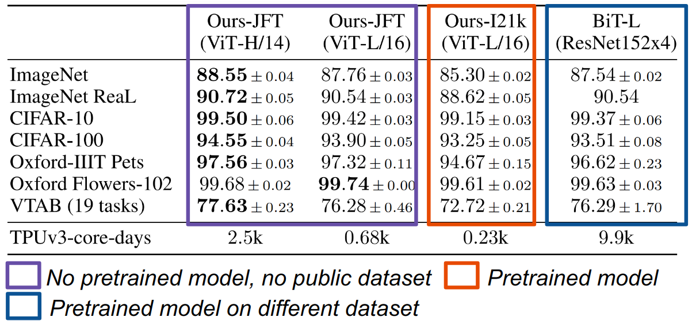

Welcome back! 

In my final blog post for the 2023 Summer of Reproducibility Fellowship, I'll be sharing my experiences and the materials I've created for the [Using Reproducibility in Machine Learning Education project](/project/osre23/nyu/eduml). As a quick reminder, my mentor {} and I have been working on developing interactive open-source educational resources that teach reproducibility and reproducible research in machine learning. You can find my [proposal here](https://drive.google.com/file/d/13HnCMZawpabiLdBoOiaJFF2mNXIPLCVJ/view?usp=sharing).

In this post, I'll give you a rundown of my experience and share the materials I've created. If you haven't checked out my previous blog posts, definitely take a look before diving into this one. Let's get started!

## Why is this project important 🤔

Reproducibility is an essential aspect of scientific research, and it's becoming increasingly important in the field of computer science. However, most efforts to promote reproducibility in education focus on students who are actively involved in research, leaving a significant gap in the curriculum for introductory courses. Our project aims to address this issue by incorporating reproducibility experiences into machine learning education.

## Why Reproducibility Matters in Education 🎓

There are two primary reasons why we believe reproducibility belongs in the computer science classroom. Firstly, it allows students to experience the process of reproducing research firsthand, giving them a deeper understanding of the scientific method and its importance in the field. This exposure can inspire students to adopt reproducible practices in their future careers, contributing to a more transparent and reliable scientific community.

*Source: Fund, Fraida. "We Need More Reproducibility Content Across the Computer Science Curriculum." Proceedings of the 2023 ACM Conference on Reproducibility and Replicability. 2023.*

Secondly, as shown in the figure, involving students in reproducibility efforts can have a significant impact on the reproducibility ecosystem itself. Students can create reproducibility artifacts, such as replicable experiments or data analysis, that can be used by other researchers, including authors and graduate students. Additionally, students can consume reproducibility artifacts created by the research community, provide feedback, and suggest improvements. Authors appreciate this type of engagement, as it adds value to their work and promotes open science.

## Focusing on Machine Learning 🧐

Given the growing interest in machine learning and its relevance to reproducibility, our project decided to focus on this area. Machine learning already has a strong culture of reproducibility, with initiatives like [Papers with Code](https://paperswithcode.com/) and the [ML Reproducibility Challenge](https://paperswithcode.com/rc2022). These efforts encourage researchers to share their code and reproduce recent machine learning papers, validating their results. By leveraging these existing resources, we can create learning materials that utilize real-world examples and foster hands-on reproducibility experiences for students.

## The Interactive Notebooks 📖

We have created two learning materials that focus on machine learning and reproducibility. **The first material** looks at a paper titled ["On Warm Starting Neural Network Training"](https://arxiv.org/abs/1910.08475) by Jordan T. Ash and Ryan P. Adams. This paper discusses the concept of warm-starting, which involves using weights from a previously trained model on a subset of the dataset to train a new model. The authors compare the performance of warm-started models with randomly initialized models and find that the warm-started models perform worse as shown in the below figure.

Our material takes students through the process of identifying the different claims made in the paper and finding the corresponding experiments that support them. They will also learn how to use open-source code and available data to reproduce these experiments and understand the computational complexity associated with reproducing each experiment. This material can be found on both [github](https://github.com/mohammed183/re_warm_start_nn/tree/main) and [chameleon](https://chameleoncloud.org/experiment/share/5b5717df-9aa9-470f-b393-c1e189c008a8) where you can use chameleon to run the material on the required resources.

**The second material** examines the paper ["An Image is Worth 16x16 Words: Transformers for Image Recognition at Scale"](https://arxiv.org/abs/2010.11929) by Dosovitskiy et al., which introduces a novel way of applying the transformer architecture, which was originally designed for natural language processing, to image recognition tasks. The paper shows that transformers can achieve state-of-the-art results on several image classification benchmarks, such as ImageNet, when trained on large-scale datasets as shown in the following table.

 

Our material guides students through the process of understanding which claims can and cannot be validated based on the available datasets and how complex it can be to validate each claim. Additionally, they will learn how to use pre-trained models to replicate computationally expensive experiments. Again this material can be on both [github](https://github.com/mohammed183/re_vit/tree/main) and [chameleon](https://chameleoncloud.org/experiment/share/8f0e34c5-d2c4-45be-8425-36686ad57650).

Both materials are designed to be easy to understand and interactive, allowing students to engage with the content and gain a deeper understanding of the concepts. Instructors can use these materials to assess their students' understanding of machine learning and reproducibility.

## Reflecting on the Journey

As we wrap up our journey of creating beginner-friendly learning materials for machine learning using reproducibility, it's time to reflect on the rewarding experiences and valuable lessons learned along the way. Our deep dive into the world of machine learning and reproducibility not only enriched our knowledge but also provided us with an opportunity to contribute to the community at the **UC Open Source Symposium 2023** at UCSC.

The symposium was a memorable event where we presented our work in a poster session. The diversity of the audience, ranging from professors and researchers to students, added depth to our understanding through their valuable feedback and insights. It was intriguing to see the potential applications of our work in various contexts and its capacity to benefit the broader community.

This project has been a personal journey of growth, teaching me much more than just machine learning and reproducibility. It honed my skills in collaboration, communication, and problem-solving. I learned to distill complex ideas into simple, accessible language and create engaging, interactive learning experiences. The most fulfilling part of this journey has been seeing our work come alive and realizing its potential to positively impact many people. The gratification that comes from creating something useful for others is unparalleled, and we are thrilled to share our materials with the world.

Your time and interest in our work are greatly appreciated! Hope you enjoyed this blog!