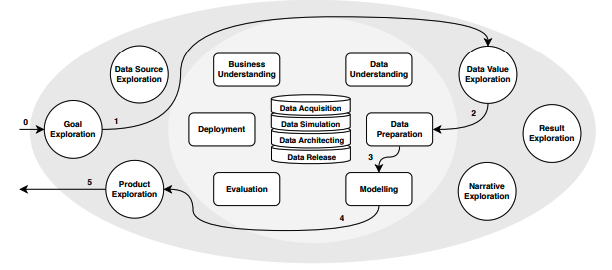
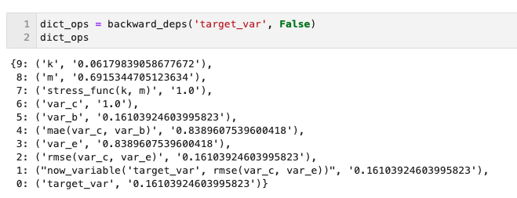
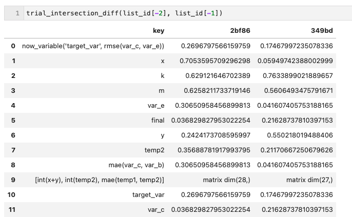
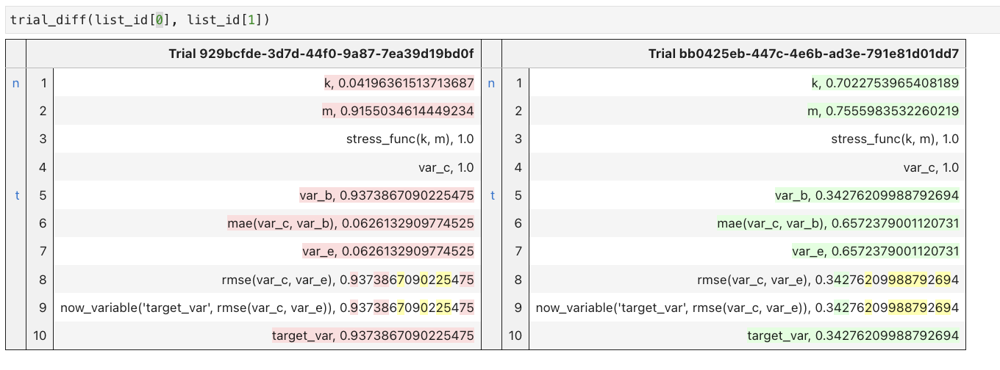
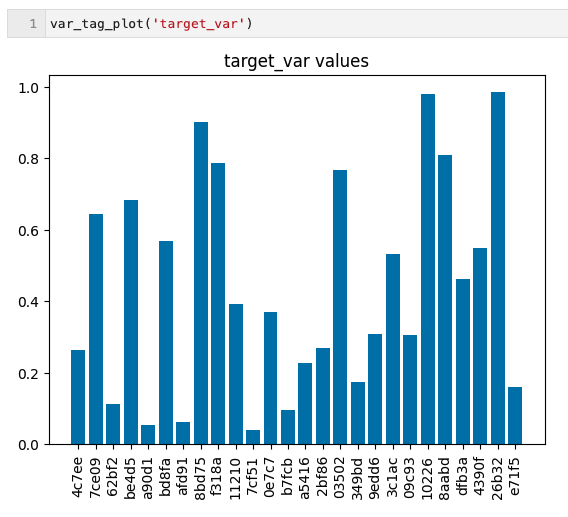
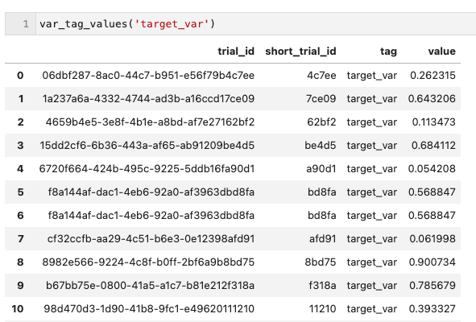

---
title: "Verifying the reproducibility of an experiment"
subtitle: "Capturing provenance into Data Science/Machine Learning workflows" 
authors: [jesselima]
tags: ["osre23", "ucsc", "nyu", "data science", "machinelearning", "provenance", "reproducibility"]
date: 2023-05-24
lastmod: 2023-05-24
draft: false
featured: false

# Featured image

# To use, add an image named `featured.jpg/png` to your page's folder.

# Focal points: Smart, Center, TopLeft, Top, TopRight, Left, Right, BottomLeft, Bottom, BottomRight.

image:
caption: ""
focal_point: "BottomLeft"
preview_only: false
---

# Summer of Reproducibility - Final Report

This post describes our midterm work status and some achievements we
have made so far in our project
[[proposal]](https://docs.google.com/document/d/1YMtPjZXcgt5eplyxIgQE8IBpQIiRlB9eqVSQiIPhXNU/edit?usp=sharing)
for
[[noWorkflow]](https://ospo.ucsc.edu/project/osre23/nyu/noworkflow).
For a more friendly introduction to our work, please, refer to this
[[tutorial
available]](https://github.com/jaglima/noworkflow_usecase/blob/main/README.md).

## Different ways of managing experiments

From our starting point at the midterm, and from our initial aspirations
for the SoR, we kept on track with the goal of adding features to
noWorkflow related to managing DS/ML experimental setups focusing on
reproducibility.

With the emergence of IA across multiple fields in industry and
academia, the subject of reproducibility has become increasingly
relevant. In [\[1\]](https://paperpile.com/c/EfP6Pl/Bpht) we have an
interesting description of the sources of irreproducibility in Machine
Learning. All these sources are present at different stages during the
project\'s experimental phases and may even persist in production
environments, leading to the accumulation of technical debt
[\[2\]](https://paperpile.com/c/EfP6Pl/KcjR). The problem of
irreproducibility is also discussed in [\[3\],
\[4\]](https://paperpile.com/c/EfP6Pl/sII8+PcGD), pointing out that the
velocity of deliverances usually comes at the expense of
reproducibility, among other victims.

The CRISP-DM process as reviewed in
[\[5\]](https://paperpile.com/c/EfP6Pl/CwPq) demonstrates that Data
Science experiments follows a typical path of execution. In the same
manner, [\[3\], \[6\],
\[7\]](https://paperpile.com/c/EfP6Pl/sII8+K2LJ+yU1q), points out that
Machine Learning pipelines are composed of well-defined layers (or
stages) through its lifecycle. The emergence of IA in real world
applications stressed the almost artisanal ways of creating and managing
analytical experiments and reinforced that there is room to make things
more efficiently.

In the search for possible approaches to the problem, we came across
several projects that aimed to address these issues. Not surprisingly,
multiple authors pursued the same goal, for instance [\[9\],
\[10\]](https://paperpile.com/c/EfP6Pl/YGCg+SkVT). In these references,
and confirmed in our survey, we found from targeted solutions to
specific steps in modeling to services aiming for end-to-end AIOps
management. Some are available as software packages, others as SaaS in
cloud environments. In general terms, all of them end up offering
features in different layers of the workflow (i.e. data, feature,
scoring, and evaluation) or with different conceptualizations of
reproducibility/replicability/repeatability as noticed by
[\[11\]](https://paperpile.com/c/EfP6Pl/vWxl). On one hand, this lack of
standards makes any assessment difficult. On the other hand, it suggests
a community in an exploratory process of a hot topic subject.

Specifically for this project, our focus is in the initial stages of
computational scientific experiments. As studied in \[8\], in this
phase, experiments are i) implemented by people as prototypes, ii) with
minor focus on pipeline design and iii) in tools like Notebooks, that
mix documentation, visualization and code with no required sequential
structure. These three practices impact reproducibility and efficiency
and are prone to create technical debts. However, tools like noWorkflow
show a huge potential in such scenarios. It is promising because they i)
demands a minimal setup to be functional, ii) works well with almost
nonexistent workflows iii) require minimal additional intrusive code
among the experimental one and iv) integrates well with Notebooks that
are the typical artifact in these experiments.

According to its core team, the primary goal of noWorkflow is to
\"\...allow scientists to benefit from provenance data analysis even
when they don\'t use a workflow system.\". Unlike other tools,
\"noWorkflow captures provenance from Python scripts without needing a
version control system or any other environment\". It is particularly
interesting when we are in the scenario described above, where we lack
any structured system at the beginning of experiments. In fact, after
going through the docs, we can verify that noWorkflow provides:

-   Command-line accessibility

-   Seamless integration with Jupyter Notebooks

-   Minimal setup requirements in your environment

-   Elimination of the need for virtual machines or containers in its
    setup

-   Workflow-free operation

-   Open source license

-   Framework-agnostic position

Finally, in our research, we confirmed that there is an open spot in the
management of scientific experiments that needs to be occupied by
reproducibility. Provenance tools can help the academy and industry
groups in this goal, and in this summer we focused on adding relevant
features to leverage the noWorkflow in this direction.

# Different tools for different needs

In our research phase, we didn\'t find any taxonomy that fully
accommodated our review of different categories of tools providing
reproducibility and experimental management. So, we could describe some
tools in the following categories (freely adapted from this online
references
[[here]](https://ml-ops.org/content/mlops-principles) and
[[here]](https://ambiata.com/blog/2020-12-07-mlops-tools/)):

**Data and Pipeline Versioning**: Platforms dealing with ingestion,
processing, and exposing of features for model training and inference.
They enable collaboration and discoverability of already existing
Feature Sets throughout the teams and organizations. Provide provenance
and lineage for data in different levels of complexity.

**Metadata Stores/Experiment Trackers**: They are specifically built to
store metadata about ML experiments and expose it to stakeholders. They
help with debugging, comparing, and collaborating on experiments. It is
possible to divide them into Experiment Trackers and a Model Registry.
Moreover, there are projects offering reproducibility features like
hyperparameter search, experiment versioning, etc. However, they demand
more robust workflows and are better suited for projects in the
production/monitoring phases.

**Pipeline frameworks**: They operate within the realm of production,
similar to Data Engineering workflows. Their usual goal is to allow any
ML/AI products to be served across a wide range of architectures, and
integrate all the low-hanging fruits along the way. For instance,
pipelines adding hyperparameter optimization tasks, experiment tracking
integrations, boilerplate containerized deployment, etc.

**Deployment and Observability**: They focus on deploying models for
real-time inference and monitoring model quality once they are deployed
in production. Their aim is to facilitate post-deployment control tasks
such as monitoring feature drifts, conducting A/B testing, facilitating
fast model shifts, and more.

The most remarkable aspect of this survey is that there are different
tools for different phases in the life cycle of AI products. There are
tools like DVC and Pachyderm that are Metadata Stores, allowing
Experiment Tracking with features of tagging variables, as well as Data
and Pipeline tracking. They are the most similar tools to noWorkflow in
functionality. However, DVC possesses a more complex framework in
dealing with different \'types\' of tags, and relies on command line
tools to extract and analyze tagged variables. Also, it depends strongly
on git and replicate the git logics. Pachyderm requires a more
sophisticated setup at the start, relying on containers and a server. It
is an obstacle to small and lean prototypes, requiring installation of a
docker image, and all friction on managing it.

There are other tools, like MLFlow and Neptune that pose themselves as
Model Experiment Versioning with features of Monitoring and Deployment.
They also have elements of pipeline frameworks, offering full
integration and boiler plates for seamless integration with cloud
platforms.

Pipelines are a vast field. They are AWS SageMaker, Google Vertex,
DataRobot and Weights & Biases, among others. All of them offer features
helping in all categories, with a strong focus on exploring all
automation that can be offered to the final user, suggesting automatic
parameter tuning, model selection, retraining, data lineage, metadata
storing, etc.

Finally, Deployment and Observability frameworks are in the deployment
realm, which is another stage far removed from prototypical phases of
experiments. They come into the scene when all experimental and
inferential processes are done, and there is an AI artifact that needs
to be deployed and monitored. Such tools like Seldon, H2O, Datarobot do
this job, again, with some features of Hyperparameter tuning, pipeline
frameworks, data and pipeline tracking.

In light of this, when considering management and operation of
experiments, we have a reduced sample of alternatives. Among them,
Notebook integration/management are rare. Some of them rely on other
tools like Git or enforces an overhead in the coding/setup with reserved
keywords, tags and managerial workflows that hinder the process.

At first sight, our \"informal\" taxonomy positions noWorkflow as a
Data/Pipeline Versioning and Metadata Store/Experiment Tracker. It is
not a Pipeline Framework which works like a building block, facilitating
the integration of artifacts at production stages. It is not a
Deployment and Observability framework, because they are in the
post-deployment realm, which is another stage far removed from
prototypical phases of experiments.

# Desiderata

As mentioned earlier, a typical workflow in DS/ML projects is well
described by the CRISP-DM [\[5\]](https://paperpile.com/c/EfP6Pl/CwPq)
and precede phases of deployment and production in the whole lifecycle
of DS/ML projects.

Fig 1: CRISP-DM example of trajectory through a data science project

Briefly speaking, a workflow starts when a user creates a Jupyter
Notebook and starts writing code. Usually, he/she imports or selects
data from a source, explore features which are expected to have the
highest inference potential, tunes some parameters to set up its
training, trains and evaluates the predictive power of the model through
different metrics. At this final step, we have delineated a trial. This
trial result can suggest further improvements and new hypotheses about
data, features, model types and hyperparameters. Then, we have a new
experiment in mind that will result in a new trial.

When this process repeats multiple times, a researcher may end with
different notebooks storing, each one, a different experiment. Each
notebook has multiple hyperparameters, modeling choices and modeling
hypotheses. Otherwise, the experimenter may have a unique notebook where
different experiments were executed, in a nonlinear order between the
cells. This former case is pointed out in
[\[8\]](https://paperpile.com/c/EfP6Pl/V84u), where Notebook flexibility
makes it difficult to understand which execution order resulted in a
specific output.

In a dream space, any researcher/team would have benefited at most if
they could

a)  in a running Notebook, being able to retrieve all the operations
    that contributed to the result of a variable of interest. In this
    case, modifications applied in the inputs or in the order of
    operations would be easily detectable. In the same way, any
    nonlinear execution that interferes in a control result.

b)  Compare trials after different experiments. After experimenting with
    different hypotheses about hyperparameters, features or operation
    order, the user should easily compare the history of two trials and
    spot differences.

c)  Retrieve a target variable among different trials that were executed
    in the context of an experiment. After proceeding with multiple
    experimental trials, users should be able to compare the results
    that are stored in different Notebooks (or even not).

d)  Be as much \"no workflow\" as possible. All the former requisites
    should be possible with minimal code intervention, tags, reserved
    words or any active coding effort.

With these goals in mind, we worked on our deliverables and used the
experiment carried out by [\[12\]](https://paperpile.com/c/EfP6Pl/qmYX)
as a guideline to validate the new noWorkflow features.

# Deliverables

In this session, we will describe what we have implemented during this
summer.

We started on tagging cells and variables and then navigating through
its pre-dependencies, or all other variables and function calls that
contributed to its final value. This was a fundamental step that allowed
us to evolve to create features that are really useful in day-to-day
practice.

From the features of tagging a cell and tagging a variable, we evolved
to the following features (an interactive notebook is available here):

-   *backwards_deps(\'var_name\', glanularity_level)* : returns a
    dictionary storing operations/functions calls and their associated
    values that contributed to the final value of the tagged variable.
    Glanularity_level allows to set if the internal operations of the
    functions must be included or not.

> 

-   *global_backwards_deps*(\'var_name\', glanularity_level) : does the
    same as backwards_deps, but from all different tagging and
    re-tagging events in the notebook. It allows to retrieval of the
    complete operation of a tagged variable across all executed cells in
    the notebook

-   *store_operations(trial_id, dictionary_ops)* : save the current
    trial in order to make further comparisons with other experiments.
    The dictionaries aren\'t stored in the *.noworkflow/db.sqlite*, but
    in a shelve object named \*ops.db\* in the current notebook local
    folder.

-   *resume_trials()* : to support the management of experiments, the
    user can see the trial_ids of all experiments stored in the ops.db
    available for comparison/analysis.

-   *trial_intersection_diff(trial_id1, trial_id2)* : all mutual
    variables/funcion_calls between two experiments have its scalar
    values compared

> 

-   *trial_diff(trial_id1, trial_id2)* : The values of variables and
    function calls are exhibited in a diff file format, emphasizing the
    operations\' order. The goal here is to show that between the two
    experiments, the order of operations was different. Again, only
    scalar values are exhibited. More complex data structures (matrices,
    vectors, tensors, etc.) are only signaled as *\'complex_type\'*

> 

-   *var_tag_plot(\'var_name\')* : Chart the evolution of a given
    variable across multiple trials in the database. In this case, all
    experiments stored in ops.db and tagged as \*target_var\* have their
    values plotted

> 

-   *var_tag_values(\'var_name\') :* Provides access to pandas.dataframe
    var_name entries with correspondent values across different trials.

# Challenges

As expected, we had unexpected findings along the project. Bellow, we
delve into the most significant challenges we had to face:

-   Jupyter notebooks allow a nonlinear execution of small parts of code
    through cells. More than once, we had to align about how to create
    functionalities to attend different scenarios that were unexpected.
    One example was the backwards_deps() and global_backwards_deps()
    functions. The latter function was born to cover the case where the
    user wants all dependencies rather than the local cell dependencies.

-   Despite the high quality of the current version of the package, the
    project needs documentation, which slows down the analysis of any
    new development. In this project, the aid of mentors was crucial at
    some points where a deeper knowledge was needed.

-   What is the vocation of noWorkflow? At some points in the project,
    we had to discuss forcing some kind of workflow over the user. And
    it would go against the philosophy of the project.

-   When working on comparing results, especially in DS/ML fields,
    complex types arise. Numerical vectors, matrices, and tensors from
    NumPy and other frameworks, as well as data frames, can\'t be
    properly manipulated based on our current approach.

-   The dilemma of focusing on graphic visual features versus more
    sophisticated APIs. More than once, we needed to choose between
    making a visual add-on to Jupyter or implementing a more complete
    API.

-   The current version of Jupyter support in noWorkflow doesn't
    integrate well with Jupyter Lab. Also, even the IPython version has
    new versions, and noWorkflow needs to adapt to a new version.

# Future Improvements

Given our current achievements and the insights gained along the
project, we would highlight the following points as crucial future
roadmap improvements:

-   Add a complex type treatment for comparisons. Today, visualizing and
    navigating through matrices, data frames, tensors, isn\'t possible
    with noWorkflow, although the user can do by its own means.

-   Integrate the dictionaries storing sequences of operations from
    shelve objects to a more efficient way of storage and retrieval.

-   Make it easier for users to manage (store, retrieve, and navigate)
    through different trials.

-   Add graphical management instead of relying upon API calls only.

-   Evolve the feature of tagging cells.

-   When tagging a model, save its binary representation to be recovered
    in the future.

-   Adding the capability of tracking the local dataset reading.
    Currently, it is possible to track changes in the name/path of the
    dataset. However, any modification in the integrity of a dataset is
    not traceable.

# What I\'ve learned

This was a great summer with two personal discoveries. The first one was
my first formal contact with the Reproducibility subject. The second was
to fully contribute with an Open Source project. In the research phase,
I could get in touch with the state-of-the-art of reproducibility
research and some of it nuances. In the Open Source contributing
experience, I could be mentored by the core team of the noWorkflow and
exercise all the skills required in doing high level software product.

# Acknowledgments

I would like to thank the organization of Summer of Reproducibility for
aiding this wonderful opportunity for interested people to engage with
Open Source software. Also, thanks to the core team of noWorkflow for
supporting me in doing this work.

# Bibliography

\[1\] [O. E. Gundersen, K. Coakley, C. Kirkpatrick, and Y. Gil, "Sources
of irreproducibility in machine learning: A review," *arXiv preprint
arXiv:2204. 07610*.](http://paperpile.com/b/EfP6Pl/Bpht)

\[2\] [D. Sculley *et al.*, "Machine Learning: The High Interest Credit
Card of Technical Debt," in *SE4ML: Software Engineering for Machine
Learning (NIPS 2014 Workshop)*,
2014.](http://paperpile.com/b/EfP6Pl/KcjR)

\[3\] [P. Sugimura and F. Hartl, "Building a reproducible machine
learning pipeline," *arXiv preprint arXiv:1810. 04570*,
2018.](http://paperpile.com/b/EfP6Pl/sII8)

\[4\] [D. Sculley *et al.*, "Hidden technical debt in machine learning
systems," *Adv. Neural Inf. Process. Syst.*, vol. 28,
2015.](http://paperpile.com/b/EfP6Pl/PcGD)

\[5\] [F. Martínez-Plumed *et al.*, "CRISP-DM twenty years later: From
data mining processes to data science trajectories," *IEEE Trans. Knowl.
Data Eng.*, vol. 33, no. 8, pp. 3048--3061,
2019.](http://paperpile.com/b/EfP6Pl/CwPq)

\[6\] [N. A. Lynnerup, L. Nolling, R. Hasle, and J. Hallam, "A Survey on
Reproducibility by Evaluating Deep Reinforcement Learning Algorithms on
Real-World Robots," in *Proceedings of the Conference on Robot
Learning*, L. P. Kaelbling, D. Kragic, and K. Sugiura, Eds., in
Proceedings of Machine Learning Research, vol. 100. PMLR, 30 Oct\--01
Nov 2020, pp. 466--489.](http://paperpile.com/b/EfP6Pl/K2LJ)

\[7\] [A. Masood, A. Hashmi, A. Masood, and A. Hashmi, "AIOps:
predictive analytics & machine learning in operations," *Cognitive
Computing Recipes: Artificial Intelligence Solutions Using Microsoft
Cognitive Services and TensorFlow*, pp. 359--382,
2019.](http://paperpile.com/b/EfP6Pl/yU1q)

\[8\] [J. F. Pimentel, L. Murta, V. Braganholo, and J. Freire,
"Understanding and improving the quality and reproducibility of Jupyter
notebooks," *Empirical Software Engineering*, vol. 26, no. 4, p. 65,
2021.](http://paperpile.com/b/EfP6Pl/V84u)

\[9\] [D. Kreuzberger, N. Kühl, and S. Hirschl, "Machine Learning
Operations (MLOps): Overview, Definition, and Architecture," *IEEE
Access*, vol. 11, pp. 31866--31879,
2023.](http://paperpile.com/b/EfP6Pl/YGCg)

\[10\] [N. Hewage and D. Meedeniya, "Machine learning operations: A
survey on MLOps tool support," *arXiv preprint arXiv:2202. 10169*,
2022.](http://paperpile.com/b/EfP6Pl/SkVT)

\[11\] [H. E. Plesser, "Reproducibility vs. replicability: a brief
history of a confused terminology," *Front. Neuroinform.*, vol. 11, p.
76, 2018.](http://paperpile.com/b/EfP6Pl/vWxl)

\[12\] [Z. Salekshahrezaee, J. L. Leevy, and T. M. Khoshgoftaar, "The
effect of feature extraction and data sampling on credit card fraud
detection," *Journal of Big Data*, vol. 10, no. 1, pp. 1--17,
2023.](http://paperpile.com/b/EfP6Pl/qmYX)
