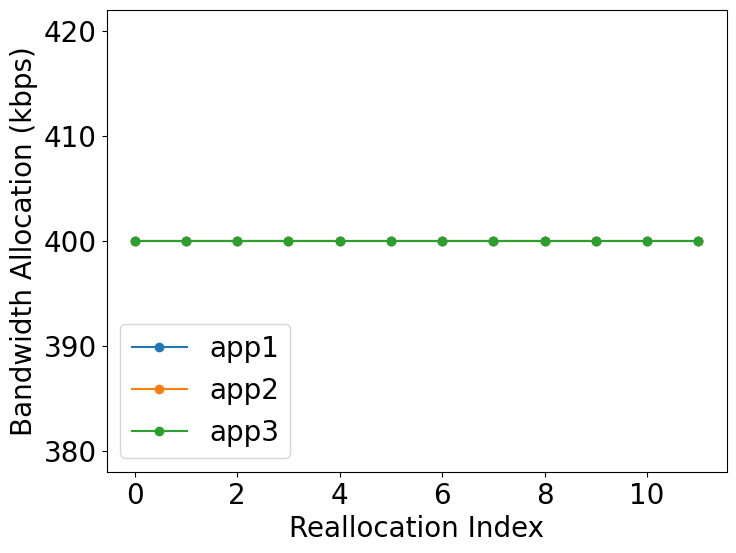

<style>
p {
  text-align: justify;
}

img {
  display: block;
  margin-left: auto;
  margin-right: auto;
}
</style>

# Introduction
Hello, it's me again, Faishal, a SoR project contributor for the edgebench project. For the past these two months, my mentors and I have been working on improving the performance of our system. In this report, I would like to share with you what we have been working on.

# Motivation
Edgebench is a project that focuses on how to efficiently distribute resource (bandwidth and cpu usage) across several video applications. Nowaday's video applications process its data or video on a server or known as edge computing, hence bandwidth or compute unit may be the greatest concern if we talk about edge computing in terms of WAN, because it is strictly limited. 

Consider the following case, suppose we have 3 video applications running that is located in several areas across a city. Suppose the total bandwidth allocated to those 3 video applications is also fixed. Naively, we may divide the bandwidth evenly to every camera in the system. We may have the following graph of the allocated bandwidth overtime. 



They are fixed and won’t change. However, every video application has its own characteristic to deliver such a good result or f1-score. It is our task to maintain high average f1-score. Therefore we need to implement a new solution which is accuracy-oriented. The accuracy-gradient[[1]]((#acc)) comes into this.

# System Design
On our current design, we need a resource allocator, namely concierge. This concierge determines how much bandwidth is needed for every video application (vap) in the system. Concierge will do the allocation at a certain time interval that has been determined before. This process is called profiling, on this process, the concierge will first ask every vap to calculate their f1-score at a certain video segment when the bandwidth is added by profile_delta. Then the difference of this f1-score is substracted by the default f1-score, namely `f1_diff_high`. After that, the concierge will ask to reduce its bandwidth by profile_delta and do the same process as before, this result will be named `f1_diff_low.` Those two results will be sent to the concierge for the next step. On the concierge, there will be sensitivity calculation, where sensitivity is

<!-- pada sistem yang kami desain, kami membutuhkan sebuah resource allocator yang kami namakan concierge. Concierge ini yang akan menentukan berapa besarnya bandwidth yang dibutuhkan pada tiap video application. Concierge akan melakukan penentuan bw dalam interval yang sudah ditentukan sebelumnya, pada tahap ini, concierge akan meminta kepada seluruh video aplikasi untuk menghitung f1-score pada segmen video tertentu ketika alokasi bandwidth pada aplikasi itu dinaikan sebesar delta yang sudah ditentukan pula. Setelah itu, the difference of f1-score disimpan pada variabel f1_diff_high. Lalu concierge akan meminta f1-score ketika bw akan diturunkan sebesar delta. Akan pula dihitung the difference-nya. Kedua hasil tersebut akan dikirimkan oleh video aplikasi kepada concierge untuk dilakukan perhitungan selanjutnya. -->


<!-- Pada concierge, akan dilakukan perhitungan sensitivity. Where sensitivity -->

$$sensitivity[i] = f1\_diff\_high[i] - \Sigma_{k=1}^nf1\_diff\_low[k]; k \neq i$$

This equation tells us which video application will give us the best f1-score improvement if we add more bandwidth to one vap while reducing other's bandwidth. From this, we will optimize and the concierge will give the bandwdith to the one with the highest sensitivity and take the bandwidth from the app with the lowest sensitvity.


# Results
As aforementioned, our main objective is to improve the accuracy. However, there are two parameters that will be taken into account which are improvement and the overhead of its improvement. We first choose 3 dds apps[[2]](#dds) that we think will be our ideal case. The following graphs show the profile of our ideal case


We can see that two of them have high sensitivity especially on lower bandwidth and one of them has low sensitivity. This is a perfect scenario since we may sacrifice one's bandwidth and give it to the app that has the highest sensitivity at that iteration. We will do the experiment under the following setup

```shell
DATASETS=("" "uav-1" "coldwater" "roppongi")
MAX_BW=1200
PROFILING_DELTA=80
MI=5
```

That setup block tells us we will use the total bandwith of 1200 kbps, that means at first we will distribute the bandwidth evenly (400 kbps). The profiling_delta will be 80 kbps and profiling interval (`MI`) will be 5 seconds.


| **Mode**      | *DDS* <br> (<span style="color:blue">*uav-1*</span>) | *DDS* <br> (<span style="color:orange">*coldwater*</span>) | *DDS* <br> (<span style="color:green">*roppongi*</span>) | Average |
| :----:        |    :----:   |    :----: | :----: | :----: |
| Baseline      | 0.042       | 0.913   | 0.551 | 0.502 |
| **Concierge**   | 0.542        | 0.854    | 0.495 | **0.63** (<span style="color:green">*+25.5%*</span>) |


From the result, we managed to improve the average f1-score by **0.1** or **25.5%**. This is obviously a very good result. There are a total of 10 videos in our dataset, for the next experiment, we first will generate 6 combinations of dds apps. Noted that for each combination, one video will be uav-1 since we know that it has the highest sensitivity. We will the experiment with 4 bandwidth scenarios **(1200, 1500, 1800, 2100)** in kbps.
<!-- dari hasil tersebut, kita telah berhasil meng-improve rata-rata f1-score sebesar 0.1 atau 13.5% Hal ini tentu saja merupakan sebuah hasil yang sangat baik. Selanjutnya kami melakukan tes yang sama namun dengan video yang berbeda. setupnya demikian  -->


The left figure depicts the average improvement of the concierge. Here we can see that the improvement decreases when the total bandwidth increases. The reason behind this is at a higher bandwidth, the sensitivity tends to be closer to 0 and the concierge won't do any allocation. Overall, this confirms our previous result that with the help of uav-1, the concierge can improve the f1-score up to 0.1. The next experiment is to randomly pick 3 dds videos out of 10 videos that will be generated 10 times. We would like to see how it perfoms without any help of uav-1.


From the result, we still managed to get the improvement. However, it seems that average improvement decreases compared to the previous one. The reason of this phenomenon will be discussed later.

## Overhead Measurement

The important thing of proposing a new method is taking care of the overhead. In this experiment, we will calculate the overhead at certain total bandwidths and monitor intervals (`MI`).


From the graph above, each graph represents the total bandwidth used. It is clearly known that the lower `MI` leads to higher overhead since there would be more profiling process than the higher `MI`. From the 4 graphs above, it can be known that there would be a significant trade off if we lower the `MI` since the improvement itself is not highly significant (1%). The highest improvement is at 1200kbps. Hence, for higher bandwidth, there is no need to do the profiling too often.


# Discussion
There are some limitations of our current design. If we have a look at box-plot in figure 5 above, we can see that there is some combinations where the improvement is negative.


The figure above depicts the profiling process from the segment 6 to determine the bandwidth used at segment 7. Here we can see that the f1-score at that bandwidth for (<span style="color:blue">*jakarta*</span>) drops significantly. Our current design cannot address this issue yet since we only consider current video segment. There is a need to not only look at current segment, but also the previous and the future segment should be taken into account as well.

Regarding the overhead, we are aware that 50% overhead is still considered bad. We might as well try the dynamic `MI` or skip the profiling for certain video if not neccesarry.


# Conclusion
Regardless the aforementioned limitations, this report shows that the concierge is generally capable of giving an f1-score improvement. The update of the next will be shown in the final report later.

# References 
<a id="acc">[1]</a> https://drive.google.com/file/d/1U_o0IwYcBNF98cb5K_h56Nl-bQJSAtMj/view?usp=sharing <br>
<a id="dds">[2]</a> Kuntai Du, Ahsan Pervaiz, Xin Yuan, Aakanksha Chowdhery, Qizheng Zhang, Henry Hoffmann, and Junchen Jiang. 2020. Server-driven video streaming for deep learning inference. In Proceedings of the Annual conference of the ACM Special Interest Group on Data Communication on the applications, technologies, architectures, and protocols for computer communication. 557–570.