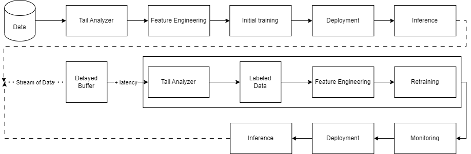
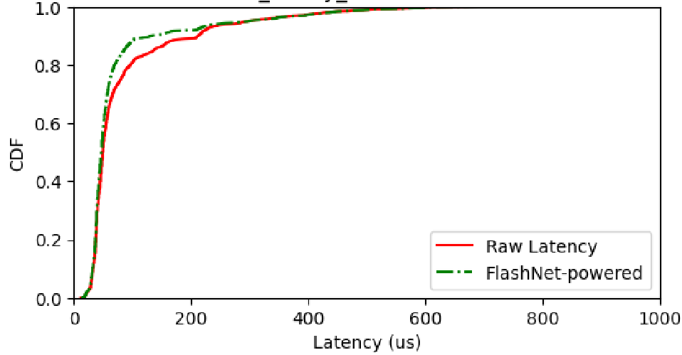

## Mid-Term Report

As part of the [FlashNet](/project/osre23/uchicago/flashnet) my [proposal](https://drive.google.com/file/d/1EhJm3kqrpybOkpXiiRMfqVxGeKe9iIsh/view?usp=sharing) under the mentorship of {} and **Daniar Kurniawan** aims to implement and optimize the FlashNet model in real-world storage systems using continual learning techniques. We focus on predicting I/Os latency to decide whether or not the I/O should be failovered to other SSD. The following sections elaborates the work description, major milestones achieved, accomplishments, and challenges during the first half of summer.

## Work Description, Major Milestones Achieved, and Accomplishments

For the first half of the summer, I implemented continual learning pipeline of the model and several drift detection algorithms. After that, I evaluated the effectiveness. Below are the detailed description for each subtask.

### 1. Continual Learning pipeline

Firstly, I designed the pipeline. As shown on the graph below, the pipeline contains 4 main modules, namely initial train, retrain, inference, and monitor.

The modules were first developed in Python using linear regression model. Turns out, linear regression model is not good enough that it gave bad accuracy. To overcome this problem, I introduced more models and learning task.

Hence, in the final implementation, we have random forest and neural networks model for both regression and classification task. Aforementioned models outperforms linear regression. The pipeline is also already optimized.

### 2. Drift detection algorithms

Sometimes, the built model's performance may degrade when facing recent I/Os having different characteristics than what it was trained upon. Hence, there should be a retrain process. Retrain should be triggered. The trigger could be as simple as periodically, or using technique called drift detection. While retraining too often might cause big overhead for computation, retraining too seldom might also cause performance degradation. Hence, we should build a good and reliable drift detection algorithm that can sense the presence of concept and covariate drift in recent data.

In order to build a good algorithm, I used heuristics derivated from the understanding about latency and throughput change over time. However, the result turns out not really good. Thus, I've been relying on using statistical tests as the drift detector. By far, Kalmogorov-Smirnov Test--commonly known as ks-test--is the best drift detector.

### 3. Evaluation

The featured image in the headline of this blog, also shown below, is the result of the evaluation. I evaluated the models and drift detection algorithms using Cumulative Distribution Function (CDF) graph, to see if any tail cut is made.

## Challenges

During the implementation, I encountered several challenges as follows,

### 1. Choice of Model

Since we want to integrate the pipeline to real storage systems, we had to be mindful of model choice. Machine learning based models are lighter than deep learning based models. However, deep learning based models offer higher accuracy, thus more preferable. Hence, I implemented both and examine the effectivity of the models.

### 2. Choice of Drift Detection Algorithm

Continual learning technique is chosen for this task may require the model to be retrained since the workload may change over time. However, the implication is we need to have a condition that triggers the retraining to be done. As training model is costly, we need to retrain it mindfully. Thus, we use drift detection algorithm to detect whether or not retraining is needed.

There are two types of drift detection algorithms, namely statistical based test and model based drift detection. For minimizing overhead reason, we pick statistical tests. There exists various algorithms of choice. I picked 5 of them to be implemented and evaluated.

## Plan

For the second half of the summer, I am going to study Riak and create Chameleon Trovi artifact for deploying Riak in a cluster.
