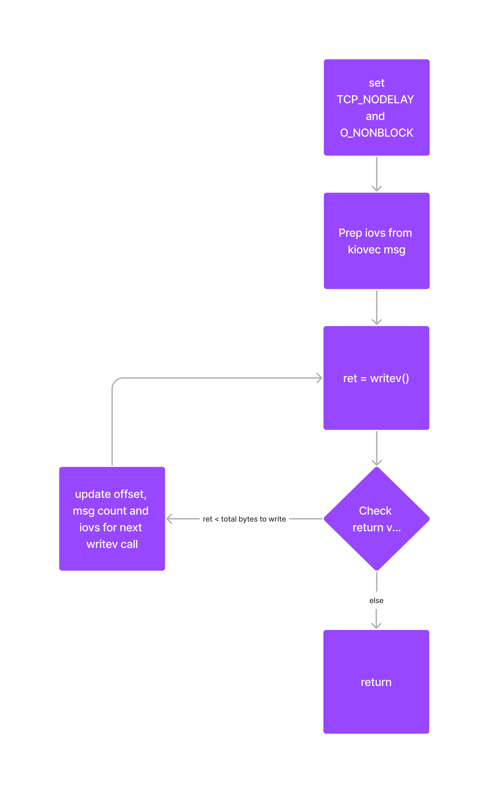
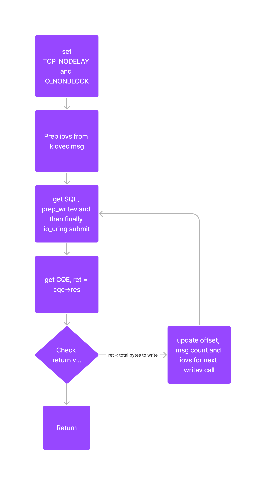
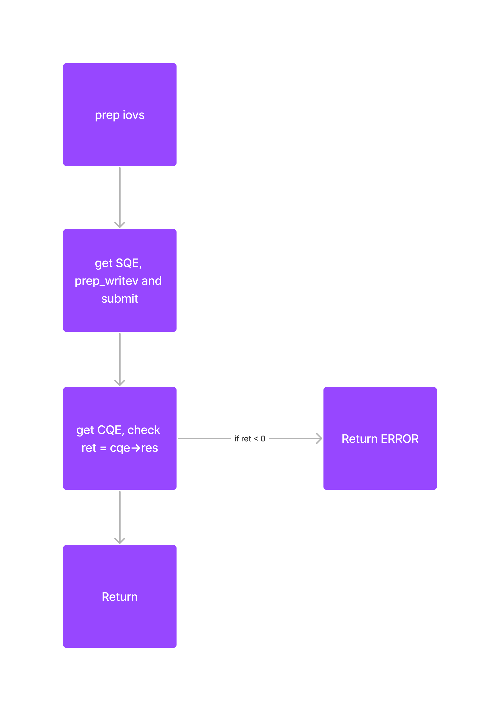

---
title: "Implemented IO uring for Key-Value Drives"
subtitle: "but still searching for the improvement"
summary: ""
authors: [manank]
author_notes: ["Student at BITS Pilani"]
tags: ["osre23"]
categories: [GSoC'23]
date: 2023-07-31
lastmod: 2023-07-31
featured: false
draft: false

# Featured image

# To use, add an image named `featured.jpg/png` to your page's folder.

# Focal points: Smart, Center, TopLeft, Top, TopRight, Left, Right, BottomLeft, Bottom, BottomRight.

image:
caption: ""
focal_point: ""
preview_only: false
---

Hi everyone! 

I'm Manank Patel, ([link](/report/osre23/ucsc/kvstore/20230526-manank) to my Introduction post) and am currently working on [Efficient Communication with Key/Value Storage Devices](/project/osre23/ucsc/kvstore). The goal of the project was to leverage the capabilities of io_uring and implement a new backend driver. 


In the existing sockets backend, we use non-blocking sockets with looping to ensure all the data is written. Here is a simplified flow diagram for the
same. The reasoning behind using non blocking sockets and TCP_NODELAY is to get proper network utilization. This snippet from the code explains it further.

```

NODELAY means that segments are always sent as soon as possible,
even if there is only a small amount of data. When not set,
data is buffered until there is a sufficient amount to send out,
thereby avoiding the frequent sending of small packets, which
results in poor utilization of the network. This option is
overridden by TCP_CORK; however, setting this option forces
an explicit flush of pending output, even if TCP_CORK is
currently set.

```



In the above figure, we have a [loop](https://gitlab.com/kinetic-storage/libkinetic/-/blob/manank/src/ktli_socket.c?ref_type=heads#L436) with a writev call, and we check the return value and if all the data has not been written, then we modify the
offsets and then loop again, otherwise, if all the data has been written, we exit the loop and return from the function. Now this works well with traditional sockets, as we get the return value from the writev call as soon as it returns. In case of io_uring, if we try to follow the same design, we get the
following flow diagram.


Here, as you can see, there are many additional steps/overhead if we want to check the return value before sending the 
next writev, as we need to know how many bytes has been written till now to change the offsets and issue 
the next request accordingly. Thus, in every iteration of the loop we need to to get an sqe, prep it for writev, then
submit it, and then get a CQE, and then wait for the CQE to get the return value of writev call.

The alternate approach would be to write the full message/iovec atomically in one call, as shown in following diagram.



However, on trying this method, and running fio tests, we noticed that it worked well with smaller block sizes, like
16k, 32k and 64k, but was failing constantly with larger block sizes like 512k or 1m. This was because it was not able to 
write all the data to the socket in one go. This method showed good results as compared to sockets backend (for small BS
i.e). We tried to increase the send/recv buffers to 1MiB-10MiB but it still struggled with larger blocksizes.

Going forward, we discussed a few ideas to understand the performance trade-offs. One is to use a static variable and increment it on
every loop iteration, in this way we can find out if that is really the contirbuting factor to our problem. Another idea
is to break down the message in small chunks, say 256k and and set up io uring with sqe polling and then link and submit
those requests in loop, without calling io_uring_submit and waiting for CQE. The plan is to try these ideas, discuss and
come up with new ideas on how we can leverage io_uring for ktli backend.


