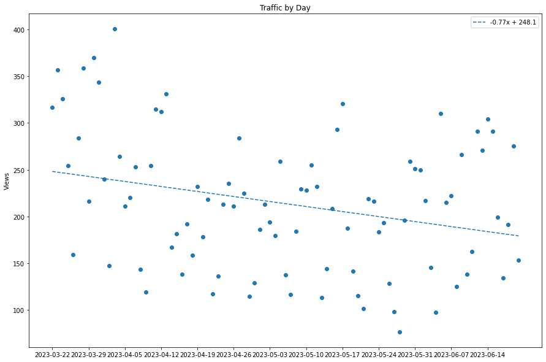
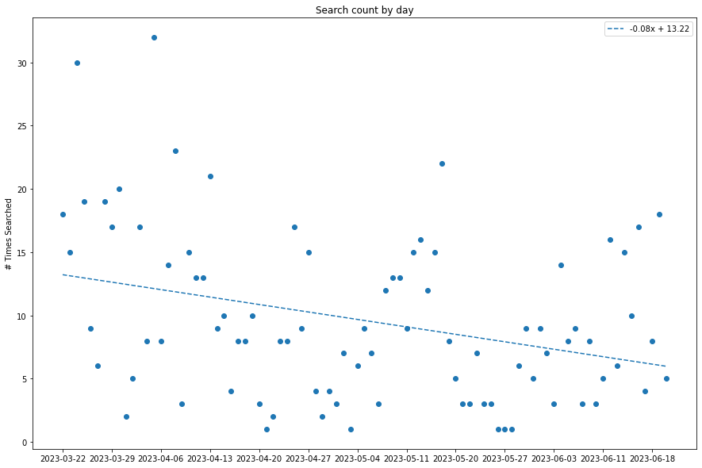

## Introduction

Hello again! This is Jack, a GSoC contributor for the OpenROAD Project. 
My task is to update and optimise the documentation to encourage user
adoption and engagement.

For open-source repo maintainers, [readthedocs](https://readthedocs.org/) 
is a godsend. One of its more underrated features are in providing
search and traffic analytics of up to **90 days** for the `Community` tier 
users. This is awesome, because ReadTheDocs is "always free for open source
and community projects". 

## Motivation

Why are analytics important? 

Analytics are great as a *proxy* indicator for documentation engagement.
For instance, traffic to a page, could highlight how popular the tool is,
or it could also mean the tool is unclear and therefore people might need
more visits to the page to further understand usage. But overall,
it still indicates that the page needs to be taken care of due to the
increased visits. 

In what follows we aim to provide a quick tutorial as well as
list out some of the actionable insights we uncovered in the 
OpenROAD/OpenROAD-flow-scripts documentation project.

## Preamble

To download the analytics raw `csv` files, refer to this
[website](https://docs.readthedocs.io/en/stable/analytics.html).

You should also have the following packages installed: `pandas`, `numpy`, `matplotlib`, `scipy`.

## Traffic Analytics

Traffic analytics are easy to understand. 
It comes in the format `Date`, `Version`, `Path`, `DailyViews` as follows:

```python
df = pd.read_csv('ta_or.csv')[::-1].reset_index(drop=True)
df.Date = df.Date.apply(lambda x: x.split()[0])
df.head()
```


The raw data is not all that informative. 
Let us aggregate the data to obtain the weekly views.

```python
weeklydf = df.copy()
weeklydf.Date = pd.to_datetime(weeklydf.Date) - pd.to_timedelta(7, unit='d')
weeklydf = weeklydf.groupby(['Path', pd.Grouper(key='Date', freq='W')])['Views']\
            .sum()\
            .reset_index()\
            .sort_values('Date')
weeklydf[weeklydf.Path == '/index.html']
```


Note that we can replace the page path with any interesting page path 
we desire. A useful command to obtain all possible page paths in this 
dataset is to use: 

```python
weeklydf.Path.unique()
```


With these neat data in our arsenal, let us do some plotting! 
For the visualisation, we have chosen to use the traffic aggregated
on a daily scale. On top of this, we also plot a linear 
best-fit line of all the points to track the trendline over time. 

The code below shows how to plot the top 20 pages. 

```python
def plot_views(df, numPages = 20):
    # Groupby Path, sum views
    pathResults = df.groupby('Path').Views.sum().sort_values(ascending=False)
    fig, ax = plt.subplots(numPages, figsize = (15,30))
    fig.tight_layout()

    for i in range(numPages):
        key = pathResults.index[i]
        temp = df[df.Path == key]
        ax[i].scatter(temp.Date, temp.Views)
        ax[i].set_xticks(np.arange(0,90, 7))  # this line is to not clutter the x-axis too much.
        ax[i].set_ylabel('Views')
        ax[i].set_title(key)

        # linear regression
        x, y = temp.Date, temp.Views
        bestfit = stats.linregress(range(len(y)),y)
        print(bestfit)
        equation = str(round(bestfit[0],2)) + "x + " + str(round(bestfit[1],2))
        ax[i].plot(range(len(y)), np.poly1d(np.polyfit(range(len(y)), y, 1))(range(len(y))), '--',label=equation)
        ax[i].legend(loc='upper right')
```

"

Also, we can aggregate the total views by day to plot daily traffic:

```python
def plot_daily_traffic(df):
    # Groupby Date, sum views
    fig = plt.figure(figsize = (15,10))
    dateResults = df.groupby('Date').Views.sum()
    x, y = dateResults.index, dateResults.values
    plt.scatter(x, y)
    plt.xticks(np.arange(0,90, 7))
    plt.ylabel('Views')
    plt.title('Traffic by Day')

    # linear regression
    bestfit = stats.linregress(range(len(y)),y)
    print(bestfit)
    equation = str(round(bestfit[0],2)) + "x + " + str(round(bestfit[1],2)) 
    plt.plot(range(len(y)), np.poly1d(np.polyfit(range(len(y)), y, 1))(range(len(y))), '--',label=equation)
    plt.legend(loc='upper right')
```



### Key Trends:

- Notice how there seems to be a cyclical pattern every week - rise 
in average view counts during Mon-Fri, then a falloff on weekends. 
This is most evident in the pages `/index.html`, `/main/README.html`. 
This could be attributed to the standard work or study week of Mon-Fri.

- According to the gradient of the best-fit line for Figure 2, 
there seems to be a slow decline of traffic for the OpenROAD docs. 
For a gradient of -0.77, it translates roughly to decline of 22 views
per month. The small decline could be attributed to the higher traffic 
from 19-29 March 2023, the dates for the 
[OpenROAD 7nm design contest](https://openroaddesigncontest.org/). 
Contest are always good for driving traffic.  

### Actionable insights:

- Top pages are usually landing pages: `index.html`, `main/README.html`, `main/src/README.html`. We thus prioritised making these pages more readable and concise. 

- This is followed by tutorial `/tutorials/index.html` and `/search.html`. The prominence of the tutorials page made us shift the tutorials link to a higher position on the left navigation sidebar. Search tips were also included to obtain better search results. More about search in the next section.

- Next, as OpenROAD consists of 20 tools: traffic analytics helps us come up with an order to update: `ifp`, `gui`, `odb`, `ppl`, `sta`, `grt`, `mpl`, `gpl`, `rsz`, `rcx`. `pdn`, `cts`, `psm`

## Search Analytics

Search analytics come in the form of: `Date`, `Query`, `TotalResults`. 
Contrary to traffic analytics, `TotalResults` do not refer to search count
for the query that day, but rather it corresponds to the total results
returned by that query on that day. Separate aggregation still needs to
be done to obtain the final count.

Firstly, let us load the dataset and perform a groupby on the column `Date`
to obtain the daily count aggregates.

```python
df = pd.read_csv('sa_or.csv')[::-1].reset_index(drop=True)
df = df.rename(columns ={'Created Date': 'Date', 'Total Results': 'TotalResults'})
df.Date = df.Date.apply(lambda x: x.split()[0])

dateResults = df.groupby('Date').TotalResults.count()
dateResults
```


Now we are ready to plot the daily aggregated searches. This represents 
the number of times a search was performed on the documentation website.

```python
def plot_daily_searches(df):
    dateResults = df.groupby('Date').TotalResults.count()
    x, y = dateResults.index, dateResults.values
    plt.scatter(x, y)
    plt.xticks(np.arange(0,90, 7))
    plt.ylabel('# Times Searched')
    plt.title('Search count by day')

    # linear regression
    bestfit = stats.linregress(range(len(y)),y)
    print(bestfit)
    equation = str(round(bestfit[0],2)) + "x + " + str(round(bestfit[1],2)) 
    plt.plot(range(len(y)), np.poly1d(np.polyfit(range(len(y)), y, 1))(range(len(y))), '--',label=equation)
    plt.legend(loc='upper right')
```



We can also do an additional plot for queries that return zero results. 
In other words, we are interested in the terms people are curious about;
but is not covered by our documentation currently. 
Think of it as an on-site search engine optimisation. 

```python
zeroResults = df[df.TotalResults == 0]
zeroResults = zeroResults.groupby('Query').Date.count().sort_values(ascending=False)
print('\nAll 0 results queries (desc)\n')
print(zeroResults.index.tolist())
```

Example output as follows:
```
['autotuner', 'tdms', '*macro*', 'rtlmp_max_inst', 'get_property',
'check_setup', 'centos', 'initialize_padring', 'core_utilization',
'pin_access', 'read_libraries', 'config', 'eco', 'rpt',
'improve_placement', 'define_process_corner', 'global_place',
'report_worst_slack', 'max_phi_cof', 'report_power', 'get_pins',
'registerfile', 'set_global_routing', 'prebuilt', 'env', 
'repair_clock_inverters', 'set_thread_count', 'report_',
'partition_design', 'place_cell', 'blockage', 'partitionmgr',
'nmos', 'tuner', 'write_sdf', 'place_density', 'place_pins_args',
'size_cell', '*macor*', 'repair_clock_inverter', 'misk',
'readhaty', 'readhat', 'obstruct', 'odbpy', 'openpdn', 'openram',
'placement_cfg', 'read_macro_placement', 'output_drc', 'positon',
'pct', 'qrctechtable', 'qrctechfile', 'qrctech', 'qrc',
'properly covered', 'precision innovations', 'repeater', '"rcx-0487"',
'report_worst', 'report_area', 'report_clock_properties', 'skywater',
'study', 'sv', 'synth', 'synth_hierarchical', 'systemverilog',
'tdm', 'tdms_place', 'triton', 'ungroup', 'verilog_files',
'wrc', 'write_lef', 'write_partition_verilog', 'שואם',
'si2', 'sever', 'setrc', 'rtl_macro', 'report_dcalc', 'report_design',
'report_design_info', 'report_instance', 'report_slews', 'resize',
'rtlmp', 'set_power_activity', 'rtree', 'run_all', 'run_all.tcl',
'sc', 'set_all_input_output_delays', 'set_io_pin_constraints', 'metis', 
'lefdef', 'make_result_file', 'macro_placement_cfg', 'clock__details',
'clocks__details', 'combinational', 'config.mk', 'coord',
'core_margin', 'db_process_node', 'dbblocjs', 'dbdatabase',
'dbr', 'dbrt', 'dbrttree', 'debian', 'define_pin_shape',
'densiy', 'desgin', 'diff_file', 'clk_period', 'clk_io_ptc',
'cdl', 'analog', './env.sh', '178', '6_final',
'6_final.odb', '_placement', 'abat', 'add_stripe', 'arch',
'ccs', 'binaries', 'bookshelf', 'buff_cell', 'buildwithdocker',
'busbitchars', 'buschar', 'captable', 'directoryobject',
'disallow_one_site_gaps', 'distribute', 'is_port', 'hierarch',
'hop', 'hyper', 'initialie_flooorplan', 'initialize_flooorplan',
'instance_count', 'is_chip', 'lean', 'gui_final', 'lec',
'*def*', 'limitation', 'lyp', 'maco', 'macro_pin',
'macro_place', 'harness', 'gui.py', 'dont', 'fill_cell',
'dreamplace', 'em', 'enable_dpo', 'energy', 'env.sh', 'erc',
'export', 'findmaste', 'grt_layer_adjustments', 'findmaster',
'freepdk45', 'gdt', 'global_', 'global_place_db',
'global_placementy', 'graph', '갲']
```

For our case we can roughly the problem with these zero-result queries fall
under one of these categories:

- Missing documentation: Either the parameter of functionality 
- Typo: User has the right keyword, but did not type it correctly. We will therefore provide them with search [tips](https://openroad-flow-scripts.readthedocs.io/en/latest/user/FAQS.html#how-do-i-get-better-search-results) such as using fuzziness `~N` operator for better matches. 

## Future Work

ReadTheDocs could also be linked with 
[Google Analytics](https://analytics.google.com/analytics/web/provision/#/provision), 
but this remains for more advanced users. 

Another rich source of information helpful to open-source maintainers 
are GitHub issues. These are the direct platform where users discuss 
their problems. Another great way to track documentation engagement 
is to use metrics such as: installation issues per unit week, 
or user-issue retention rate, which tracks the number of users 
that continue to file issues after their first. 

## Conclusion

This post showcases the amount of insight one can gather from parsing
traffic and search analytics. It also provides useful Python functions
that can be applied to the analytics dataset for fast prototyping
and experimentation. If you are a contributor to open-source projects,
try uncovering some insights for your doc pages today!
