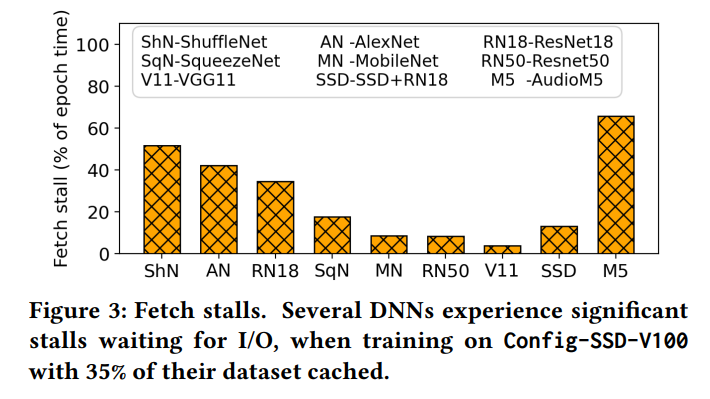
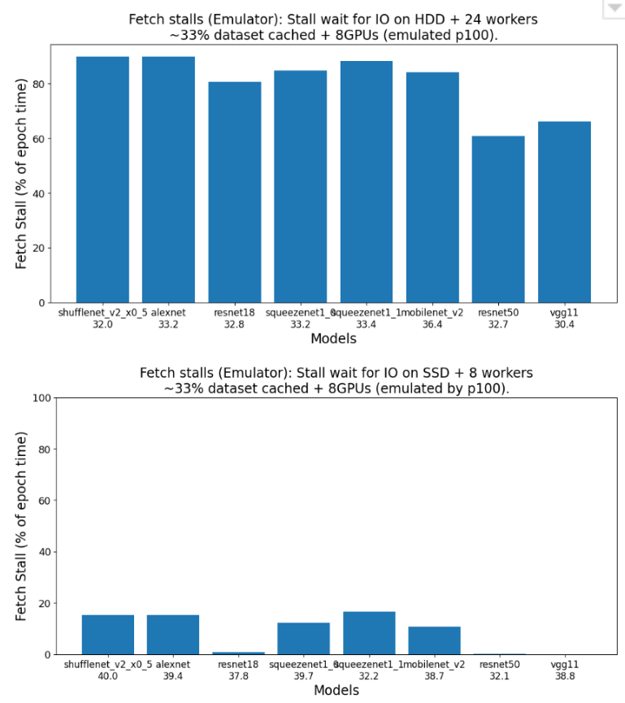
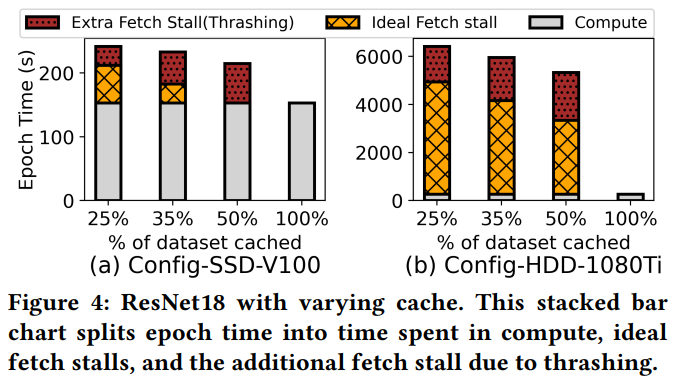
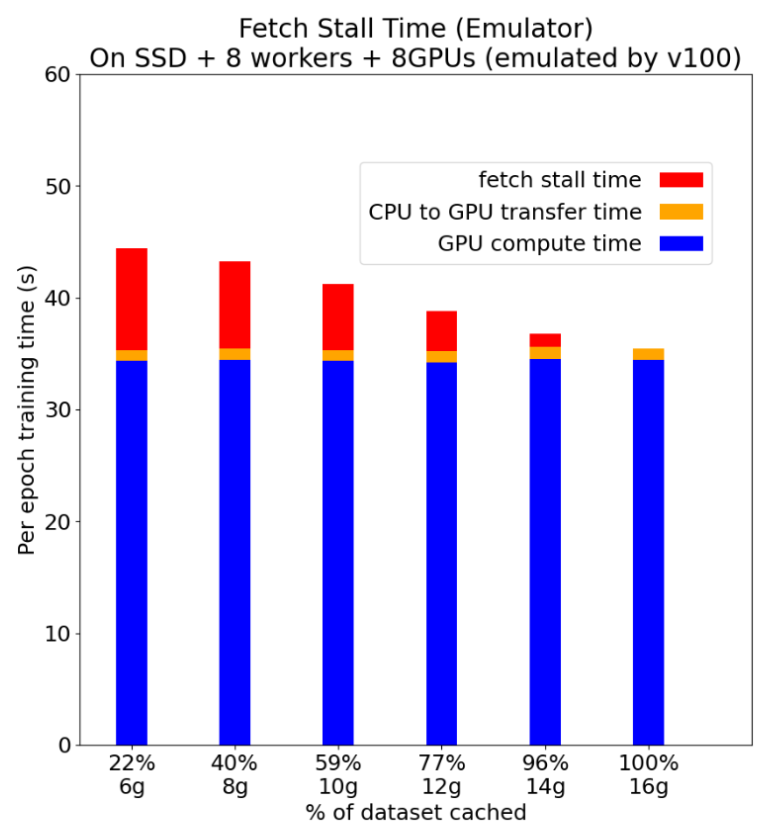
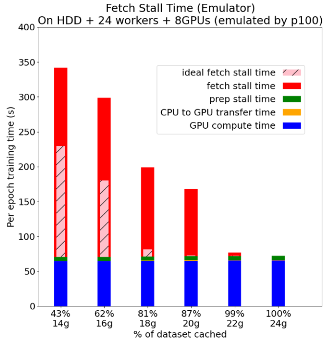
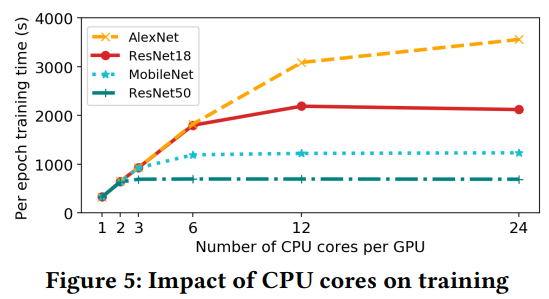
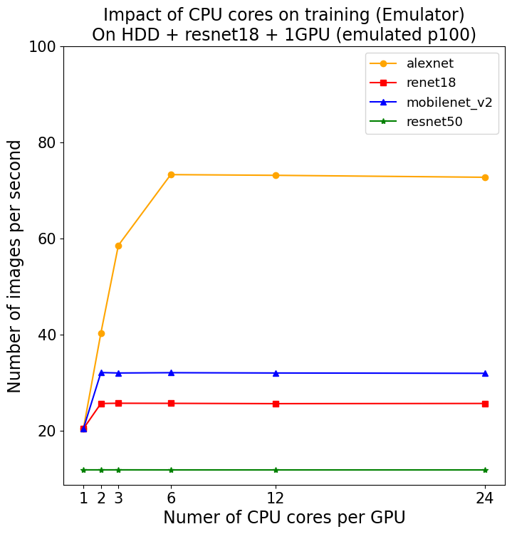
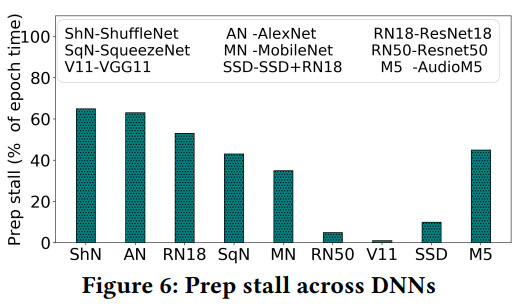
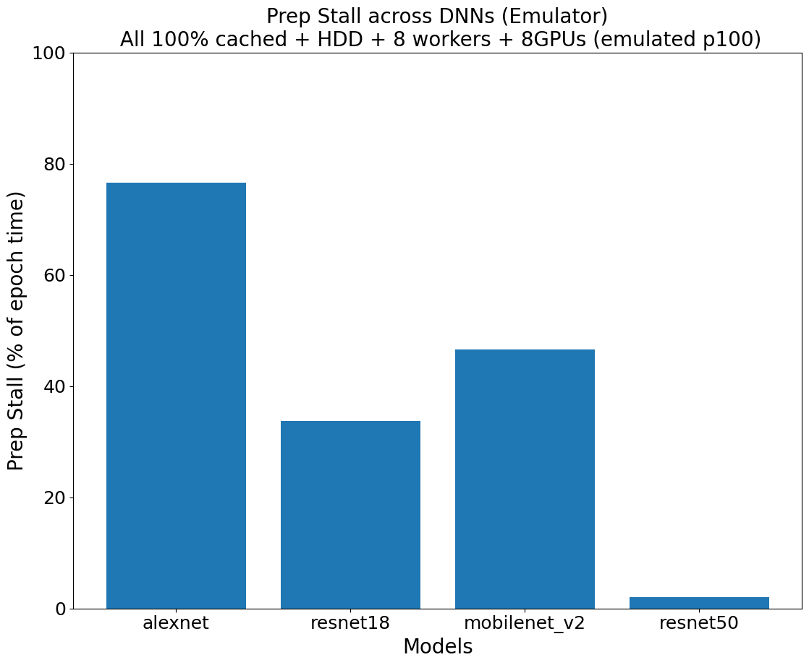

## Introduction
#### Motivation
The growing popularity of Deep Neural Networks has resulted in a substantial increase in demand for Graphics Processing Units (GPUs). GPUs are crucial for conducting matrix computations in DNN training and inference. However, they are expensive to purchase for personal use, and the limited availability of GPU resources in public research clouds like Chameleon further exacerbates the issue. This scarcity of resources can cause delays in DNN-related research projects. Therefore, building an emulator can ameliorate the trouble of reserving GPUs, and the emulator can be modified to gather the profiles needed for optimization much quicker. 
#### Overture
The follwing sections will introduce the completed tasks and specify the details within each. The contents are briefly summarized and will try to present the necessary information only. We finished the following tasks: 
* Literature Review
* Emulator implementation: 
  * Time Profiling
  * Pinned Memory
  * Inter-GPUs Computation
* Reproducing Figures

I will introduce them and the importance of each one. 
## Tasks + Reason
#### Literature Review
While waiting for the measurements, I started reading about other GPU-related papers, especially the ones about GPU Schedulers. We found that besides emulating computation and transfer time, we should also emulate the GPU memory profile in order to reproduce some other papers. Fortunately, it’s doable. In fact, without actually using a GPU, we can emulate many aspects of the GPU, more than just its timing. I found several papers that are reproducible theoretically, but they use Tensorflow while my current work targets Pytorch. Therefore I need to keep looking for the ones that use Pytorch.

Afterwards, we started doing more paper reviews and looked over the papers about GPU Scheduling from 2018-2023 to see if we can reproduce figures from other papers. We went over 150 papers to search for the ones that do have implementation in PyTorch and the complemented GitHub page. We managed to find about 15 papers built in PyTorch and 6 of them were published on GitHub. 

We found the paper “CoGNN: Efficient Scheduling for Concurrent GNN Training on GPUs” and its GitHub page. The paper has three badges of “Artifacts Available, Evaluated, and Reproduced.” The paper’s content is implemented in PyTorch which means we can probably emulate this paper’s result with the emulator we already have by adding more features. We have started testing out to see if we can set up a similar environment and reproduce the experiments in the paper. After checking out the reproducibility of the paper, we will try to reproduce it using our emulator, and we might add new features to our emulator during this process. 

Firstly, I tried to reproduce the figures in the paper “CoGNN: Efficient Scheduling for Concurrent GNN Training on GPUs”, but stopped after a considerable number of attempts because the README was incomplete and too hard to follow. I first headed to the GitHub of the paper. I read the paper and understood that the GNN’s training was not the same as regular deep learning training, because it had input irregularity, and CoGNN helped better schedule the jobs to the machines by their algorithm. However, when I tried to install the software by the requirement of their environment README in order to reproduce the figures, many dependency issues were there, and barely any packages required were installed successfully. Their README in the software module was unclear on how to run the experiments too. Following the experiment setup did not give me the expected results. After a set of struggles with even completing one suggested experiment, we eventually decided to move on with other papers and abandoned this paper, reminding me the importance of reproducibility again. 

Secondly, we found another paper “Beware of Fragmentation: Scheduling GPU-Sharing Workloads with Fragmentation Gradient Descent”. After reading the paper, we figured that the main focus was on distributing the resources (CPU, GPU) of the nodes to the jobs that were distributed by the Kubernetes Scheduler. In this way, there would be less GPU fragmentation and a higher utility rate of the resources. The paper used a simulator to simulate a large number of nodes and run the jobs by simulation. I successfully ran the experiments demonstrated in the repo and even created a smaller sample so that we could gain the result faster, because their original experiment takes 1020 times which will take about a month. However, when we dug deeper into their paper, we soon realized that their emulator is not a “real” one. Although their emulator is built off Kubernetes, the side where they used to create the figures are mere simulators and therefore doesn’t fit with our goal of emulating only GPU-related parts while running other real-system parts. 
##### Reason: 
The purpose is to figure out which papers can be reproduced using the emulator, and what other features are needed for the emulator to work. 

#### Emulator implementation
##### Time Profiling
I did the performance profiling of different GPUs, which included CPU-to-GPU data transfer time and GPU computation time. These two elements will always be rather constant on GPUs so they can be easily emulated by profiling first and then utilized in the emulation. We did it for 6 different GPUs including k80, rtx6000, m40, a100pcie, v100, and p100. 

After having the performance profiling information of a few types of GPU nodes, I implemented the first naive version of the emulator. I used the profile recorded and sleep() function to represent the amount of time that each step needs to accomplish. Meanwhile, the time also varies with the command given so some simple arithmetics were implemented too. It’s implemented on a CPU node yet if we want to know the time profile of a GPU, we can still get them just like on a real GPU node. 
##### Reason: 
The time profile collected can be compared with Data Wait Time to conduct research on minimizing pipeline stall across different GPUs and models. 
##### Pinned Memory
Pin memory threads – GPU-based Pytorch utilizes such threads to copy data from SHM to pinned memory, but CPU-based Pytorch doesn’t do so. Therefore, I need to implement an emulation of the pin mem threads. Fortunately, the data copy time is predictable. I have already found out that pin mem time has little to do with # of workers or the model type but only the batch size. I still need to find out if it has anything to do with the GPU nodes, which I assume not at this point. 

While implementing the features, We first emulated the CPU-to-GPU transfer time and GPU computation time for the p100 GPU based on the profiled information. Another CUDA behavior that requires emulation is that CUDA copies data from shared memory to pinned memory. In order to emulate it, we measured and emulated the time for copying such data (pinned memory). However, the emulator did not behave exactly as the real GPU. This was because we only emulated the time cost of using pinned_memory, but didn’t emulate its memory cost. In order to resolve the problem above, we wrote a CPython module to manually allocate page-locked memory (which behaves the same as CUDA’s pinned_memory). After we implemented this mechanism, the emulator’s fundamental functions were equipped and properly mimicked CUDA’s behaviors.
##### Reason: 
After collecting the GPU profile, I did a comparison with the actual GPU but noticed some differences in their IO time, meaning there was a difference between the emulation-based Pytorch and the actual GPU-based Pytorch. 
##### Inter-GPUs Computation
We worked on the emulation of inter-GPU computation time in order to emulate Figure 9 in the DNN stall paper. This is one of the influential factors in multi-GPU training and we decided to first figure out how to implement this feature. As claimed in the paper, the larger the batch size, the less time it took to update the model. However, our current emulator would give out the same computation time since we have not added features to emulate inter-GPU behaviors. The smaller the batch size, more overheads were proven to be larger. The first step was to rent a lease that had 2 GPUs and saw the effects of inter-GPUs on computation time. We found that there was a small amount of overhead when running two GPUs instead of 1 GPU on the p100 node. My job was to find out where and how these overheads happened and find ways to emulate these features in order to reproduce Figure 9. We used resnet18, 4 workers, 10 batches to separately run 128 batch-size with 1 GPU (Group A) and 256 batch-size with 2 GPUs (Group B). With our current emulator, we would get the same computation time for both experiments to finish 1 batch. However, we saw that the computation time of Group B was longer than Group A, meaning there were some overheads in computation time. I then hacked into the source code of PyTorch and successfully figured out one part of the overhead contributing factors. 
##### Reason: 
To better complete the emulator so that it can procide accurate emulation even when using more than 1 GPU on a machine. 

#### Reproducing Figures 
After implementing the emulator, we managed to use it to reproduce Figures 3, 4, 5, and 6 in the paper [“Analyzing and Mitigating Data Stalls in DNN Training”](chrome-extension://efaidnbmnnnibpcajpcglclefindmkaj/https://vldb.org/pvldb/vol14/p771-mohan.pdf) after a series of experiments and testing. It was noted that some environments in the paper were not the same as what we ran in the past week, but general patterns did apply to the expected hypothesis and measurements. We double checked all the data and figures produced and found out that our prototype meets our expectations, and it was time to look for other papers to reproduce to make the emulator more interesting. 
The orginial comparing with the reproduced figures are demonstrated as below, you can notice that the patterns do reflect our expected results: 
Original Figure 3: 

Reproduced Figure 3: 

Original Figure 4: 

Reproduced Figure 4: 

Original Figure 5: 

Reproduced Figure 5: 

Original Figure 6: 

Reproduced Figure 6: 

##### Reason: 
Our origninal goal was to reproduce papers. Therefore, reproducing figures is a really good step to achieve that. 

## Summary + Coming Future
We will keep on trying to complete the emulator and figure out the exact mechanisms needed for the implementation. We will also seek for more features and see if it's possible to add in better features into the emulator. 

