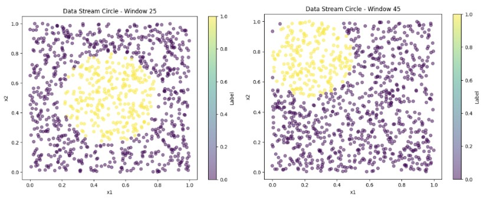
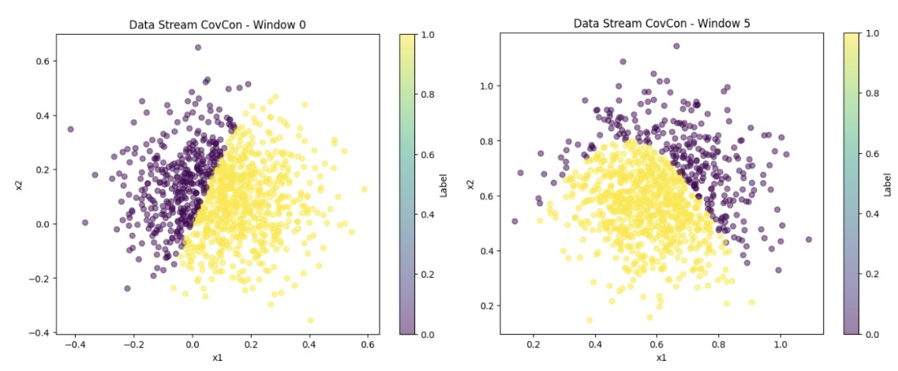
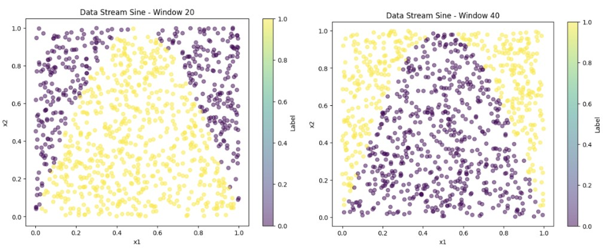
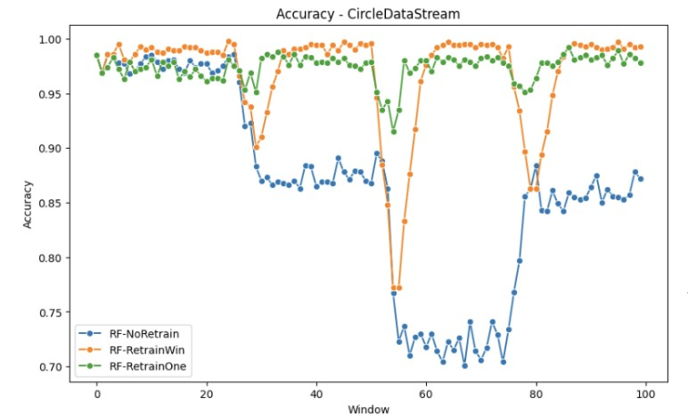
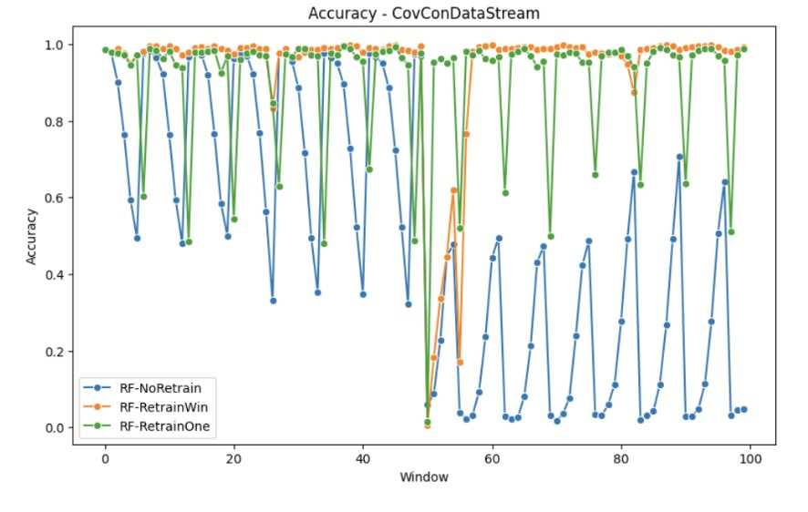
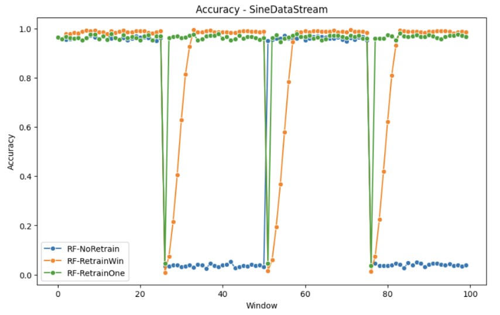

Hello there! I'm William and I'm thrilled to share the progress on my project, "Developing A Comprehensive Pipeline to Benchmark Drift Management Approaches" under the mentorship of {} and {} under the [LAST](/project/osre24/anl/last) project.

# Project Overview
If you're not familiar with it, this project aims to address the issue of model aging, where machine learning (ML) models experience a decline in effectiveness over time due to environmental changes, known as drift. My goal is to design an extensible pipeline that evaluates and benchmarks the robustness of state-of-the-art algorithms in addressing these drifts. 

# Progress
So far, I've generated various synthetic datasets, which include:
- CIRCLE: This dataset contains two features x1, x2 drawn uniformly from the interval [0, 1]. Each data point is labeled as per the condition (x1 − c1)^2 + (x2 − c2)^2 <= r where the center (c1, c2) and radius r of the circular decision boundary changes gradually over a period of time introducing (gradual) concept drift.

- COVCON: This 2-dimensional dataset has covariate shift and concept drift. The decision boundary at each point is given by α ∗ sin(πx1) > x2. We use 10000 points (100 batches, 1000 points per batch). Covariate shift is introduced by changing the location of x1 and x2 (for batch t x1 and x2). Concept drift is introduced by alternating the value of α.

- SINE: This dataset contains two features x1, x2 drawn uniformly from the interval [0, 1]. In the first context all points below the curve y = sin(x) are classified as positive. The label for the classes are flipped after.

Additionally, I've also curated drifting data from the Tencent I/O block trace. These datasets will be used to benchmark model performance under different drift conditions. 

The pipeline can receive a base sci-kit learn model, and evaluate their performance on these datasets prequentially. Here are some of the initial results for the performance of the models on these drifting dataset, under a never retraining and retraining, using 1 & 7 past windows. As you can see, model performance degrades upon encountering extreme drift.

# Findings
From the experiments conducted so far, the findings are as follows:
- A model without retraining struggles to maintain performance when drift occurs.
- Retraining on data from previous drifting windows, whether abruptly (SINE) or gradually (CIRCLE), leads to poorer performance, especially evident in the retrain Window, which incorporates data up to 7 windows prior.
- However, retraining on previous data proves beneficial in cases of covariate shift (CovCon), allowing the model to better align with the evolving real-world feature distributions.

# Next Steps
As the base template for the pipeline and dataset curation is done, as I move forward, my focus will be on:
- Implementing three advanced algorithms: AUE (Accuracy Updated Ensemble), MATCHMAKER, and Driftsurf, then integrating them into the pipeline.
- Enhancing the benchmarking process by adding more metrics and plots, such as training time and inference time, to better evaluate the strategies.
- Packaging the entire experiment into a Chameleon Trovi Artifact, ensuring ease of reproducibility and extension.

Stay tuned for my final blog as I delve deeper into this project!