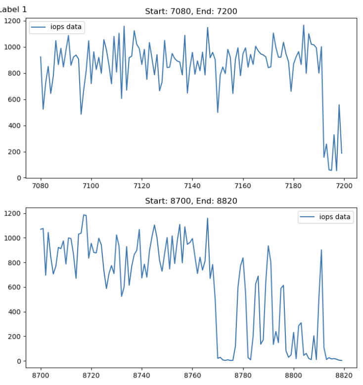
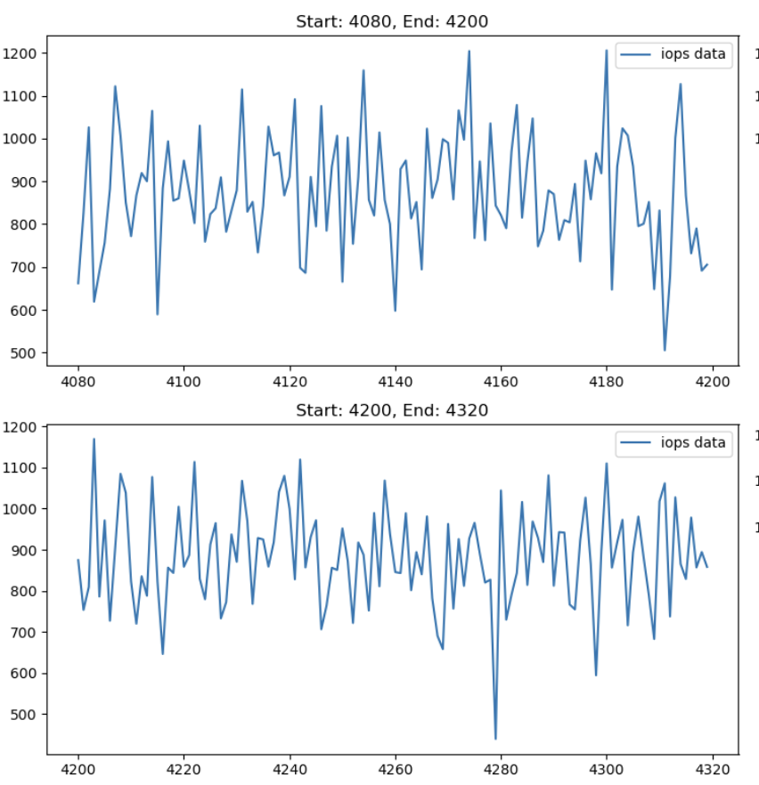
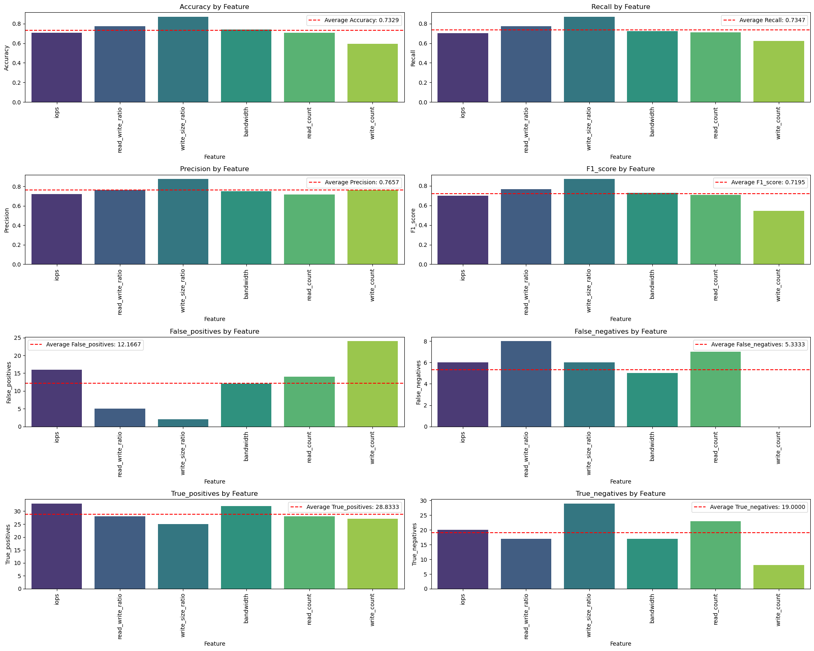
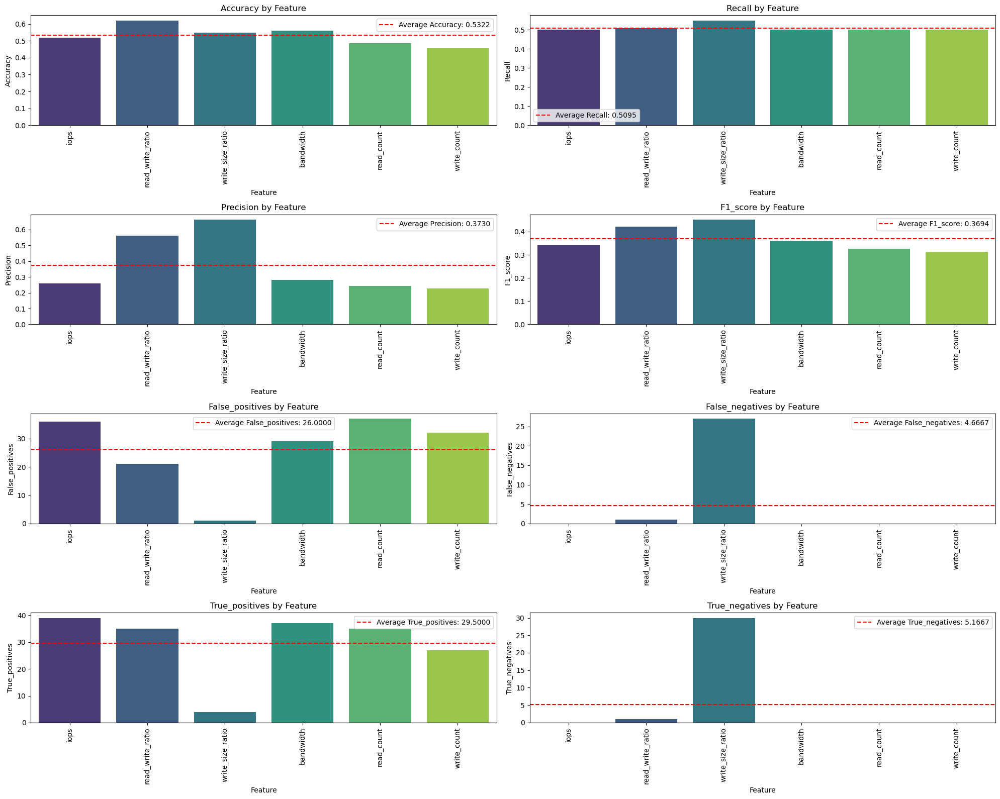

Hello! I'm Joanna! I have been contributing to the [ML in Detecting and Addressing System Drift](/project/osre24/anl/last) project under the mentorship of {} and {}. My project aims to design a pipeline to evaluate drift detection algorithms on system traces. 

# Methodology

Here is some background on my project: Model drift, or the degradation of model performance, is typically caused by data drift, which is a shift in the input distribution, and concept drift, which is a change in the relationship between input and output. This project focuses specifically on data drift, aiming to design a pipeline for evaluating drift detection algorithms on system traces. The goal is to benchmark different drift detection algorithms and have a better understanding of the features of system traces. The project is divided into two main parts: dataset construction and algorithm benchmarking.

### PART 1: Dataset Construction

To benchmark drift detection algorithms in system data, it's important to recognize that system trace data is inherently different from other data types, often containing more noise, which can complicate detection efforts. Therefore, constructing a labeled dataset specific to system data is crucial. In our case, we utilize the Tencent I/O block trace data as the dataset. This raw data was processed to extract timestamps along with various features such as IOPS, write size ratio, read write ratio, and etc., which were then used to create a data drift dataset.

I constructed this dataset by labeling segments of the trace data as either exhibiting drift or not. To identify where the drift occurs and to help construct the dataset, I employed several offline drift detection algorithms, including Kolmogorov-Smirnov, Cramer-von Mises, KL-Divergence, and Jensen-Shannon Distance.

To enhance the accuracy of the drift detection, especially in the presence of noise common in trace data, I applied additional preprocessing steps such as Fourier transform and moving average. These techniques help to smooth the data, making it easier to detect true drift signals. Finally, a voting strategy was used in combination with post-processing methods to build and refine the final datasets.

The first figure below illustrates the segments of IOPS where drift has been detected. The second figure shows the segments of data where no drift occurs.

### PART 2: Benchmark Drift Detection Algorithms

This part focuses on benchmarking the Jensen-Shannon and Wasserstein drift detection methods using system trace data. The evaluation metrics are categorized into three main areas:

1. Detection Accuracy Metrics
- True Positive Rate (Recall)
- True Negative Rate (Specificity)
- Precision
- F1-Score
2. Detection Overhead Metrics
- Time Taken: The computational time required to detect drifts, critical 
3. Stability Metrics
- False Positive Rate
- False Negative Rate 

(Additional) Comparative Analysis:
- Accuracy Across Different Features: How well the detection algorithms perform when applied to various features within the system trace data.

# Discussion

The results clearly demonstrate that the Jensen-Shannon distance method outperforms the Wasserstein distance method in detecting drift. Additionally, the write size ratio proves to be a more effective feature for representing the variations in the data, offering a more nuanced understanding of the underlying changes.

# Conclusion and Next Steps

In conclusion, this project  establishes a pipeline that encompasses data labeling, data processing, and the benchmarking of drift detection algorithms. This just serves as the first step in detecting drift in system data.

There is significant potential for further improvement. Future work should focus on enhancing dataset construction by incorporating large language models (LLMs) and other advanced techniques to further clean and refine the datasets. Additionally, the evaluation of drift detection methods should be expanded beyond the current benchmarks, which only include two statistical methods. Incorporating additional statistical methods, as well as machine learning (ML) and deep learning (DL) approaches, could provide a more comprehensive analysis. Furthermore, exploring a broader range of evaluation metrics will ensure a more robust and accurate assessment of drift detection performance. These steps will help to advance the accuracy and reliability of drift detection in system trace data.

# Deliverables
The following are the deliverables of this project:
- [Trovi Artifact](https://www.chameleoncloud.org/experiment/share/384ee2bd-853c-427b-877b-3af2993fb502)
- [Github Repository](https://github.com/williamnixon20/osre-drift): This repository contains the code for generating drift datasets with labels and notebooks with benchmarking results

