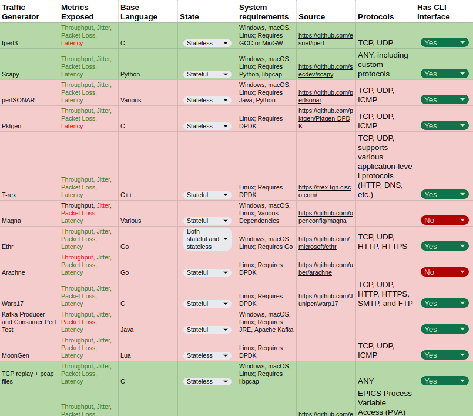
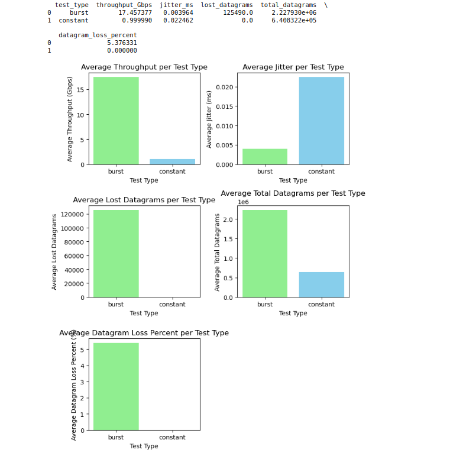
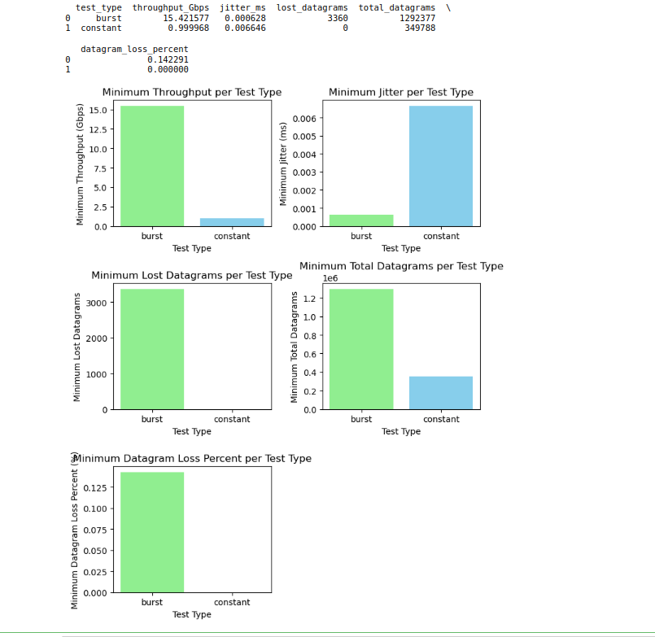
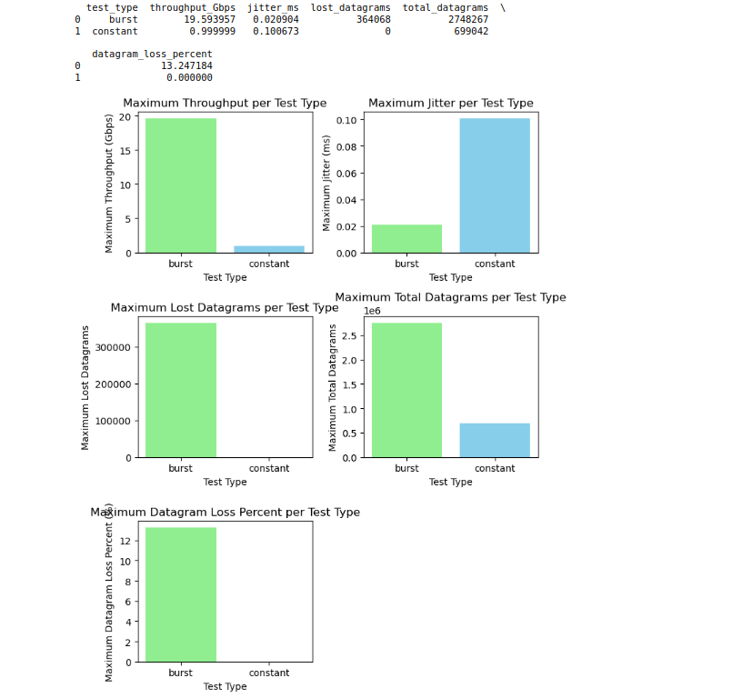
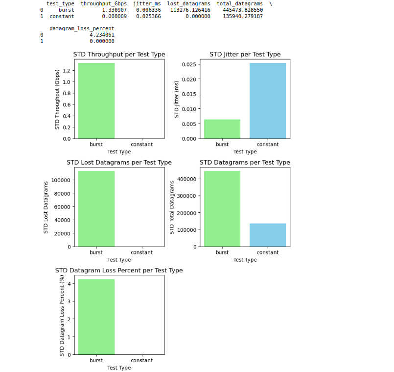

Hello there! I'm Acheme and I'm thrilled to share the progress on my project, "Optimizing Scientific Data Streaming: Developing Reproducible Benchmarks for High-Speed Memory-to-Memory Data Transfer over SciStream" under the mentorship of {} and {} under the [SciStream](/project/osre24/anl/scistream/) project.

# Project Overview
This project aims to develop SciStream-bench, a set of benchmarks and artifacts designed to precisely evaluate the performance of scientific streaming applications across diverse traffic patterns when running over the SciStream framework.
# Progress
One of the first points of call in the project was consultation with SciStream team members working at Argonne to identify use cases in scientific streaming applications and what typical traffic profiles they represent. The goal was to simulate these profiles using traffic generator tools and network configuration of network resources on the FABRIC/Chameleon testbed. The following traffic profiles were identified to meet many use-cases including one of the ESnet’s broad categorization, “The Time-Sensitive Pattern”, in integrated research workflows:
1. Throughput intensive startup
2. Intermittent burst of traffic for a duration of time
3. Constant rate traffic
4. Latency sensitive

Since data streaming applications have some unique requirements for optimum performance, the following metrics were selected as important for testing streaming performance.
1. Latency
2. Jitter
3. Packet loss / message loss
4. Throughput

Subsequently, about seventeen open-source traffic generator applications were identified and compared to determine a few suitable ones for generating our defined traffic profiles and that expose the desired performance metrics. 
We ultimately settled on iperf3 and pvaPy (a scientific streaming application developed at Argonne National Lab)

So far, the first set of tools for benchmarking using iperf3 as traffic generator with profiles of constant rate and intermittent bursts have been developed, the tools generate traffic, collects the metrics that iperf3 exposes metrics including throughput, jitter and datagram losses, and saved to a csv file for further analysis. A Jupyter notebook is used to setup a FABRIC slice and configure a four-node experiment suitable for benchmarking SciStream base architecture. After running the experiments on the nodes on FABRIC and collecting results in a CSV file, cells in the Jupyter notebook were coded to analyze the data.
In the analysis includes average, min, max and standard deviation of the various metric performances.

# Findings
From the experiments conducted so far, the findings are as follows:
- We could not properly simulate some of the listed traffic profiles initially defined: for example, to simulate a latency-sensitive traffic profile, we needed the ability to set timeouts in iperf3 which is not available at the moment
- It is not straightforward to implement SciStream on the Chameleon testbed at the moment.
- Iperf3 does not expose the latency metric and the jitter computation is suspect.

# Next Steps
Similar to the iperf3-based benchmarking tool developed and the analysis tools, I will focus next on pvaPy:
- Fully develop traffic generator and metric collection tools for pvaPy for the defined traffic profiles and exposing the chosen metrics
- Perform initial experiment like for iperf3 before
- Repeat both iperf3 and pvaPy-based benchmarking operation in multiple scenario (LAN, METRO, WAN), compare performance and explain results.

Stay tuned for my final blog as I present deeper results and insights!
