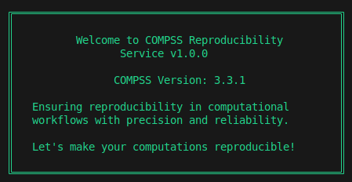

## Introduction

Hello everyone,

I'm Archit from India, an undergraduate student at the Indian Institute of Technology, Banaras Hindu University (IIT BHU), Varanasi. As part of the [Automatic Reproducibility of COMPSs Experiments through the Integration of RO-Crate in Chameleon](/project/osre24/bsc/ro-crate-compss/) project, my [proposal](https://drive.google.com/file/d/1qY-uipQZPox144LD4bs05rn3islfcjky/view), under the mentorship of {}, aims to develop a service that facilitates the automated replication of COMPSs experiments within the Chameleon infrastructure.

## About the Project

The project proposes to create a service that can take a COMPSs crate (an artifact adhering to the RO-Crate specification) and, through analysis of the provided metadata, construct a Chameleon-compatible image for replicating the experiment on the testbed. Minor adjustments to the COMPSs RO-Crate are anticipated, such as incorporating third-party software necessary for the application.

## Final Product

  

The basic workflow of the COMPSs Reproducibility Service can be explained as follows:

1. The service takes the workflow path or link as the first argument from the user.
2. The program shifts the execution to a separate sub-directory, `reproducibility_service_{timestamp}`, to store the results from the reproducibility process.
3. Two main flags are required:
   - **Provenance flag**: If you want to generate the provenance of the workflow via the runcompss runtime.
   - **New Dataset flag**: If you want to reproduce the experiment with a new dataset instead of the one originally used.
4. If there are any remote datasets, they are fetched into the sub-directory.
5. The main work begins with parsing the metadata from `ro-crate-metadata.json` and verifying the files present inside the dataset, as well as any files downloaded as remote datasets. This step generates a status table for the user to check if any files are missing or have modified sizes.

  

6. The final step is to transform the `compss-command-line.txt` and all the paths specified inside it to match the local environment where the experiment will be reproduced. This includes:
   - Mapping the paths from the old machine to new paths inside the RO-Crate.
   - Changing the runtime to `runcompss` or `enqueue_compss`, depending on whether the environment is a SLURM cluster.
   - Detecting if the paths specified in the command line are for results, and redirecting them to new results inside the `reproducibility_service_{timestamp}\Results` directory.
7. After this, the service prompts the user to add any additional flags to the final command. Upon final verification, the command is executed via Python's subprocess pipe.

  

- **Logging System**: All logs related to the Reproducibility Service are stored inside the `reproducibility_service_{timestamp}\log`.

You can view the basic [pseudocode](https://github.com/Minimega12121/COMPSs-Reproducibility-Service/blob/main/pseudocode.txt) of the service.

## Conclusion and Future Work

It's been a long journey since I started this project, and now it's finally coming to an end. I have learned a lot from this experience, from weekly meetings with my mentor to working towards long-term goals—it has all been thrilling. I would like to thank the OSRE community and my mentor for providing me with this learning opportunity.

This is only version 1.0.0 of the Reproducibility Service. If I have time from my coursework, I would like to fix any bugs or improve the service further to meet user needs.

However, the following issues still exist with the service and can be improved upon:

- **Third-party software dependencies**: Automatic detection and loading of these dependencies on a SLURM cluster are not yet implemented. Currently, these must be handled manually by the user.
- **Support for workflows with `data_persistence = False`**: There is no support for workflows where all datasets are remote files.

## Deliverables

- [Reproducibility Service Repository](https://github.com/Minimega12121/COMPSs-Reproducibility-Service): This repository contains the main service along with guidelines on how to use it. It will be launched in the main COMPSs repository as a tool.
- [Chameleon Appliance](https://www.chameleoncloud.org/appliances/121/) : This is a single-node appliance with COMPSs 3.3.1 installed, so that anyone with access to Chameleon can reproduce experiments.
<!-- - [Experiments Analysis](https://docs.google.com/spreadsheets/d/1W4CKqiYVPquSwXFRITbb1Hga1xcyv2_3DJIcq7JalZk/edit?gid=0#gid=0) : This report contains details of experiments I have reproduced using the Reproducibility Service on a SLURM cluster, a local machine, and a Chameleon appliance, along with observations. -->

## Previous Blogs

Make sure to check out my other blogs to see how I started this project and the challenges I faced along the way:

- [First blog](/report/osre24/intel/20240612-architd/)
- [Mid-term blog](/report/osre24/intel/20240729-architd/)

Thank you for reading the blog, have a nice day!!

