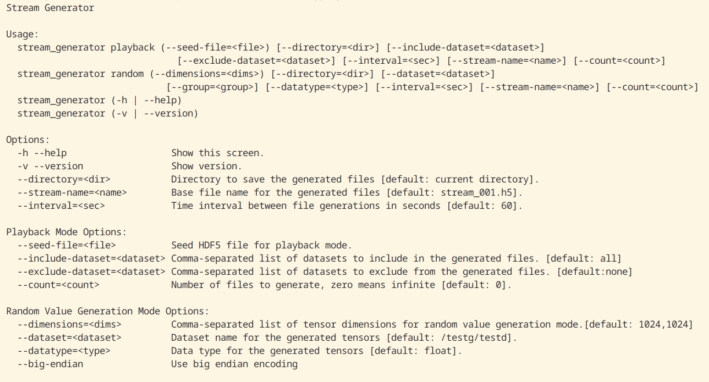

Hey there, HPC enthusiasts and fellow coders! I'm excited to share my progress on this summer's Google Summer of Code project under UC OSPO's FasTensor. 
Here's a glimpse into how we're pushing the boundaries of real-time data processing.

## The Big Picture: FasTensor and HPC Challenges
First, a quick refresher: FasTensor is our go-to tool for handling dense arrays in scientific computing. It tackles three major HPC challenges:

- Optimizing computations

- Distributing data efficiently
- Balancing workloads across computing cores

FasTensor excels at these tasks, especially when dealing with data that has structural locality - a common feature in scientific computing. Here, the Stencil computations come in handy, capturing data locality for operations like solving partial differential equations in physical simulations.

### The Mission: Bringing FasTensor into Real-Time
While FasTensor is great at processing existing data, the next frontier is handling live data streams from scientific instruments and sensors. That's where my GSoC project comes in: adding stream processing capabilities to FasTensor.

## Progress Highlights:

### Building a Stream Simulator
We've created FTstream, a nifty tool that simulates data streams. It can generate streams of various sizes and intervals, pushing the limits of what your disk can handle. We're talking speeds up to 2.5 GiB/s on a non-parallel NVMe! This tool is crucial because many scientific instruments, from particle accelerators to radio telescopes, generate massive amounts of data at incredible speeds and we need to able to simulate that. For context, that's faster than a 10MP RGB camera shooting at 35 frames per second that generates data at ~1 GiB/s.

### Optimizing I/O Strategies
We've been experimenting with various I/O approaches to optimize high-speed data stream handling.

### Exploring Streaming Semantics
We're investigating various ways to express and execute stream transformations, to ensure that FasTensor can handle a wide range of streaming computations.

### Developing I/O Drivers
We've developed two new I/O drivers based on LinuxAIO and MPI IO to ingest incoming data smoothly and maintain stream consistency.

## What's Next?

### Putting It All Together
We're in the final stretch of integrating all these components into a seamless stream processing system.

### Rigorous Testing
We'll push our stream processing to its limits, simulating diverse data flows to ensure rock-solid performance in any scientific setting.

### HPC Environment Validation
The ultimate test will be running our new streaming capabilities in real HPC environments, checking how they perform with different I/O setups and computing paradigms.

## Wrapping Up
This summer has been a whirlwind of coding, testing, and learning. We're making significant strides in bringing real-time processing capabilities to FasTensor, which could open up exciting new possibilities in scientific computing and data analysis.
Stay tuned for more updates as we finalize this feature. If you're interested in the nitty-gritty technical details or want to check out the code, feel free to reach out or check our project repository.
Happy coding, and may your computations be ever faster!