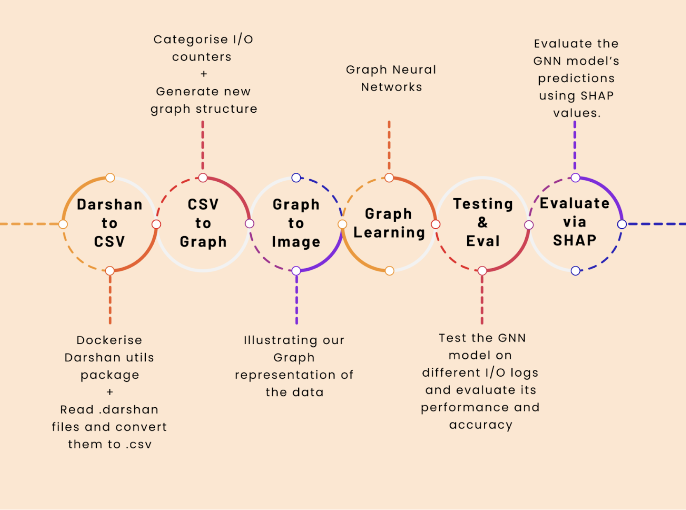

Hello, I'm {}, a Ph.D. student in Computer Science at Iowa State University. I'm currently working on the [AIIO / Graph Neural Network](/project/osre24/lbl/aiio/) project under the guidance of {} and Suren Byna. Our project focuses on enhancing the AIIO framework to automatically diagnose I/O performance bottlenecks in high-performance computing (HPC) systems using Graph Neural Networks (GNNs).

# Project Overview

Our primary goal is to tackle the persistent issue of I/O bottlenecks in HPC applications. Identifying these bottlenecks manually is often labor-intensive and prone to errors. By integrating GNNs into the AIIO framework, we aim to create an automated solution that can diagnose these bottlenecks with high accuracy, ultimately improving the efficiency and reliability of HPC systems.

# Progress and Challenges

Over the past few weeks, my work has been centered on developing a robust data pre-processing pipeline. This pipeline is crucial for converting raw I/O log data into a graph format suitable for GNN analysis. The data pre-processing involves extracting relevant features from Darshan I/O logs, which include job-related information and performance metrics. One of the main challenges has been dealing with the heterogeneity and sparsity of the data, which can affect the accuracy of our models. To address this, we've focused on using correlation analysis to identify and select the most relevant features, ensuring that the dataset is well-structured and informative for GNN processing.

We've also started constructing the GNN model. The model is designed to capture the complex relationships between different I/O operations and their impact on system performance. This involves defining nodes and edges in the graph that represent job IDs, counter types, and their values. We explored different graph structures, including those that focus on counter types and those that incorporate more detailed information. While more detailed graphs offer better accuracy, they also require more computational resources.

# Current Achievements

1. **Data Pre-processing Pipeline**: We have successfully developed and tested the pipeline to transform Darshan I/O logs into graph-structured data. This was a significant milestone, as it sets the foundation for all subsequent GNN modeling efforts.
   
2. **GNN Model Construction**: The initial version of our GNN model has been implemented. This model is now capable of learning from the graph data and making predictions about I/O performance bottlenecks.

3. **Correlation Analysis for Graph Structure Design**: We have used correlation analysis on the dataset to understand the relationships between I/O counters. This analysis has been instrumental in designing a more effective graph structure, helping to better capture the dependencies and interactions critical for accurate performance diagnosis.

4. **Training for Different Graph Structures**: We are currently training our model using various graph structures to determine the most effective configuration for accurate I/O performance diagnosis. This ongoing process aims to refine our approach and improve the model's predictive accuracy.

# Next Steps

Looking ahead, we plan to focus on several key areas:

1. **Refinement and Testing**: We'll continue refining the GNN model, focusing on improving its accuracy and efficiency. This includes experimenting with different graph structures and training techniques.

2. **SHAP Analysis**: To enhance the interpretability of our model, we'll incorporate SHAP (SHapley Additive exPlanations) values. This will help us understand the contribution of each feature to the model's predictions, making it easier to identify critical factors in I/O performance.

3. **Documentation and Community Engagement**: As we make progress, we'll document our methods and findings, sharing them with the broader community. This includes contributing to open-source repositories and engaging with other researchers in the field.

This journey has been both challenging and rewarding, and I am grateful for the support and guidance from my mentors and the community. I look forward to sharing more updates as we continue to advance this exciting project.

