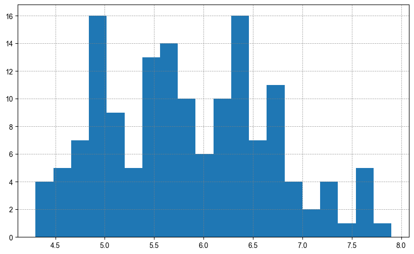
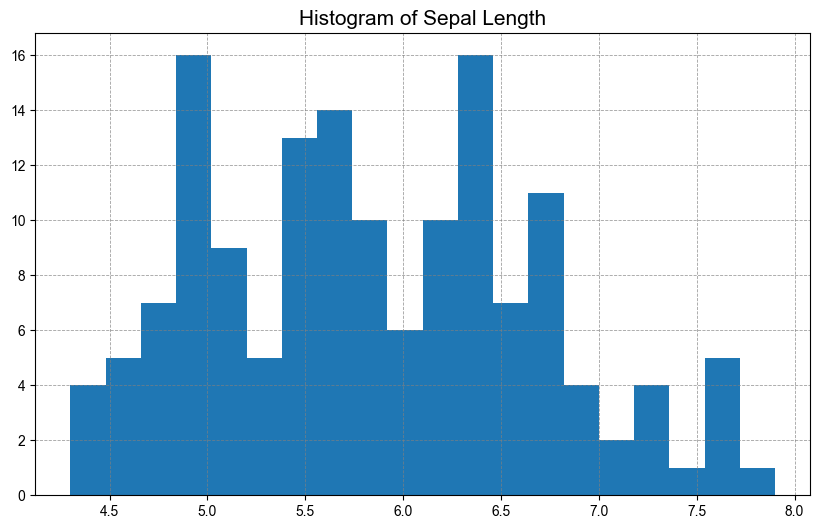

## Introduction
Hello! My name is {} a machine learning engineer and researcher based out of Kolkata, a city in Eastern India dubbed the City of Joy.
For the last month and a half I have been working closely with Professor {}  on the project titled [Reproducibility in Data Visualization](/project/osre24/niu/repro-vis/). I’m thrilled to be able to make my own little mark on this amazing project and aid in exploring solutions to capture visualizations in hopes of making reproducibility easier in this domain.

## Progress and Challenges
The last month and a half have mostly been spent trying to explore best possible solutions to facilitate the reproducibility of STATIC visualizations from local sources and/or the web.
We have taken inspiration from existing work in the domain and successfully captured meta-information required to ensure reproducibility in the regenerated visualizations from the said metadata. The metadata extracted is saved into the generated .png figure of the visualization therefore allowing reproducibility as long as you have (a) The original dataset (b) The generated .png of the visualization. Every other information is stored inside the .png file as a json object and can be used to regenerate the original image with a very high accuracy.

The problem however remains with visualizations where randomness such as jitter is involved. Capturing the randomness has not been 100% successful as of now, and we are looking into options to ensure the capture of certain plots that contains randomness.

The following images can be used to highlight some results from our reproducibility experiments:
Original Histogram using Matplotlib on the iris dataset: 

Reproduced Histogram using metainformation from the original: 

## The next steps
We have already started looking into solutions and ways to capture visualizations from the web i.e. from platforms such as ObservableHq and use these experiments to transition into capturing interactive visualizations from the web.

Capturing user interactions and all states in an interactive visualization can prove to be very useful as it is a very known pain-point in the reproducibility community and has been a challenge that needs to be solved. My next steps involve working on finding a solution to capture these interactive visualizations especially those living on the web and ensuring their reproducibility.

