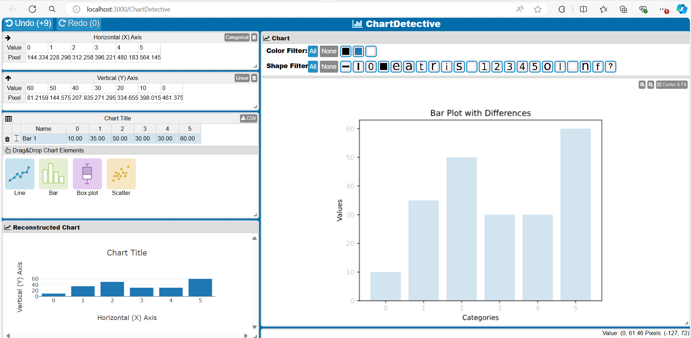
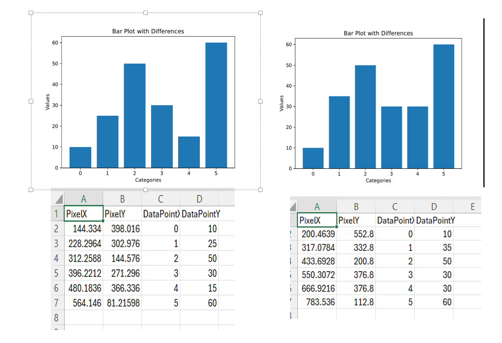
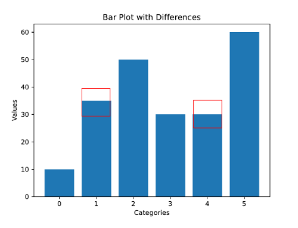
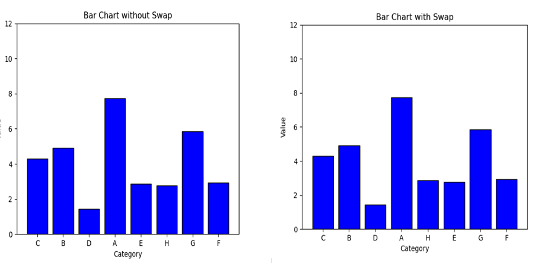

Hello everyone!

I'm Triveni, a Master's student in Computer Science at Northern Illinois University (NIU). I'm excited to share my progress on the OSRE 2024 project [Categorize Differences in Reproduced Visualizations](/project/osre24/niu/repro-vis/) focusing on data visualization reproducibility. Working under the mentorship of [David Koop]{}, I've made some significant strides and faced some interesting challenges.

# Reproducibility in data visualization

Reproducibility is crucial in data visualization, ensuring that two visualizations accurately convey the same data. This is essential for maintaining transparency and trust in data-driven decision-making. When comparing two visualizations, the challenge is not just spotting differences but determining which differences are meaningful. Tools like OpenCV are often used for image comparison, but they may detect all differences, including those that do not impact the data's interpretation. For example, slight shifts in labels might be flagged as differences even if the underlying data remains unchanged, making it challenging to assess whether the visualizations genuinely differ in terms of the information they convey.

# A Breakthrough with ChartDetective

Among various tools like ChartOCR and ChartReader, ChartDetective proved to be the most effective. This tool enabled me to extract data from a range of visualizations, including bar charts, line charts, box plots, and scatter plots. To enhance its capabilities, I modified the codebase to capture pixel values alongside the extracted data and store both in a CSV file. This enhancement allowed for a direct comparison of data values and their corresponding pixel coordinates between two visualizations, focusing on meaningful differences that truly impact data interpretation.

# Example: Comparing Two Bar Plots with ChartDetective

Consider two bar plots that visually appear similar but have slight differences in their data values. Using ChartDetective, I extracted the data and pixel coordinates from both plots and stored this information in a CSV file. The tool then compared these values to identify any discrepancies.

For instance, in one bar plot, the height of a specific bars were slightly increased. By comparing the CSV files generated by ChartDetective, I was able to pinpoint these differences precisely. The final step involved highlighting these differences on one of the plots using OpenCV, making it clear where visualizations diverged.This approach ensures that only meaningful differences—those that reflect changes in the data—are considered when assessing reproducibility.
- ChartDetective: SVG or PDF file of the visualization is uploaded to extract data.

- Data Extraction: Data values along with pixel details are stored in the CSV files.

- Highlighting the differences: Differences are highlighted on one of the plots using OpenCV

# Understanding User Perspectives on Reproducibility

To complement the technical analysis, I created a pilot survey to understand how users perceive reproducibility in data visualizations. The survey evaluates user interpretations of two visualizations and explores which visual parameters impact their decision-making. This user-centered approach is crucial because even minor differences in visual representation can significantly affect how data is interpreted and used.

Pilot Survey Example:

Pixel Differences: In one scenario, the height of two bars was altered slightly, introducing a noticeable yet subtle change.

Label Swapping: In another scenario, the labels of two bars were swapped without changing their positions or heights.

Participants will be asked to evaluate the reproducibility of these visualizations, considering whether the differences impacted their interpretation of the data. The goal was to determine which visual parameters—such as bar height or label positioning—users find most critical when assessing the similarity of visualizations.

# Future Work and Conclusion
Going forward, I plan to develop a proof of concept based on these findings and implement an extensive survey to further explore the impact of visual parameters on users' perceptions of reproducibility. Understanding this will help refine tools and methods for comparing visualizations, ensuring they not only look similar but also accurately represent the same underlying data.

