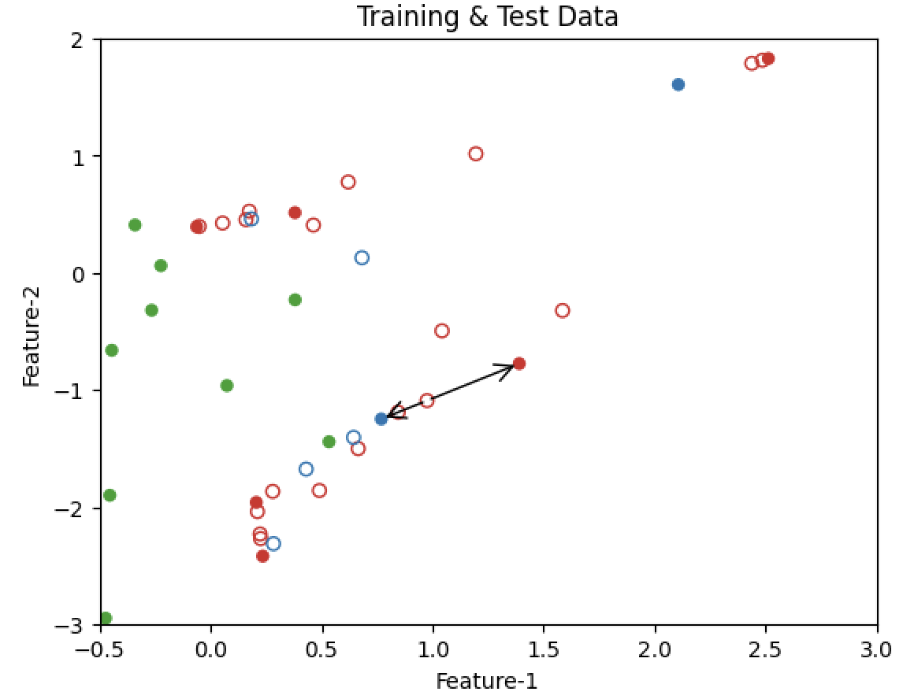
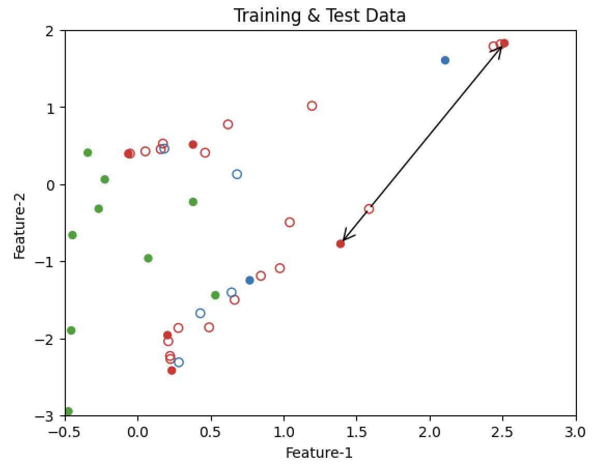

Hello everyone!

I have been working on reproducing the results from **Characterization of Term and Preterm Deliveries using Electrohysterograms Signatures**. This paper aims to predict preterm birth using Support Vector Machine with RBF kernel. However, there is a major flaw in the methodology: **preprocessing on training and test set**. This happens when preprocessing is performed on the entire dataset before splitting it into training and test sets.

Reproducing the published results came with its own challenges, including updating EHG-Oversampling to extract meaningful features from EHG signals and finding optimal hyperparameters for the model. Through our work on reproducing the published results and creating toy example notebooks, we have been able to demonstrate that data leakage leads to overly optimistic measures of model performance and models trained with data leakage fail to generalize to real-world data. In such cases, performance on test set doesn't translate to performance in the real-world. 

Next, I'll be reproducing the results published in **Identification of COVID-19 Samples from Chest X-Ray Images Using Deep Learning: A Comparison of Transfer Learning Approaches***. 

You can follow my work on the EHG paper [here](https://github.com/shaivimalik/medicine_preprocessing-on-entire-dataset).

Stay tuned for more insights on data leakage and updates on our progress!