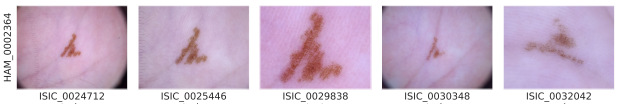
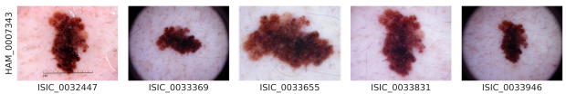

Hello!

In this blog post, I will explore a common issue in machine learning called data leakage, using an example from the paper:

> Benedetti, P., Perri, D., Simonetti, M., Gervasi, O., Reali, G., Femminella, M. (2020). Skin Cancer Classification Using Inception Network and Transfer Learning. In: Gervasi, O., et al. Computational Science and Its Applications – ICCSA 2020. ICCSA 2020. Lecture Notes in Computer Science(), vol 12249. Springer, Cham. https://doi.org/10.1007/978-3-030-58799-4_39 [arXiv](https://arxiv.org/pdf/2111.02402v1)

# Overview of the Paper
In this paper, the authors use transfer learning on a pretrained convolutional neural network (CNN) to classify skin lesions in dermatoscopic images from the HAM10000 (Human Against Machine with 10,000 training images) dataset. The paper reports a final accuracy of 78.9% on the validation set.

While this reported result appears to be impressive, there are concerns regarding the validity of this performance metric due to data leakage. Data leakage occurs when the model is trained or evaluated on data that it would not have access to during real-world deployment, leading to an overestimation of the model's true performance.

# Identifying Data Leakage in the Original Paper
Upon closer inspection, it appears that the original experiment suffers from data leakage in two significant ways:

1. Duplicate Images in Training and Validation Sets:

    The HAM10000 dataset contains near-duplicate images of the same lesions in both the training and validation sets. This results in the model seeing very similar images during training and then again during validation. Consequently, the model's performance is artificially inflated because it has already been "trained" on images similar to those in the validation set, making the task easier than it should be.

    
    

2. Using the Validation Set for Early Stopping and Final Evaluation:

    Another critical issue is the use of the validation set for both early stopping and final model evaluation. Early stopping is a technique where training is halted when the model's performance on a validation set no longer improves, preventing overfitting. However, if this same validation set is later used to evaluate the model's final performance, it can lead to overfitting on the validation data itself, resulting in an overly optimistic estimate of model accuracy.

# Our Reproduction and Results
To demonstrate the impact of these data leakage issues, we reproduced the experiment with corrected methodologies:

- Corrected Data Split: We ensured that there were no duplicate images between the training and validation sets. This setup is crucial to simulate a realistic scenario where the model encounters completely unseen data during validation.

- Separate Validation and Test Sets: We introduced a distinct test set to evaluate the final model performance, independent of the data used for early stopping.

**Results Comparison**

  <table>
    <tr>
      <td></td>
      <td>Original results</td>
      <td>Our results</td>
    </tr>
    <tr>
      <td>
          Accuracy
      </td>
      <td>
          78.9%
     </td>
      <td>
          78.6%
      </td>
    </tr> 
    <tr>
      <td>
          Number of epochs
      </td>
      <td>
          Approx. 42 epochs
      </td>
      <td>
          40 epochs
      </td>
    </tr>
    <tr>
      <td>
          Training size
      </td>
      <td>
          Unknown
      </td>
      <td>
          7000 samples
      </td>
    </tr>
    <tr>
      <td>
          Validation size
      </td>
      <td>
          478 samples
      </td>
      <td>
          478 samples
      </td>
    </tr>
    <tr>
      <td>
          Confusion martix
      </td>
      <td>
        
      </td>
      <td>
          
      </td>
    </tr>
    
  </table>

# Analysis of the Results
While our reproduced accuracy of 78.6% is close to the original reported accuracy, it is based on a properly separated training and validation set, avoiding the data leakage pitfalls of the original paper. The slight drop in accuracy further highlights the overestimation of the original model's performance due to data leakage.

Moreover, using a separate test set for final evaluation provides a more reliable measure of the model's ability to generalize to new, unseen data. The confusion matrices show that our model's performance is consistent across different lesion classes, confirming the robustness of the evaluation.

# Conclusion
Data leakage is a common and often overlooked problem in applied machine learning, leading to misleading performance metrics and irreproducible results. By carefully examining and correcting these issues in our reproduction, we hope to provide a clearer understanding of the importance of proper data handling and validation practices.

It is crucial for researchers and practitioners to be vigilant about data leakage and ensure that their models are trained, validated, and tested under realistic conditions. This not only ensures the credibility of their results but also enhances the real-world applicability of their models.

Thank you for reading, and stay tuned for more insights on machine learning reproducibility!

