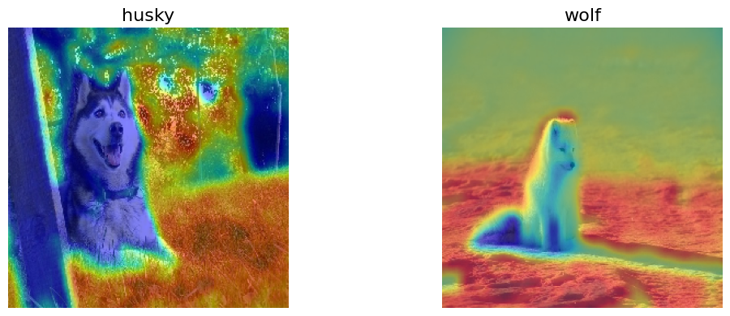

Hello everyone!

I have been working on reproducing the results from **Identification of COVID-19 Samples from Chest X-Ray Images Using Deep Learning: A Comparison of Transfer Learning Approaches**. This study aimed to distinguish COVID-19 cases from normal and pneumonia cases using chest X-ray images. Since my last blog post, we have successfully reproduced the results using the VGG19 model, achieving a 92% accuracy on the test set. However, a significant demographic inconsistency exists: normal and pneumonia chest X-ray images were from pediatric patients, while COVID-19 chest X-ray images were from adults. This allowed the model to achieve high accuracy by learning features that were not clinically relevant. 

In [Reproducing “Identification of COVID-19 samples from chest X-Ray images using deep learning: A comparison of transfer learning approaches” without Data Leakage](https://github.com/shaivimalik/covid_illegitimate_features/blob/main/notebooks/Correcting_Original_Result.ipynb), we followed the methodology outlined in the paper, but with a key change: we used datasets containing adult chest X-ray images. This time, the model achieved an accuracy of 51%, a 41% drop from the earlier results, confirming that the metrics reported in the paper were overly optimistic due to data leakage, where the model learned illegitimate features.

To further illustrate this issue, we created a [toy example](https://github.com/shaivimalik/covid_illegitimate_features/blob/main/notebooks/Exploring_ConvNet_Activations.ipynb) demonstrating how a model can learn illegitimate features. Using a small dataset of wolf and husky images, the model achieved an accuracy of 90%. We then revealed that this performance was due to a data leakage issue: all wolf images had snowy backgrounds, while husky images had grassy backgrounds. When we trained the model on a dataset where both wolf and husky images had white backgrounds, the accuracy dropped to 70%. This shows that the accuracy obtained earlier was an overly optimistic measure due to data leakage.

You can explore our work on the COVID-19 paper [here](https://github.com/shaivimalik/covid_illegitimate_features). 

Lastly, I would like to thank {} and {} for their support and guidance throughout my SoR journey.