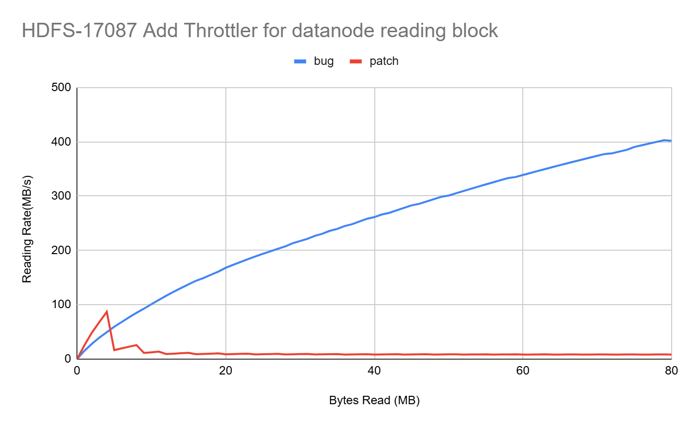
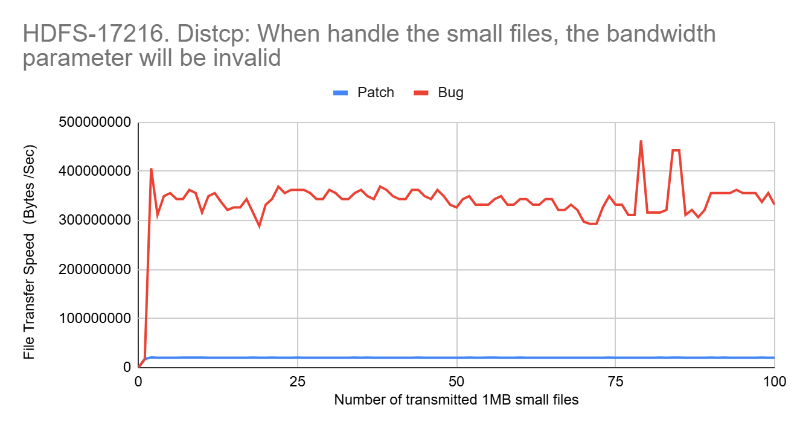

## HDFS-17087: Missing Throttler in DataXceiver#readBlock

One of the throttling bugs I explored was HDFS-17087. The DataXceiver#readBlock function in HDFS lacked a throttler, resulting in unregulated data reads. This absence could lead to potential performance degradation under heavy loads. The developer fixed this issue by adding a throttler to regulate the data transfer rate. In my work, I reproduced the bug and observed the system's behavior both before and after applying the developer's patch. The results showed a significant improvement in stability and performance post-fix.

## HDFS-17216: Incorrect Data Rate Calculation

Another crucial bug was HDFS-17216. The issue stemmed from the use of integer division in the getBytesPerSec function, which caused incorrect speed calculations and failed to trigger the throttle, resulting in overspeed. The developer addressed this by switching from integer to float for calculating the elapsed time, ensuring accurate speed measurements. I reproduced the conditions that highlighted the bug's effects and compared the system's performance with and without the fix. The post-fix results confirmed that the throttling mechanism worked correctly, effectively preventing overspeed.

## Conclusion

Reproducing these throttling bugs and validating the developer fixes was a vital step in understanding their impact on HDFS's scalability. The improvements observed in system stability and performance underscore the importance of accurate throttling mechanisms. This work contributes to the broader effort of maintaining robust and scalable distributed systems, ensuring they can handle increasing loads efficiently.