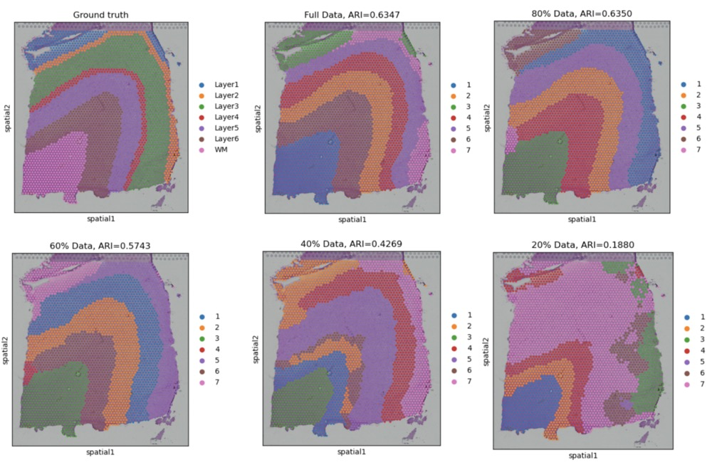

Hello! I'm Qianru! I have been contributing to the BenchmarkST: Cross-Platform, Multi-Species Spatial Transcriptomics Gene Imputation Benchmarking project under the mentorship of Ziheng Duan. My project aims to provide a standardized, easily accessible evaluation framework for gene imputation in spatial transcriptomics. 

# Motivation and Overview

The "BenchmarkST" project was driven by the need to address a critical challenge in spatial transcriptomics: the impact of sparse data on downstream tasks, such as spatial domain identification. Sparse data can significantly degrade the performance of these tasks. For example, in a 10X Visium dataset of human brain Dorsolateral Prefrontal Cortex (DLPFC), using the complete dataset with GraphST (a state-of-the-art clustering method)  for clustering resulted in an ARI (Adjusted Rand Index) of 0.6347. However, when using only 20% of the data—a common scenario—the performance dropped dramatically to 0.1880. This stark difference highlights the importance of effective gene imputation, which can help restore the lost information and improve the accuracy of downstream analyses.

To tackle this issue, the BenchmarkST project led to the creation of the Impeller package. This package provides a standardized, easily accessible evaluation framework for gene imputation in spatial transcriptomics, offering preprocessed datasets, reproducible evaluation methods, and flexible inference interfaces. It spans across different platforms, species, and organs, aiming to enhance the integrity and usability of spatial transcriptomics data.

# What Was Accomplished
##  Development of the Impeller Package

#### Data Aggregation and Preprocessing: 
We aggregated and preprocessed spatial transcriptomic datasets from multiple platforms (10X Visium, StereoSeq, SlideSeqV2), species (human, mouse), and organs (Dorsolateral Prefrontal Cortex, olfactory bulb). These datasets are readily available for download within the package.
#### Unified Evaluation Framework: 
A reproducible framework was developed, integrating methods such as K-Nearest Neighbors (KNN) and the deep learning-based Impeller method, enabling users to easily evaluate the performance of different gene imputation techniques.
#### Inference Interfaces: 
We provided interfaces that allow users to apply gene imputation on custom datasets, offering the flexibility to predict any gene in any cell, maximizing the utility for diverse research needs.

## Code Contributions and Documentation
#### Repository: 
All code related to the Impeller package has been committed to the [Impeller](https://pypi.org/project/impeller/0.1.2/#files) repository.
#### Link to Versions: 
[Here](https://pypi.org/project/impeller/0.1.2/#history) you can find all the versions made during the project, with detailed descriptions of each change.
#### [README.md](https://pypi.org/project/impeller/0.1.2/#description): 
Detailed documentation on how to use the Impeller package, including installation instructions, usage examples, and explanations of the key components.
