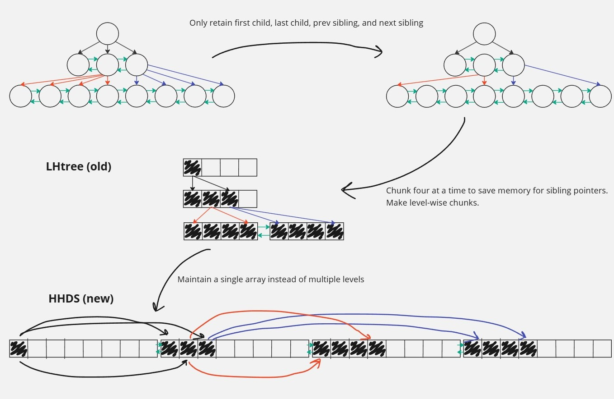
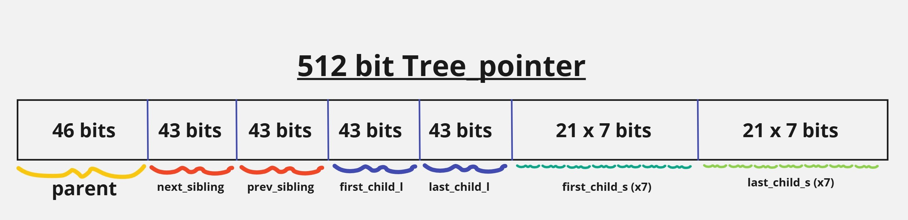

Hi everyone! I am Ujjwal Shekhar, a Computer Engineering student at the International Institute of Information Technology - Hyderabad. I am excited to share my current progress on the project titled "Hardware Hierarchical Dynamical Systems" as part of the [Open Source Research Experience (OSRE) program](https://ucsc-ospo.github.io/osre/) and [Google Summer of Code](https://summerofcode.withgoogle.com/). I am working with my mentors, {} and {}, on this project.

# Project Overview
With hardware compilers, it is not uncommon for the size of code that the hardware compilers need to handle to go into millions. We aim to improve the efficiency of the tree data structure to be used for representing the Abstract Syntax Tree (AST) of the input program. The tree data structure is optimized for typical AST traversal and queries. Some queries that are made to this tree are much more frequent than others.

Thus, the goal of this project is to be able to optimize the tree for frequent queries while still providing support for other infrequent queries. We use Google Bench to benchmark the tree for scalability and performance and expect it to outperform the current version of the tree. Finally, the new version of the tree will be integrated into the LiveHD core repository.

# Progress and Challenges
Over the past month and a half, I have successfully finished working on the add/append methods of the tree. Moreover, I have finished writing the iterators on the tree too. There are preliminary tests already in place and the HHDS repository now has a working Bazel build system.

As shown in the figure, we can see that the tree went from storing pointers to everything that it could to only storing pointers to the nodes that are absolutely necessary. Moreover, by not maintaining multiple levels in the tree, we have been able to reduce the memory footprint of the tree. This is a significant improvement from the LHtree that was being used earlier.

Furthermore, we have also been able to improve the cache friendliness of each node of the tree. By realizing that most of the time, new children are added soon after the parent is added, we have been able to store the children in a contiguous memory location whenever possible, or access them using a shorter delta from the parent node. This has significantly improved the cache friendliness of the tree by allowing the packing of the book-keeping of up to 8 children in a single 512-bit word. This 512-bit chunk has amazing cache alignment properties.

## Highlights
- Finished working on the add/append methods of the tree.
- Finished writing the iterators on the tree.
- Preliminary tests are in place.
- HHDS repository now has a working Bazel build system.

## Challenges
- Working out a new plan: The initial plan was to use a flattening policy to optimize the tree for frequent queries. However, this plan has been revised and we have flattened the tree not using a tour-based flattening policy, but by still storing pointers to various nodes in the tree. This has been done to ensure that the tree is still able to support infrequent queries.
- Benchmarking: The benchmarking of the tree is still in progress. I am working on creating a benchmarking suite that will be able to test the tree for scalability and performance. This will allow future developers to test the tree for performance and scalability after they make changes.

# Next Steps
From here, a lot of testing and benchmarking is still left to be done. Moreover, we need to add the delete methods and make sure that the integration with the LiveHD core repository is smooth. The next steps involve:
- Adding the delete methods to the tree.
- Benchmarking the tree for scalability and performance.
- Ensuring that the syntax of the tree is in line with the LiveHD core repository.
- Integrating the tree into the LiveHD core repository.
- Adding documentation to the tree.
- Integrating the testing of the tree into the LiveHD testing suite.

# Conclusions
My experience so far has been amazing. I have been able to work on a project that is at the intersection of hardware and software. Moreover, I have been able to work with a team that is very supportive and has been able to guide me through the project. I am looking forward to the next steps and am excited to see the final version of the tree in the LiveHD core repository.

# Acknowledgements
I would like to thank my mentors, {} and {} for their guidance and support throughout the project. It would not have been possible without their help.
