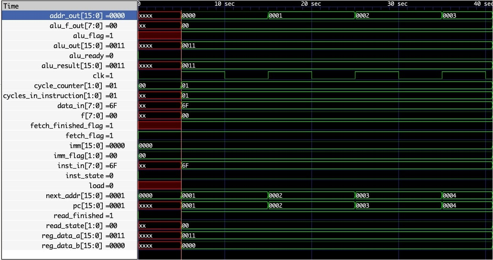

# Introduction

Hello everyone! I'm Ashwin Bardhwaj, an undergraduate student studying at UC Berkeley. As part of [Micro Architecture Santa Cruz (MASC)](/project/osre23/ucsc/livehd) my [proposal](https://drive.google.com/file/d/1Fnr85lqrTs7OBohfHfSZI2K3wZU3zJm0/view?usp=sharing) under the mentorship of {} and {} looks to create a suite of benchmark programs for [HDEval](https://github.com/masc-ucsc/hdeval).

The goal of this project is to create large-scale Verilog programs in order to benchmark that capability of LLMs to develop HDL code. Throughout this project, I have created 3 of the large Verilog testbenches called 3-Stage-RISC_V processor, Gameboy Emulator, and Sorts. The benchmark programs will lose their effectriveness if LLMs such as ChatGPT scrape over Github reposotires and learn from them. As a result, the code itself cannot be made public due to LLM scraping over repositories, this file will cover the test report for all 3 of these projects.

# 3 Stage RISC V Processor 
This is a pipelined RISC processor developed to to handle RV32I instructions. A 3-Stage processsor will typically contain a Fetch, Decode, and Execute cycle. As a result, every instruction will take exactly 3 clock cycles. For this processor, instructions can be formatted into R, I (Load), S (Store), B (Cond), and J (Jump and Link) type instructions. Once a 32 bit instruction is fetched at the location in memory specifed by the pc (Program Counter) register, it is sent to be decoded by the "decode unit". Through decoding an instruction, we can determine the exact operation code, register location of the 2 operands (rs1 and rs2), and the destination register (rd) at which to write the calculated result. After decoding, an activation flag is sent to the excetution cycle to then take and access the register file at address rs1 and rs2 in order to get the correct operand data. The data and operation is then sent to the ALU to compute the result based on the opcode. The result is then written back into the register file at the rd address and the program counter is incremented and the next instruction is fetched.

The prompts for each module in this processor have been generated and tested against a GPT 3 turbo and GPT 4o models as an example. In the RISC V tab in my test report, I have provided the exact prompts and results after running on MASC's [HDLAgent](https://github.com/masc-ucsc/hdlagent) tool which can access the APIs of many LLMs.

# Gameboy Emulator
The Gameboy Emulator is a Verilog implementation of the classic GameBoy console that was widely popular in the 1990s. The main aspects of the GameBoy that were focused on in this project were the Z-80 like CPU, memory objects like RAM, VRAM, and ROM, the PPU (Picture Processing Unit), and other peripherals. The instructions are given to the CISC (variable-length instructions) CPU where they are decoded and executed based on the details and expectations of that specific instruction. In some cases, timing becomes a concern and there is significant effort made to ensure that instructions can be parsed and run predictably and effictively. Instructions from the ROM may take between 1 to 4 clock cycles to run depending on the requirements. For example, the instruction "LD B, HL" , loads the data found at the 16 bit address given by registers H and L into register B is a 2 cycle instruction. The first cycle decodes the HL address and fetches the data at the accurate location, while the second cycle takes the new input data at writes it into register B. This requires accurate timing control between different asects of the GameBoy. 

The Picture Processing Unit is also an integral feature of the gameboy. Three frames called Background, Window, and Sprite are combined into the classic Gameboy screens we know today. White the Background and Window data are consistently called from the VRAM after certain clock cycle times, the Sprite and sprtite attributes are accessed using DMA (Direct Memory Access) from OAM (Object Attribute Memory). This reduces the CPU load and improves the speed of sprite data. 

# Deliverables
- **HDEval Test Report**: The [HDEval Test Report](https://docs.google.com/spreadsheets/d/1vDh_k75h0sG8JGRDDZcdBM4AprVcw9l1/edit?usp=sharing&ouid=102173779464961795129&rtpof=true&sd=true) contains the module prompts for each testbench, the results after testing on GPT 3 turbo and 4o, and test cases to ensure code correctness and reliability.

- **HDEval Repo**: [HDEval](https://github.com/masc-ucsc/hdeval) contains the encrypted version of the yaml files that encapsulate the code, prompts, and additional data. 

# Next Steps
Given these benchmarks, it is important to track the abilities of these LLMs to generate HDL code. Therefore, including GPT 3-turbo and 4o. I would like these benchmarks to be applied to more models so that we can track their growth and keep informed on their effectiveness in HDL and hardware.

# Previous Blogs
Please feel free to check out my previous blogs!
- [First Blog](/report/osre24/ucsc/livehd/20240611-ashwinbardhwaj/)
- [Midterm Blog](/report/osre24/ucsc/livehd/20240718-ashwinbardhwaj/)

Thank you for reading!