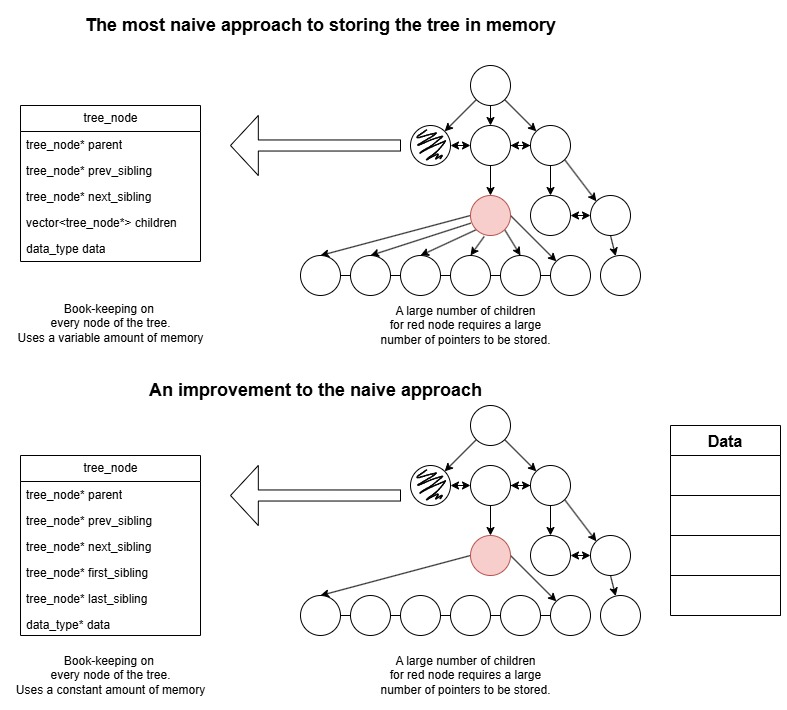
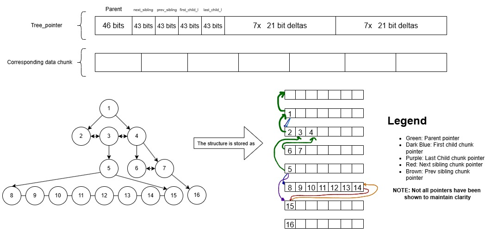
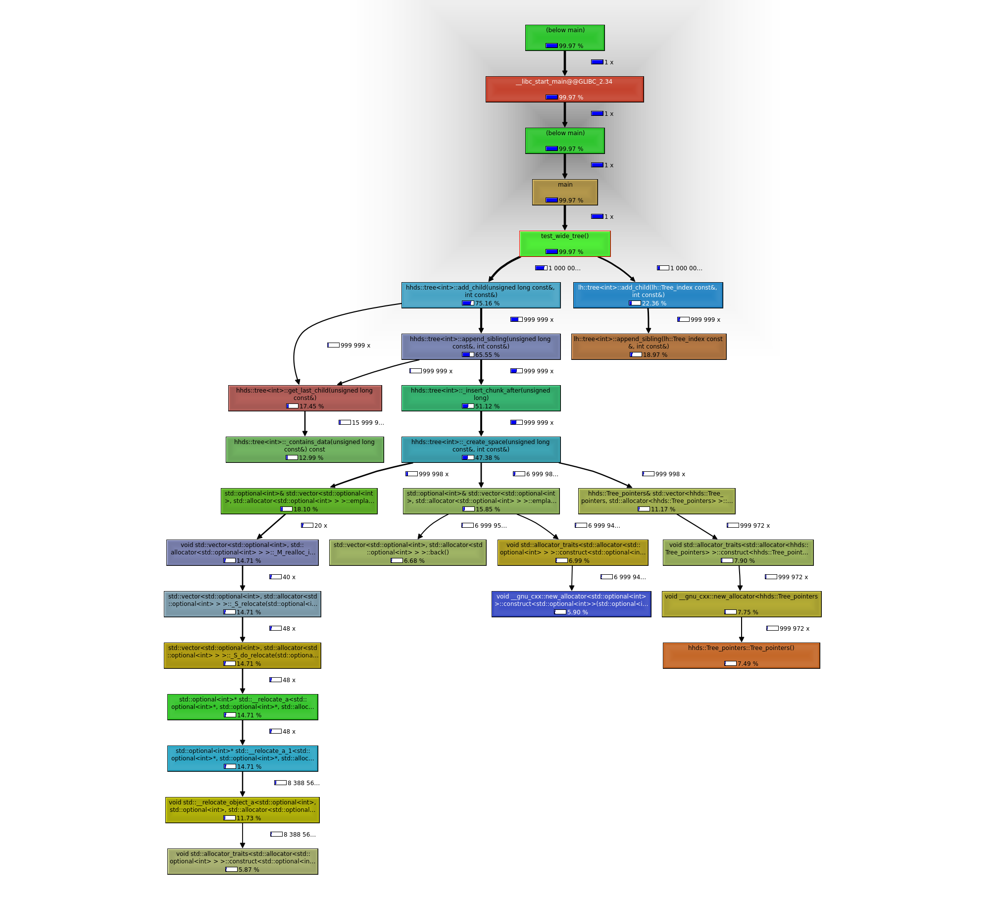

Hi everyone! I am Ujjwal Shekhar, a Computer Science student at the International Institute of Information Technology - Hyderabad. I am excited to share my work on the project titled **"Hardware Hierarchical Dynamical Systems"** as part of the [Open Source Research Experience (OSRE) program](https://ucsc-ospo.github.io/osre/) and [Google Summer of Code](https://summerofcode.withgoogle.com/). This project has been an incredible journey, and I've had the privilege of working with my mentors, {} and {}.

# Project Overview and Goals
> Abstract Syntax Trees (ASTs) are fundamental to modern compilers, serving as the backbone for parsing and transforming code. When compiling hardware code, the sheer volume of data can make compilation times a significant bottleneck. My project focuses on building a memory-optimized tree data structure specifically tailored for AST-typical queries. 

The [LiveHD](https://github.com/masc-ucsc/livehd) repository, developed by the [Micro Architecture Lab](https://masc.soe.ucsc.edu) at UCSC, offers a compiler infrastructure optimized for hardware synthesis and simulation. The existing [LHTree](https://github.com/masc-ucsc/livehd/blob/master/core/lhtree.hpp) data structure provides a foundation, but there was significant potential for further optimization, which I explored throughout this project.

### Key AST Queries
The core queries that the tree is optimized for include:
- Finding the parent of a node.
- Finding the first and last child of a node.
- Locating the previous and next sibling of a node.
- Adding a child to a node.
- Inserting a sibling to a node.
- Performing preorder, postorder, and sibling order traversal.
- Removing a leaf or an entire subtree from the tree.

The primary goal was to create a tree class that excels at handling these queries efficiently, while still being robust enough to support less frequent operations. The new HHDS tree structure has demonstrated superior performance for specific tree configurations and continues to show potential across other types, particularly in memory consumption and cache efficiency, compared to the current LHTree.

The benchmarks were done using Google Bench to test the tree for scalability and performance. The new version of the tree is currently being integrated into the LiveHD core repository. Profiling to find bottlenecks in the tree was also done using Callgrind and KCachegrind.

## Background and Motivation
### Naive approach
A straightforward method for storing an n-ary tree is to maintain pointers from each node to its parent, children, and immediate siblings. While simple, this approach is memory-intensive and has poor cache efficiency due to the non-contiguous nature of nodes in memory. The variable memory usage per node, depending on the number of children, can also introduce significant overhead.

### Enhancements to the Naive Approach
To reduce memory overhead, one optimization is to store only pointers to the first and last child within each node. This reduces memory usage to a constant per node. Additionally, since many AST-related queries focus on the tree's structure rather than the data itself, we can separate the data from the structure. The tree would store only pointers to the data, allowing the tree structure to be optimized independently of the data storage.

> While separating the data and the structure may seem like an obvious improvement, we will see that it can be extended to provide greater benefits.



### Improving the cache efficiency
While reducing memory consumption is beneficial, the tree's cache efficiency can still be suboptimal if the children of a node are scattered in memory. To enhance cache efficiency, storing children in contiguous memory locations is crucial. This improves spatial locality, which in turn boosts cache performance. Additionally, this approach eliminates the need to explicitly store data pointers in the tree, as the data resides at a contiguous memory index aligned with the bookkeeping.

By storing children contiguously, we can also eliminate the need for previous and next sibling pointers, as siblings are inherently adjacent in memory. Similarly, we can avoid storing the parent pointer for every child, since all children share the same parent.

## Optimizations in LHTree (Old method)
The [LHTree](https://github.com/masc-ucsc/livehd/blob/master/core/lhtree.hpp) class in LiveHD was designed with these optimizations in mind. It groups siblings into *chunks* of four, storing the parent pointer only in the first sibling of each chunk. The last sibling in each chunk points to the next chunk, minimizing the number of pointers required and thus reducing memory overhead.

LHTree organizes the entire tree as a 2-dimensional array, where the first dimension represents the tree level and the second dimension represents the node index at that level. This structure improves cache efficiency by storing nodes contiguously in memory. Each tree position is a 48-bit ID, with the last 32 bits representing the node's index and the first 16 bits indicating the tree level. 

This explicit maintenance of level separately limits the tree's scalability for deeper trees, due to the fixed number of bits allocated for the level.

> Despite these optimizations, LHTree has some limitations, particularly in cache alignment and flexibility, which the HHDS tree aims to address.

Unfortunately, the number of bits required by each "chunk" happens to be slightly bigger than a single cache line (512 bits). This means that the cache efficiency of the tree is not optimal. 

## HHDS Tree : A New Approach
### Eliminating Levels
The HHDS tree stores everything in a single vector, removing the need for explicit level information. This simplification not only improves cache efficiency but also eliminates restrictions on the number of nodes per level and the total number of levels.

### Enhanced Cache Alignment
In the HHDS tree, each node has a 46-bit ID. Chunks in the HHDS tree contain up to eight children, with the first 43 bits of the absolute ID serving as the chunk ID and the last three bits indicating the node's offset within the chunk.

For each chunk, which is exactly 64 bytes (or 512 bits) long—matching the size of a cache line—the following information is stored:
- A 46-bit parent pointer (absolute ID).
- A 43-bit first child long pointer (chunk ID).
- A 43-bit last child long pointer (chunk ID).
- 43-bit previous and next sibling chunk pointers.
- Seven 21-bit short delta pointers for the first child.
- Seven 21-bit short delta pointers for the last child.
> **NOTE**: The 0th chunk is an INVALID node, the real nodes start from the 1st chunk, with the node at an absolute ID of 8 (chunk ID of 1) being the root node.



> Refer to the next section for more information on the short delta pointers.

The chunk is 512 bits long, which is 64 bytes, exactly the size of a cache line. Thus the amount of memory required in the worst case is 512 bits for a single node in the chunk, and in the best case is 46 bits for all 8 nodes in the chunk.

> We utilized the `__attribute__((packed, aligned(64)))` attribute in C++ to ensure that each chunk aligns perfectly with a cache line. Bitfields were employed to pack the data efficiently within the chunk.

```cpp
class __attribute__((packed, aligned(64))) Tree_pointers {
private:
    // We only store the exact ID of parent
    Tree_pos parent                     : CHUNK_BITS + CHUNK_SHIFT;
    Tree_pos next_sibling               : CHUNK_BITS;
    Tree_pos prev_sibling               : CHUNK_BITS;

    // Long child pointers
    Tree_pos first_child_l              : CHUNK_BITS;
    Tree_pos last_child_l               : CHUNK_BITS;

    // Short (delta) child pointers
    // You cannot make an array of bitfields inside a packed 
    // struct, since the compiler will align each bitfield to the 
    // size of the nearest power of two.
    Short_delta first_child_s_0         : SHORT_DELTA;
    Short_delta first_child_s_1         : SHORT_DELTA;
    Short_delta first_child_s_2         : SHORT_DELTA;
    Short_delta first_child_s_3         : SHORT_DELTA;
    Short_delta first_child_s_4         : SHORT_DELTA;
    Short_delta first_child_s_5         : SHORT_DELTA;
    Short_delta first_child_s_6         : SHORT_DELTA;

    Short_delta last_child_s_0          : SHORT_DELTA;
    Short_delta last_child_s_1          : SHORT_DELTA;
    Short_delta last_child_s_2          : SHORT_DELTA;
    Short_delta last_child_s_3          : SHORT_DELTA;
    Short_delta last_child_s_4          : SHORT_DELTA;
    Short_delta last_child_s_5          : SHORT_DELTA;
    Short_delta last_child_s_6          : SHORT_DELTA;
}
```

### Build Append - Short Delta Heuristic
Empirical observations show that children are often added to a node shortly after the parent, meaning they are stored close to the parent in memory. This allows children to be stored as a delta from the parent, reducing the need for full chunk IDs.

When adding a child:

- Attempt to store the child as a delta from the parent.
- If not feasible, allocate a new chunk for the parent and store the pointer to the child chunk in the newly created parent chunk.

Implementing chunk breaking required careful handling to ensure that when a parent moves to a new chunk, its new chunk can still be referenced efficiently by its parent, potentially requiring recursive adjustments.

> This is because the grandparent might not be able to store the parent as a delta from itself after the parent moves to a new chunk.

## Compliance with the LiveHD core repository
Since the HHDS tree is an evolution of the LHTree, it was crucial to maintain compatibility with the LiveHD core repository. All necessary methods were implemented in the HHDS tree to ensure seamless integration. Naming conventions and syntax were kept consistent with the LHTree to facilitate a smooth transition.

Exposed methods in the HHDS tree are:
```cpp
/**
  *  Query based API (no updates)
  */
  Tree_pos get_parent (const Tree_pos& curr_index) const;
  Tree_pos get_last_child (const Tree_pos& parent_index) const;
  Tree_pos get_first_child (const Tree_pos& parent_index) const;
  bool is_last_child (const Tree_pos& self_index) const;
  bool is_first_child (const Tree_pos& self_index) const;
  Tree_pos get_sibling_next (const Tree_pos& sibling_id) const;
  Tree_pos get_sibling_prev (const Tree_pos& sibling_id) const;
  bool is_leaf (const Tree_pos& leaf_index) const;


/**
  *  Update based API (Adds and Deletes from the tree)
  */
  // FREQUENT UPDATES
  Tree_pos append_sibling(const Tree_pos& sibling_id, const X& data);
  Tree_pos add_child(const Tree_pos& parent_index, const X& data);
  Tree_pos add_root(const X& data);

  void delete_leaf(const Tree_pos& leaf_index);
  void delete_subtree(const Tree_pos& subtree_root);

  // INFREQUENT UPDATES
  Tree_pos insert_next_sibling(const Tree_pos& sibling_id, 
                               const X& data);
```

# Benchmarking Results
Preliminary benchmarks indicate that the HHDS tree outperforms the LHTree in both runtime efficiency (for certain cases, more on this in a later section) and memory consumption. The HHDS tree demonstrates enhanced performance across various tests, offering a more optimized solution for handling Abstract Syntax Tree (AST) operations.

I constructed identical trees using both the LHTree and HHDS tree structures and executed a series of queries on each. The benchmarks were performed using Google Benchmark to ensure accurate and consistent results. Below, I detail the specific tests conducted.

### Benchmark Tests Overview
1. **Deep Tree Test**  
   This test simulates a line graph by repeatedly adding a child to the last node in the tree. It is designed to assess the tree's performance when handling deep structures, where each node has a single child.

2. **Wide Tree Test**  
   In this scenario, a single root node is created, followed by the addition of numerous child nodes directly under the root. This test evaluates the tree's efficiency in managing wide structures with many immediate children.

3. **Chip-Typical Tree Test**  
   This test models a tree commonly seen in hardware design. For each node, a random number of children (ranging from 1 to 7) are added, and the process is recursively applied to the leaf nodes up to a certain depth. This test measures the tree's performance in realistic, varied conditions.

4. **Chip-Typical (Long) Tree Test**  
   Similar to the Chip-Typical Tree Test, but with a broader range of children per node (1 to 20). This test is particularly useful for examining performance when the tree is more complex and chunk splitting is more likely.

These tests provide a comprehensive analysis of the HHDS tree's capabilities, highlighting its superiority over the LHTree for deeper trees.

## Add/Append Benchmarks
### Deep Tree Test
> `test_deep_tree_100_hhds` indicates the time taken to run a benchmark on a deep tree of 100 nodes using the HHDS tree structure. This nomenclature is consistent across all tests.

#### Disabled compiler optimizations
```
------------------------------------------
Benchmark                             Time
------------------------------------------
test_deep_tree_10_hhds            11704 ns
test_deep_tree_10_lh              19541 ns
test_deep_tree_100_hhds           85317 ns
test_deep_tree_100_lh            163058 ns
test_deep_tree_1000_hhds         760260 ns
test_deep_tree_1000_lh          1442391 ns
test_deep_tree_10000_hhds       9889199 ns
test_deep_tree_10000_lh        16215232 ns
test_deep_tree_100000_hhds     84650074 ns
test_deep_tree_100000_lh      163255882 ns
test_deep_tree_1000000_hhds   877646208 ns
test_deep_tree_1000000_lh    1659725904 ns
test_deep_tree_10000000_hhds 9256118059 ns
test_deep_tree_10000000_lh   1.4431e+10 ns
```

#### Enabled compiler optimizations
```
------------------------------------------
Benchmark                             Time
------------------------------------------
test_deep_tree_10_hhds             1443 ns
test_deep_tree_10_lh               1462 ns
test_deep_tree_100_hhds            7398 ns
test_deep_tree_100_lh             17455 ns
test_deep_tree_1000_hhds          79544 ns
test_deep_tree_1000_lh           165656 ns
test_deep_tree_10000_hhds       1337406 ns
test_deep_tree_10000_lh         1494153 ns
test_deep_tree_100000_hhds     12288324 ns
test_deep_tree_100000_lh       14897463 ns
test_deep_tree_1000000_hhds   116810846 ns
test_deep_tree_1000000_lh     188815892 ns
test_deep_tree_10000000_hhds 2338596582 ns
test_deep_tree_10000000_lh   2238844395 ns
```

Here, the HHDS tree structure consistently outperforms the LHTree in the Deep Tree Test, showcasing its efficiency in handling deep tree structures.

### Wide Tree Test
#### Disabled compiler optimizations
```
------------------------------------------
Benchmark                             Time
------------------------------------------
test_wide_tree_10_hhds             6581 ns
test_wide_tree_10_lh               6235 ns
test_wide_tree_100_hhds           34911 ns
test_wide_tree_100_lh             35734 ns
test_wide_tree_1000_hhds         323228 ns
test_wide_tree_1000_lh           312755 ns
test_wide_tree_10000_hhds       3547963 ns
test_wide_tree_10000_lh         2975894 ns
test_wide_tree_100000_hhds     33800125 ns
test_wide_tree_100000_lh       32538424 ns
test_wide_tree_1000000_hhds   332509041 ns
test_wide_tree_1000000_lh     336261868 ns
test_wide_tree_10000000_hhds 3527352810 ns
test_wide_tree_10000000_lh   8774024963 ns
```

#### Enabled compiler optimizations
```
------------------------------------------
Benchmark                             Time
------------------------------------------
test_wide_tree_10_hhds              837 ns
test_wide_tree_10_lh                512 ns
test_wide_tree_100_hhds            3394 ns
test_wide_tree_100_lh              2675 ns
test_wide_tree_1000_hhds          26019 ns
test_wide_tree_1000_lh            20141 ns
test_wide_tree_10000_hhds        319068 ns
test_wide_tree_10000_lh          245964 ns
test_wide_tree_100000_hhds      3369183 ns
test_wide_tree_100000_lh        2910862 ns
test_wide_tree_1000000_hhds    39243340 ns
test_wide_tree_1000000_lh      26777306 ns
test_wide_tree_10000000_hhds  454508781 ns
test_wide_tree_10000000_lh    331688046 ns
```

Here without compiler optimizations, the HHDS tree structure typically outperforms the LHTree in the Wide Tree Test for large tree sizes. For smaller tree sizes, the LHTree showed a slightly better performance. However, using compiler optimizations, the LHTree starts to perform better than HHDS.

> The reason for the HHDS tree's superior performance can be attributed to the chunk size being large, which allows for better cache utilization and reduced memory overhead. However, the LH Tree has been put through more tuning and has been in use for a longer time, which could explain its better performance with compiler optimizations. In the future, the HHDS tree could be optimized further to match or exceed the LH Tree's performance.

### Chip Typical Tree Test
#### Disabled compiler optimizations
```
--------------------------------------------------------
Benchmark                                           Time
--------------------------------------------------------
test_chip_typical_tree_1_hhds                    7109 ns
test_chip_typical_tree_1_lh                      6803 ns
test_chip_typical_tree_2_hhds                   22728 ns
test_chip_typical_tree_2_lh                     22064 ns
test_chip_typical_tree_3_hhds                   75398 ns
test_chip_typical_tree_3_lh                     70910 ns
test_chip_typical_tree_4_hhds                  270062 ns
test_chip_typical_tree_4_lh                    254423 ns
test_chip_typical_tree_5_hhds                 1110254 ns
test_chip_typical_tree_5_lh                   1074439 ns
test_chip_typical_tree_6_hhds                 5024264 ns
test_chip_typical_tree_6_lh                   3900709 ns
test_chip_typical_tree_7_hhds/iterations:5   13290739 ns
test_chip_typical_tree_7_lh/iterations:5     22145462 ns
test_chip_typical_tree_8_hhds/iterations:5   83438683 ns
test_chip_typical_tree_8_lh/iterations:5    105475664 ns
```

#### Enabled compiler optimizations
```
--------------------------------------------------------
Benchmark                                           Time
--------------------------------------------------------
test_chip_typical_tree_1_hhds                     938 ns
test_chip_typical_tree_1_lh                       387 ns
test_chip_typical_tree_2_hhds                    1877 ns
test_chip_typical_tree_2_lh                      1351 ns
test_chip_typical_tree_3_hhds                    7095 ns
test_chip_typical_tree_3_lh                      5052 ns
test_chip_typical_tree_4_hhds                   35019 ns
test_chip_typical_tree_4_lh                     21569 ns
test_chip_typical_tree_5_hhds                  130915 ns
test_chip_typical_tree_5_lh                     78010 ns
test_chip_typical_tree_6_hhds                  522385 ns
test_chip_typical_tree_6_lh                    278223 ns
test_chip_typical_tree_7_hhds/iterations:5    4015636 ns
test_chip_typical_tree_7_lh/iterations:5      1648426 ns
test_chip_typical_tree_8_hhds/iterations:5    9873724 ns
test_chip_typical_tree_8_lh/iterations:5      4607773 ns
```

For the Chip Typical test, the HHDS tree's performance is better for larger tree sizes, while the LHTree performs better for smaller tree sizes. However, with compiler optimizations, the LH Tree performs better than the HHDS tree.

### Chip Typical (long) Tree test
#### Disabled compiler optimizations
```
-------------------------------------------------------------
Benchmark                                                Time
-------------------------------------------------------------
test_chip_typical_long_tree_1_hhds                    8875 ns
test_chip_typical_long_tree_1_lh                      8479 ns
test_chip_typical_long_tree_2_hhds                   62490 ns
test_chip_typical_long_tree_2_lh                     64620 ns
test_chip_typical_long_tree_3_hhds                  625064 ns
test_chip_typical_long_tree_3_lh                    654787 ns
test_chip_typical_long_tree_4_hhds                 6128047 ns
test_chip_typical_long_tree_4_lh                   6528778 ns
test_chip_typical_long_tree_5_hhds                71345448 ns
test_chip_typical_long_tree_5_lh                  77170587 ns
test_chip_typical_long_tree_6_hhds/iterations:5  656595039 ns
test_chip_typical_long_tree_6_lh/iterations:5    860193491 ns
```

#### Enabled compiler optimizations
```
-------------------------------------------------------------
Benchmark                                                Time
-------------------------------------------------------------
test_chip_typical_long_tree_1_hhds                    1139 ns
test_chip_typical_long_tree_1_lh                       692 ns
test_chip_typical_long_tree_2_hhds                    8666 ns
test_chip_typical_long_tree_2_lh                      5238 ns
test_chip_typical_long_tree_3_hhds                   90856 ns
test_chip_typical_long_tree_3_lh                     48758 ns
test_chip_typical_long_tree_4_hhds                 1034346 ns
test_chip_typical_long_tree_4_lh                    472964 ns
test_chip_typical_long_tree_5_hhds                13040238 ns
test_chip_typical_long_tree_5_lh                   5025192 ns
test_chip_typical_long_tree_6_hhds/iterations:3  131143411 ns
test_chip_typical_long_tree_6_lh/iterations:3     68739573 ns
```
Similar to the previous case, the HHDS tree performs better in debug mode (without compiler optimizations). However, the LH Tree performs better with compiler optimizations.

> We see that the HHDS tree has shown overall better performance without compiler optimizations, however, with compiler optimizations, the LH Tree has shown better performance. HHDS Tree has shown better performance regardless, for the Deep Tree test. This indicates an inherent trade-off between the choice of both trees. To further investigate this behaviour I conducted some profiling, which is in a later section.

## Iterators Benchmarks
### Deep Tree test
#### Disabled compiler optimizations
```
--------------------------------------------------------
Benchmark                                          Time
-------------------------------------------------------
test_deep_tree_10_hhds                           884 ns
test_deep_tree_10_lh                            1356 ns
test_deep_tree_100_hhds                         7987 ns
test_deep_tree_100_lh                          11191 ns
test_deep_tree_1000_hhds                       86991 ns
test_deep_tree_1000_lh                        105809 ns
test_deep_tree_10000_hhds                     894127 ns
test_deep_tree_10000_lh                      1076983 ns
test_deep_tree_100000_hhds                   7927102 ns
test_deep_tree_100000_lh                    11177187 ns
test_deep_tree_1000000_hhds/iterations:4    80470145 ns
test_deep_tree_1000000_lh/iterations:4     145763040 ns
test_deep_tree_10000000_hhds/iterations:3 1055529435 ns
test_deep_tree_10000000_lh/iterations:3    995416880 ns
```
#### Enabled compiler optimizations
```
------------------------------------------
Benchmark                             Time
------------------------------------------
test_deep_tree_10_hhds              202 ns
test_deep_tree_10_lh               93.1 ns
test_deep_tree_100_hhds            1595 ns
test_deep_tree_100_lh              1039 ns
test_deep_tree_1000_hhds          15663 ns
test_deep_tree_1000_lh            11000 ns
test_deep_tree_10000_hhds        164778 ns
test_deep_tree_10000_lh          107293 ns
test_deep_tree_100000_hhds      1615928 ns
test_deep_tree_100000_lh        1260507 ns
test_deep_tree_1000000_hhds    19582402 ns
test_deep_tree_1000000_lh      15954697 ns
test_deep_tree_10000000_hhds  214887559 ns
test_deep_tree_10000000_lh    179118729 ns
```

### Wide Tree test
#### Disabled compiler optimizations
```
-------------------------------------------------------
Benchmark                                          Time
-------------------------------------------------------
test_wide_tree_10_hhds                          7171 ns
test_wide_tree_10_lh                            7098 ns
test_wide_tree_100_hhds                         6204 ns
test_wide_tree_100_lh                          10372 ns
test_wide_tree_1000_hhds                       62762 ns
test_wide_tree_1000_lh                        106132 ns
test_wide_tree_10000_hhds                     622999 ns
test_wide_tree_10000_lh                      1124283 ns
test_wide_tree_100000_hhds                   6118490 ns
test_wide_tree_100000_lh                     9550170 ns
test_wide_tree_1000000_hhds/iterations:10   59438777 ns
test_wide_tree_1000000_lh/iterations:10     97842431 ns
test_wide_tree_10000000_hhds/iterations:7  778347697 ns
test_wide_tree_10000000_lh/iterations:7   1163215808 ns
```
#### Enabled compiler optimizations
```
------------------------------------------
Benchmark                             Time
------------------------------------------
test_wide_tree_10_hhds             2103 ns
test_wide_tree_10_lh               1284 ns
test_wide_tree_100_hhds            1563 ns
test_wide_tree_100_lh               632 ns
test_wide_tree_1000_hhds          15627 ns
test_wide_tree_1000_lh             6410 ns
test_wide_tree_10000_hhds        149588 ns
test_wide_tree_10000_lh           56030 ns
test_wide_tree_100000_hhds      1511278 ns
test_wide_tree_100000_lh         563926 ns
test_wide_tree_1000000_hhds    17056051 ns
test_wide_tree_1000000_lh       7754815 ns
test_wide_tree_10000000_hhds  143994848 ns
test_wide_tree_10000000_lh     55040231 ns
```

### Chip typical test
#### Disabled compiler optimizations
```
--------------------------------------------------------
Benchmark                                           Time
--------------------------------------------------------
test_chip_typical_tree_1_hhds                     344 ns
test_chip_typical_tree_1_lh                       892 ns
test_chip_typical_tree_2_hhds                    2192 ns
test_chip_typical_tree_2_lh                      1691 ns
test_chip_typical_tree_3_hhds                   13628 ns
test_chip_typical_tree_3_lh                     14235 ns
test_chip_typical_tree_4_hhds                   34049 ns
test_chip_typical_tree_4_lh                     84096 ns
test_chip_typical_tree_5_hhds                  206482 ns
test_chip_typical_tree_5_lh                    203680 ns
test_chip_typical_tree_6_hhds                  848996 ns
test_chip_typical_tree_6_lh                    708212 ns
test_chip_typical_tree_7_hhds/iterations:5    3645372 ns
test_chip_typical_tree_7_lh/iterations:5      6657982 ns
test_chip_typical_tree_8_hhds/iterations:5    7375050 ns
test_chip_typical_tree_8_lh/iterations:5      4577351 ns
```
#### Enabled compiler optimizations
```
-------------------------------------------
Benchmark                              Time
-------------------------------------------
test_chip_typical_tree_1_hhds       93.1 ns
test_chip_typical_tree_1_lh         50.1 ns
test_chip_typical_tree_2_hhds        149 ns
test_chip_typical_tree_2_lh          212 ns
test_chip_typical_tree_3_hhds       1166 ns
test_chip_typical_tree_3_lh          554 ns
test_chip_typical_tree_4_hhds       7385 ns
test_chip_typical_tree_4_lh         3138 ns
test_chip_typical_tree_5_hhds      54477 ns
test_chip_typical_tree_5_lh        10643 ns
test_chip_typical_tree_6_hhds     215050 ns
test_chip_typical_tree_6_lh        53043 ns
test_chip_typical_tree_7_hhds     492555 ns
test_chip_typical_tree_7_lh       577120 ns
test_chip_typical_tree_8_hhds    2630675 ns
test_chip_typical_tree_8_lh      1278702 ns
```

### Chip typical (long) test
#### Disabled compiler optimizations
```
------------------------------------------------
Benchmark                                   Time
------------------------------------------------
test_chip_typical_long_tree_1_hhds        911 ns
test_chip_typical_long_tree_1_lh         1435 ns
test_chip_typical_long_tree_2_hhds       8161 ns
test_chip_typical_long_tree_2_lh         8619 ns
test_chip_typical_long_tree_3_hhds      76618 ns
test_chip_typical_long_tree_3_lh       132467 ns
test_chip_typical_long_tree_4_hhds    1644808 ns
test_chip_typical_long_tree_4_lh      1962406 ns
test_chip_typical_long_tree_5_hhds    7199648 ns
test_chip_typical_long_tree_5_lh      9195894 ns
test_chip_typical_long_tree_6_hhds  169002499 ns
test_chip_typical_long_tree_6_lh    207296570 ns
```
#### Enabled compiler optimizations
```
------------------------------------------------
Benchmark                                   Time
------------------------------------------------
test_chip_typical_long_tree_1_hhds        223 ns
test_chip_typical_long_tree_1_lh          101 ns
test_chip_typical_long_tree_2_hhds       2270 ns
test_chip_typical_long_tree_2_lh          719 ns
test_chip_typical_long_tree_3_hhds      38291 ns
test_chip_typical_long_tree_3_lh        12547 ns
test_chip_typical_long_tree_4_hhds     294222 ns
test_chip_typical_long_tree_4_lh       187010 ns
test_chip_typical_long_tree_5_hhds    4721230 ns
test_chip_typical_long_tree_5_lh       835256 ns
test_chip_typical_long_tree_6_hhds   30302468 ns
test_chip_typical_long_tree_6_lh     10057136 ns
```

Overall, both add/append and iterators related benchmarks show an improvement in performance. Without compiler optimizations, HHDS tree performs better than the LH Tree. With compiler optimizations, there are similar differences in the traversal benchmarks. We will now look at some profiling that was done to identify the bottlenecks in the HHDS tree.

## Exceptions, and a reminder of why they are slow.
When looking at the performance difference between the HHDS tree and LH tree (after enabling compiler optimizations), I was shocked to see that the HHDS tree was performing worse than the LH tree by multiple orders of magnitude upon using exceptions. This was a surprise to me, as I had not expected exceptions to have such a large impact on performance. 

The reason this happens is because exceptions are slow. When an exception is thrown, the stack is unwound, and the program has to jump to the catch block. This is a slow process, and should be avoided in performance-critical code. Moreover, the compiler cannot optimize code with exceptions as well as it can without them. This is why the HHDS tree performs so much worse than the LH tree when exceptions are enabled. But the HHDS tree still wasn't performing as well as it should have been.

# Profiling
I used `callgrind` to profile the HHDS tree and identify potential bottlenecks. The profiling results provided valuable insights into the tree's performance and areas for optimization. I generated a call graph using `KCachegrind` and analyzed the function calls to determine the most time-consuming operations. 


The call graph clearly shows that the bottleneck is the `_create_space` call that is tasked with creating space for a new node. This function is called when a new node is added to the tree, and its performance directly impacts the tree's efficiency. 
```
inline Tree_pos _create_space(const X& data) {
   // Make space for CHUNK_SIZE number of entries at the end
   data_stack.emplace_back(data);
   for (int i = 0; i < CHUNK_MASK; i++) {
      data_stack.emplace_back();
   }

   // Add the single pointer node for all CHUNK_SIZE entries
   pointers_stack.emplace_back();

   return pointers_stack.size() - 1;
}
```

However, the `_create_space` function is relatively simple and should not be causing such a significant performance hit. This indicates that the issue may lie in the memory allocation process or the data structure itself. One possible way of dealing with this would be to increase chunk sizes, or enable dynamic chunk sizing, which would allow for more efficient memory allocation.

Another possible bottleneck, seems to be any amount of computation that will be done to find the next vacant space in the chunk (like in `get_last_child()`). This is because the chunk is a fixed size, and if the chunk is full, the program will have to search for the next chunk that has space. This is a linear operation, and can be slow for wide trees. To fix this, I tried to add extra bookkeeping in the `Tree_pointers` node structure:
```
class __attribute__((packed, aligned(64))) Tree_pointers {
private:
   // We only store the exact ID of parent
   Tree_pos parent                     : CHUNK_BITS + CHUNK_SHIFT;
   Tree_pos next_sibling               : CHUNK_BITS;
   Tree_pos prev_sibling               : CHUNK_BITS;

   // Long child pointers
   Tree_pos first_child_l              : CHUNK_BITS;
   Tree_pos last_child_l               : CHUNK_BITS;

   // Storing the last occupied index in the short delta
   // This is to avoid iterating over all short deltas
   // to find the last occupied index
   unsigned short last_occupied        : CHUNK_SHIFT;

   // Short (delta) child pointers
   Short_delta first_child_s_0         : SHORT_DELTA;
   Short_delta first_child_s_1         : SHORT_DELTA;
   ...
```

However, the improvement in performance was marginal after making this change. This indicates that the issue may be more complex and require further investigation. This tree has also been added to the repository, in case a future contributor might be able to make use of it.

There are other possible bottlenecks that might be coming from storing separate short deltas instead of reducing the size of the delta and packing it into a single large integer type. I will be implementing this idea in the future.

# Code contributions
All of my Pull requests and code changes here made on the [HHDS repository](https://github.com/masc-ucsc/hhds/graphs/contributors). Each contribution has undergone thorough review and been successfully merged into the main repository:

- https://github.com/masc-ucsc/hhds/pull/32
- https://github.com/masc-ucsc/hhds/pull/37
- https://github.com/masc-ucsc/hhds/pull/38
- https://github.com/masc-ucsc/hhds/pull/41
- https://github.com/masc-ucsc/hhds/pull/47
- https://github.com/masc-ucsc/hhds/pull/48
- https://github.com/masc-ucsc/hhds/pull/54

Additionally, we are planning to integrate these changes into the LiveHD repository in the near future.

# Conclusion and Future Work
Working on this project has been a valuable learning experience, particularly in applying core C++ features. I discovered that simple, fundamentally sound optimizations often outperform more complex ones. The greatest challenge for me was to steer through the changes in our original Plan of Action, however, due to the support and guidance from my mentors I was able to make it.

There are still areas where the HHDS tree can be improved to make it more robust. One area of future exploration is dynamic chunk sizing:

> Dynamic Chunk Sizing: Instead of using fixed 8-sized chunks as we did, we could implement multiple chunk sizes. This would allow users to "hint" the HHDS tree to use specific chunk types, potentially reducing memory consumption further.

Overall, the HHDS tree has shown promise in handling deep tree structures efficiently. With further optimization and enhancements, it can become a powerful tool for handling complex tree operations.

# Acknowledgements
I would like to thank my mentors, {} and {} for their guidance and support throughout the project. It would not have been possible without their help. Their insights and mentorship have significantly contributed to my learning and the success of this work.