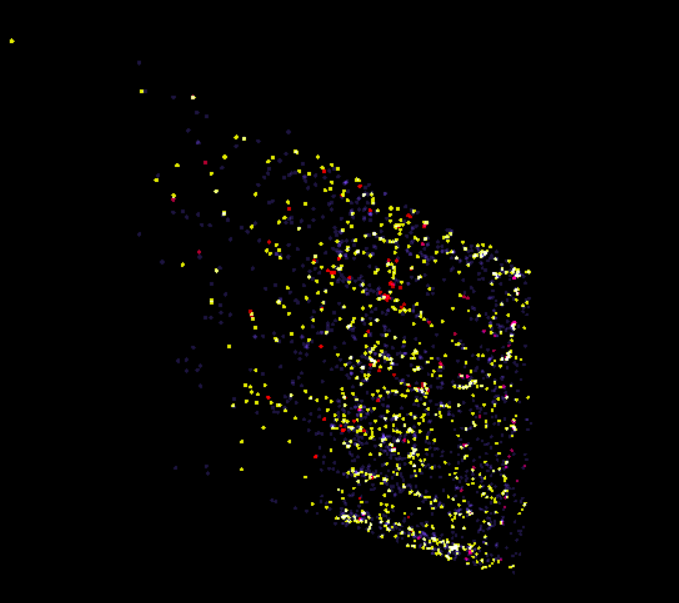
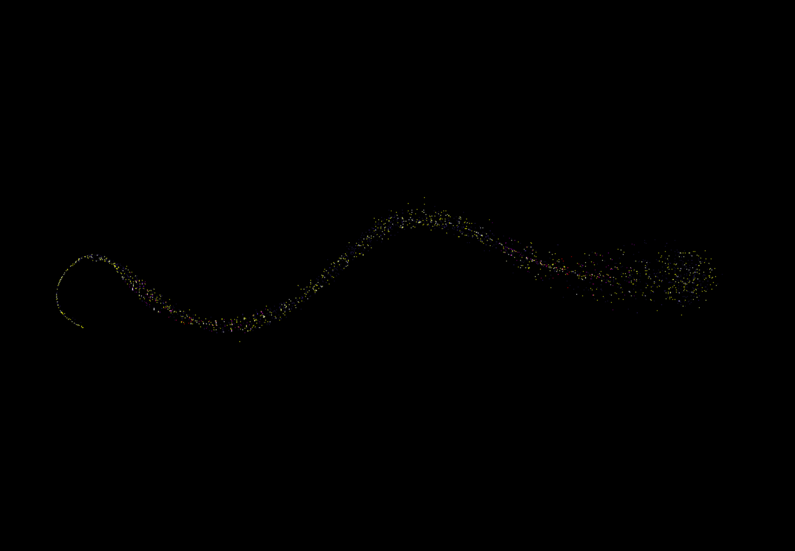

## Introduction
    Hello! My name is {}, a machine learning engineer and researcher based out of Chandigarh, a beautiful city in Northern India known for its modern architecture and green spaces.
    For the last month and a half I have been working closely with my mentors {} and {}  on the project titled [Unveiling Medicine Patterns: 3D Clustering with Polyphy/Polyglot](\project\osre24\ucsc\polyphy)as part of GSoC 2024.

## Progress and Challenges
The project focuses on developing effective clustering algorithms to visualize medicine data in three dimensions using PolyPhy and Polyglot. My journey began with data preprocessing and cleaning, where unnecessary data points were removed, and missing values were addressed.

One of the primary techniques we've employed is UMAP (Uniform Manifold Approximation and Projection). UMAP's ability to preserve the global structure of the data while providing meaningful clusters proved advantageous. Initial experiments with UMAP on datasets of various sizes (ranging from 1,500 to 15,000 medicines) provided valuable insights into the clustering patterns. By iteratively halving the dimensions and refining the parameters, we achieved more accurate clustering results.

To complement UMAP, we explored t-SNE (t-distributed Stochastic Neighbor Embedding). t-SNE's focus on local relationships helped in understanding finer details within the clusters. By adjusting t-SNE parameters and conducting perturbations, we could better comprehend the data's behavior. Combining UMAP with t-SNE in a loop, halving dimensions iteratively, showed promise, allowing us to leverage the strengths of both techniques to enhance clustering accuracy.

We also experimented with pre-trained models like BERT and Glove to create embeddings for the medicines. BERT’s splitting of salts into subparts and Glove’s limitations in recognizing specific salts led us to inaccurate clustering and we've been working on improving it for the time being.

## Next Steps
Moving forward, I will focus on refining our clustering and embedding techniques to enhance overall accuracy. This involves integrating Jaccard distance alongside other distance measures to improve similarity assessments between medicines and clusters. Additionally, I'll continue experimenting with advanced models like gpt,CLIP, gemini etc., for better embeddings while addressing the limitations of BERT and Glove by leveraging custom embeddings created with transformers and one-hot encoding. Optimization of UMAP and t-SNE algorithms will also be crucial, ensuring their effectiveness in clustering and visualization. These steps aim to overcome current challenges and further advance the project's goals.