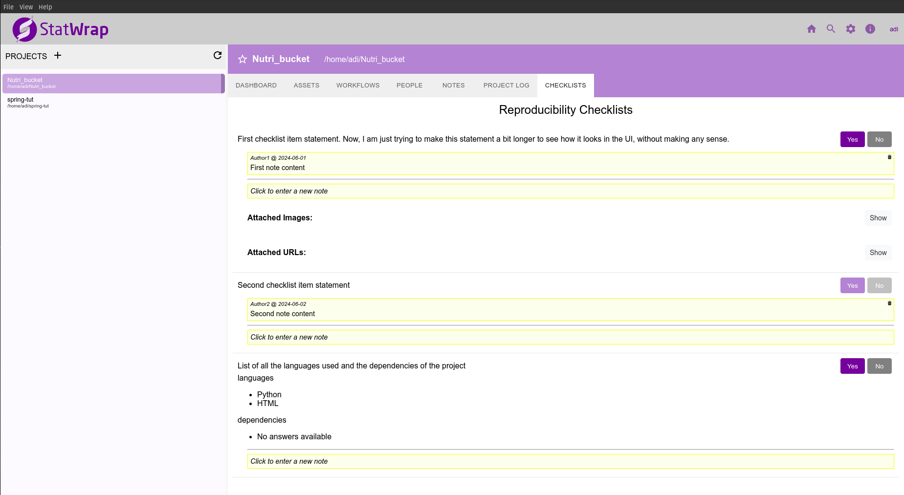
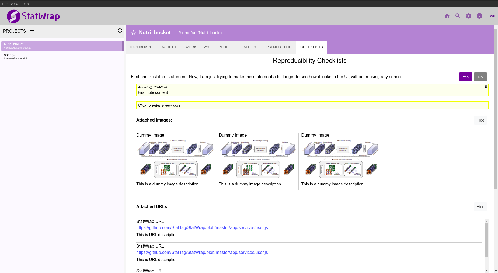

Namaste🙏🏻! I'm {}, and I'm excited to share progress updates on the [Reproducibility Checklists project](https://drive.google.com/file/d/1xV7eHL9lIWGKueQJxBks6OB_rcXCr8JY/view?usp=sharing) by StatWrap, under the mentorship of {}.

## Project Overview

The project aims to integrate customizable reproducibility checklists into StatWrap, using metadata and user input to automate their generation. The goal is to enhance the reproducibility of research projects by providing researchers with structured and comprehensive checklists to ensure their work is reproducible.

## Progress

Over the past few months, my mentors and I have worked on developing the interface for the checklists page and designed key components to support our project goals. We’ve implemented logic that iterates over each checklist item, displaying its statement along with Boolean controls (Yes/No buttons) for user interaction.

We’ve also developed components to display attached images and URLs linked to each checklist item. Additionally, we’ve integrated a notes feature that allows users to add, edit, and view project-related notes. Currently, we are writing methods to integrate real-time project data into the checklists. For example, one method we’ve implemented scans project files (assets) to detect the languages used.

## What's Next?

As we move closer to the final evaluation phase, our focus will be on the following objectives:
- Implement methods for each checklist item, integrating real-time data from the project data to auto-populate checklist answers.
- Enhance the `Attached Images` component to allow users to select and attach existing image assets from the project.
- Display the results of the scans for each checklist item, providing users with detailed outputs based on the automated analysis.

Stay tuned for further updates as we continue developing this feature set! 🚀
