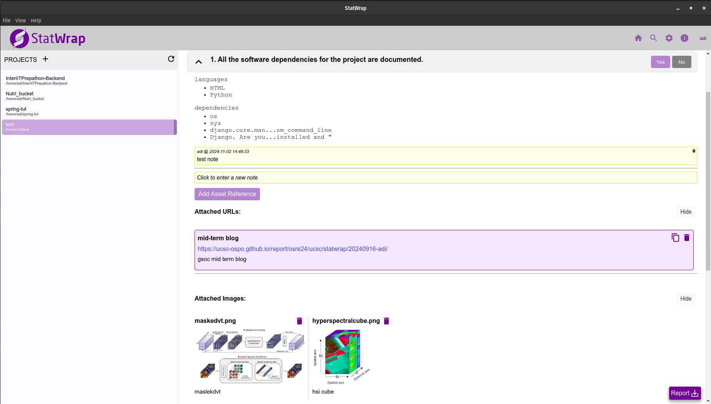
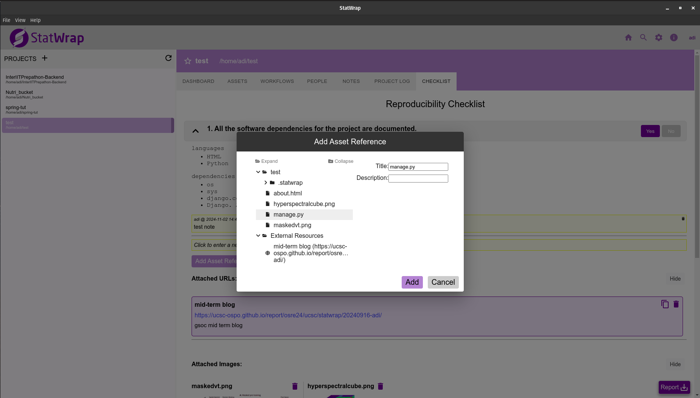
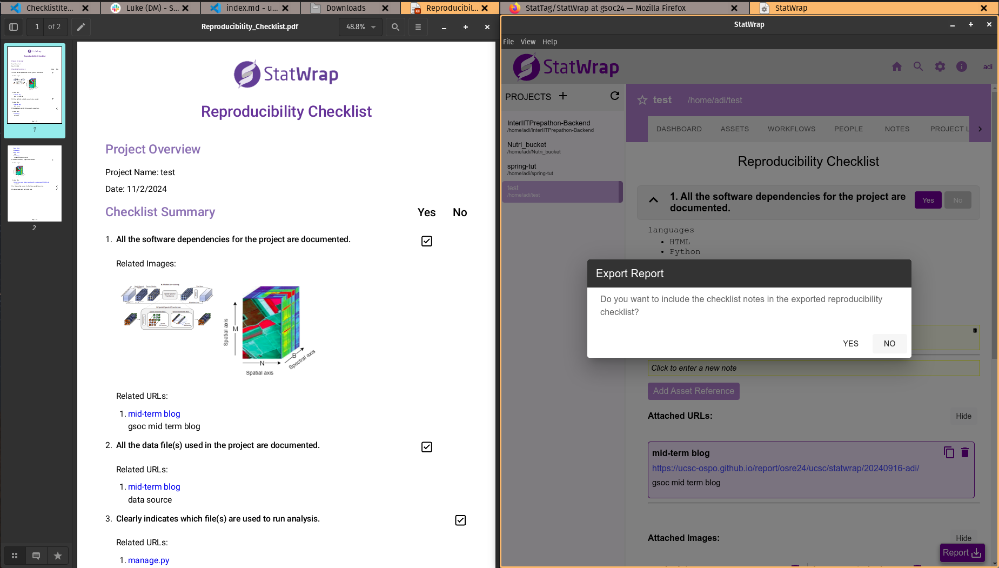

Namaste🙏🏻! I'm {}, and I'm excited to share my final updates on the [Reproducibility Checklists project](https://drive.google.com/file/d/1xV7eHL9lIWGKueQJxBks6OB_rcXCr8JY/view?usp=sharing) by StatWrap, under the mentorship of {}.

## Project Overview

This project introduces customizable reproducibility checklists in StatWrap, enabling metadata-driven and user-guided generation of checklists. The goal is to enhance the reproducibility of research projects by providing researchers with structured and comprehensive checklist to ensure their work is reproducible.

## Project Links

Explore the StatWrap project repository and my contributions during GSoC '24:

- [StatWrap](https://github.com/StatTag/StatWrap)
- [GSoC '24 Contributions](https://github.com/StatTag/StatWrap/tree/gsoc24)

## Progress And Achievements

During the timeline of this project, I worked on designing the interface for the checklist page and the data structure to support the project needs.

The interface was designed with user needs in mind, featuring components such as:

- URLs component to manage external links or file URIs, attached to the project.
- Images component to display project image files.
- Checklist Notes component to manage user-added notes.

All these assets (Files, URLs, Images) can be added to each checklist statement using the existing assets and external resources(urls) present in the project.

Additionally, for each checklist item, StatWrap runs relevant scans to provide meaningful data based on its requirements. For example, for the item, “All the software dependencies for the project are documented,” StatWrap scans project files to list the languages and dependencies detected.
For each checklist statement supported in StatWrap, we implement methods to retrieve specific information by scanning project data. StatWrap currently supports six such checklist statements identified as foundational for ensuring research reproducibility.
Additionally, the checklist can be exported as a PDF summary, generated by StatWrap using the checklist data, with options to include notes.

## Future Prospects

As the project concludes, several areas for growth have emerged:

- Expanding language support within StatWrap. While StatWrap already includes key languages used in research, there is always a scope to extend compatibility to cover even more technologies.
- Options to export a data-extensive report that includes checklist and their associated scan results.
  These and other enhancements, like adding new checklist statements with their scanning methods, will extend StatWrap’s impact on reproducibility in research.

## Earlier Blogs

If you’re interested in seeing the project’s evolution, check out my earlier posts:

- [Intro Blog](https://ucsc-ospo.github.io/report/osre24/ucsc/statwrap/20240614-adi/)
- [MidTerm Blog](https://ucsc-ospo.github.io/report/osre24/ucsc/statwrap/20240916-adi/)

Thank you for reading!
