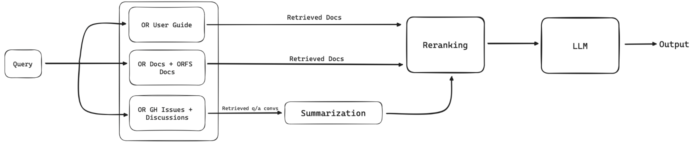
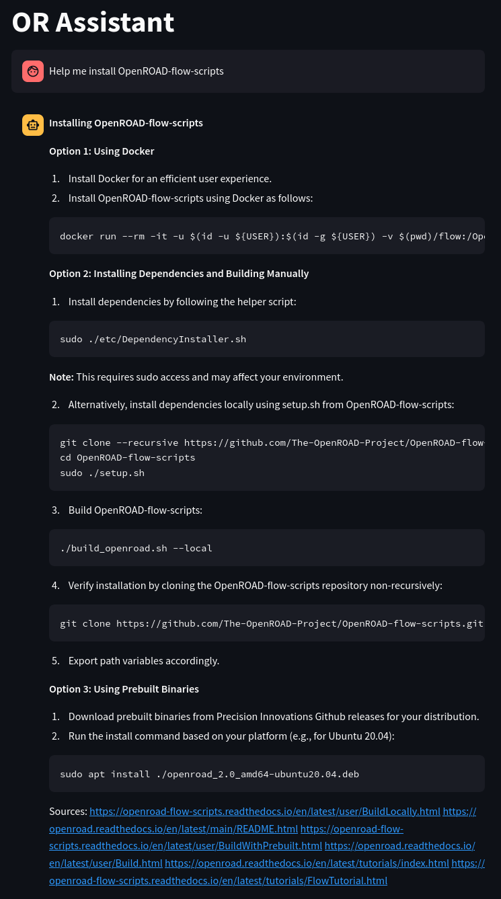

Hi there! 

I’m Palaniappan R, currently an undergraduate student at the Birla Institute of Technology & Science, Pilani, India.

I'll be working on the [LLM Assistant for OpenROAD - Model Architecture and Prototype](https://summerofcode.withgoogle.com/programs/2024/projects/DSo6kvA5) project, under the mentorship of [Indira Iyer](https://ucsc-ospo.github.io/author/indira-iyer/) and [Jack Luar](https://ucsc-ospo.github.io/author/jack-luar/). 

My project aims to develop the architecture for a chat assistant built for OpenROAD and its native flow, designed to assist beginners and experienced users by giving easy access to existing resources, offering troubleshooting assistance, and providing fast and accurate responses to common questions. I plan to do this by leveraging state-of-the-art retrieval and fine-tuning techniques.

As part of this project, I will be working alongside another [project](https://summerofcode.withgoogle.com/programs/2024/projects/J8uAFNCu) to build and test on a valid dataset for training and deployment. We will also be collaborating with other research teams at NYU and ASU, working on similar projects  related to OpenROAD chat assistants and flow generation using Generative AI. Our primary objective is to minimize support overhead, improve user experience by reducing response times, and provide access to updated information about OpenROAD.

Upon completion, my project will offer a viable chat assistant architecture as part of OpenROAD that benefits both the users and tool developers of OpenROAD.

An [early prototype](https://github.com/The-OpenROAD-Project/ORAssistant) developed along with a human evaluation framework shows promising results.

    
    

I'm excited about the potential of ORAssistant as part of the OpenROAD tool suite to accelerate innovation in EDA and chip design by utilizing open-source tools along with Generative AI. 

Stay tuned for more updates!
