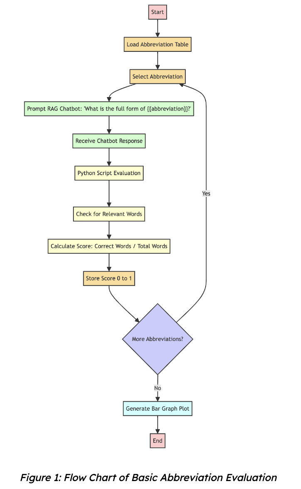
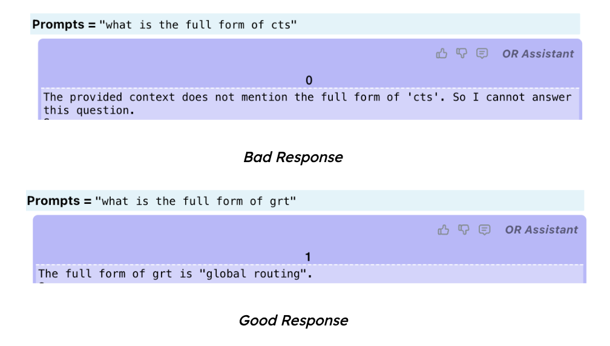
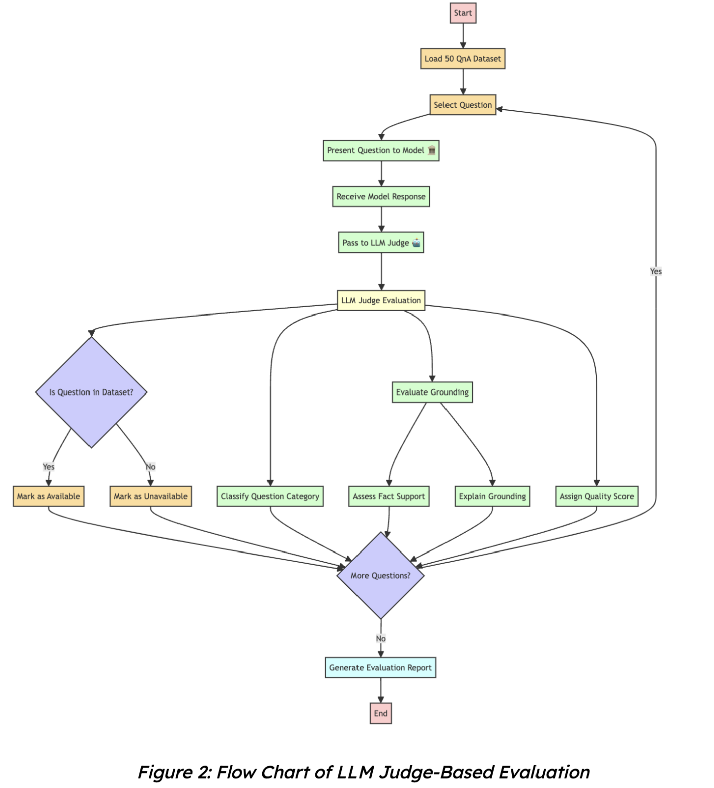
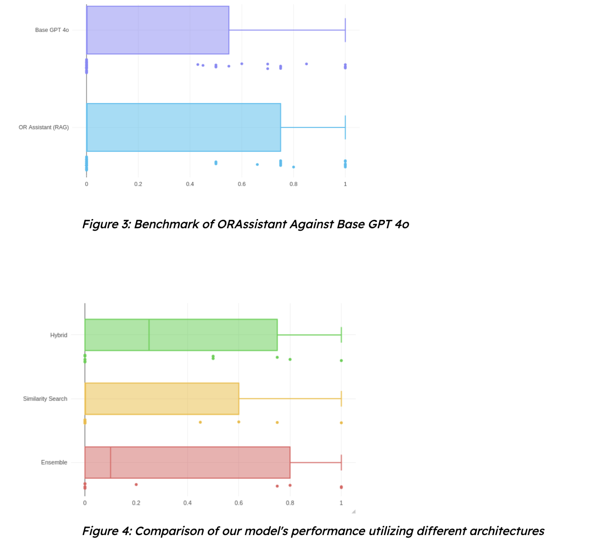
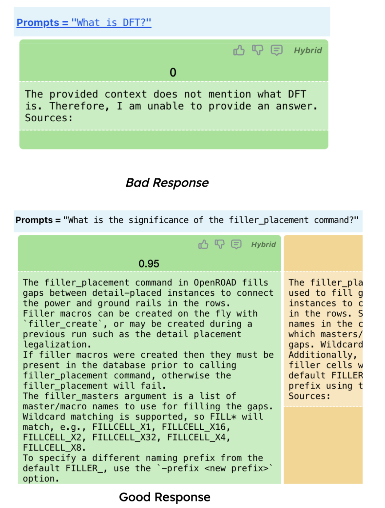
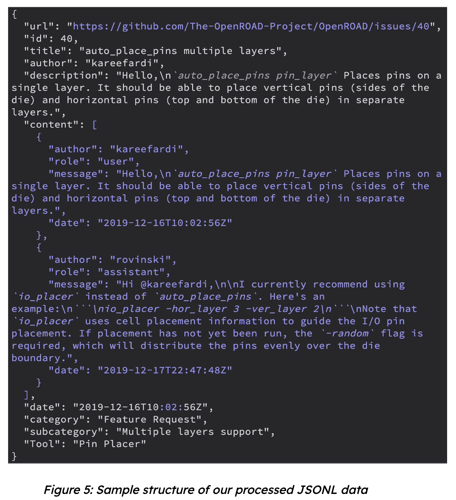
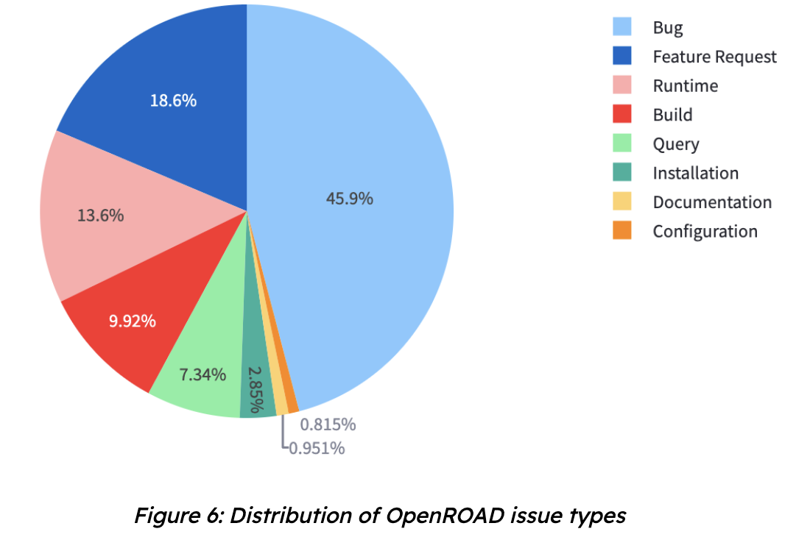
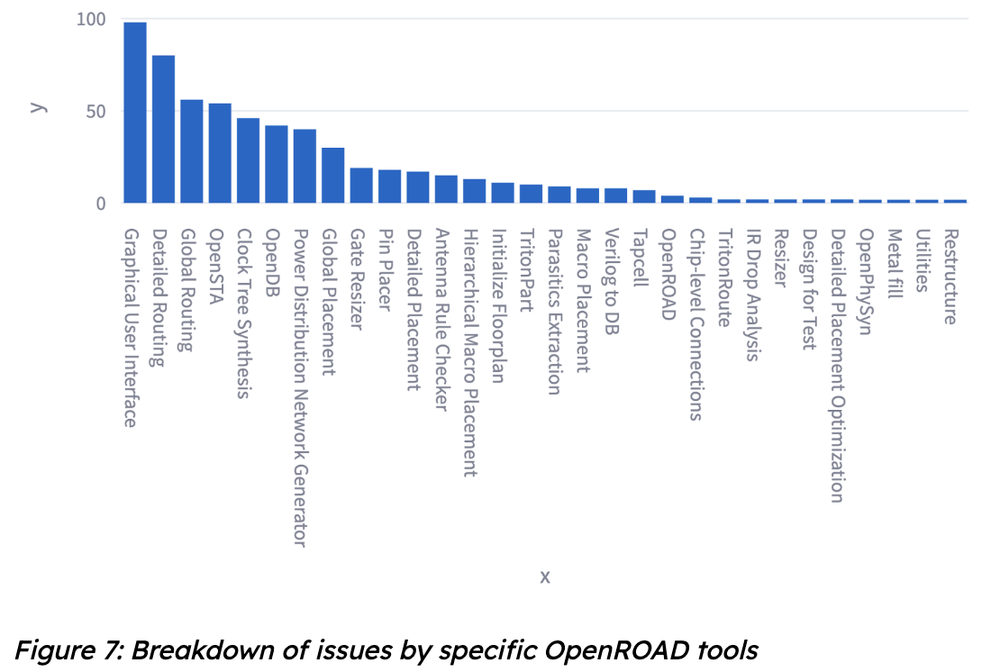

Hello everyone! We've reached the halfway point of our Google Summer of Code 2024 journey, and it's time for an update on our project to build a conversational chat assistant for OpenROAD. Under the guidance of our mentors, {} and {}, we're making significant strides in enhancing OpenROAD's user support capabilities.

## Project Focus

My project focuses on two crucial aspects of our chat assistant:
1. **Data Engineering**: Ensuring our assistant has access to comprehensive and relevant information. 
2. **Evaluation**: Developing robust methods to assess and improve the assistant's performance.

The ultimate goal is to create a more responsive and accurate chat assistant capable of aiding users with troubleshooting, installation, and general queries about OpenROAD. I'm working in tandem with {}, who is developing the RAG architecture for our assistant.

## Progress 

Since our initial deployment, I've been concentrating on implementing automated evaluation systems for our RAG architecture. We've developed two primary evaluation methods: 

### Basic Abbreviation Evaluation 

This method assesses the model's ability to accurately identify and explain common abbreviations used within the OpenROAD community. It ensures that our assistant can effectively communicate using domain-specific terminology.

### LLM Judge-Based Evaluation 

For this more comprehensive evaluation, we:

1. Prepared a dataset of question-answer pairs relevant to OpenROAD.
2. Queried our model with these questions to generate answers.
3. Employed LLMs (including GPT-4o and Gemini 1.5 Flash) to act as judges.
4. Evaluated our model's responses against ground truth answers.

Here's a glimpse of our early benchmark results:

## Exploratory Data Analysis (EDA) on GitHub OpenROAD issues

To gather more data, I performed Exploratory Data Analysis (EDA) on GitHub OpenROAD issues using GitHub's GraphQL API. This allowed us to:

- Filter data based on parameters such as:
  - Minimum number of comments
  - Date range
  - Mentioned PRs
  - Open or closed status
- Structure the data, focusing on issues tagged with Build, Query, Installation, and Runtime.
- Process the data into JSONL format with key fields including:

  - `url`: URL of the GitHub issue
  - `id`: Unique issue number
  - `title`: Issue title
  - `author`: Username of the issue creator
  - `description`: Initial issue description
  - `content`: Array of messages related to the issue
  - `category`: General category of the issue
  - `subcategory`: More specific category of the issue
  - `tool`: Relevant tools or components
  - `date`: Issue creation timestamp

After curating this dataset, I was able to run an Analysis on OpenROAD Github Issues, identifying multiple categories of issues in the form of a pie chart.

## Looking Ahead

As we move into the second half of the GSOC period, our plans include:
- Incorporating GitHub Discussions data into our knowledge base.
- Utilizing this expanded dataset to enhance our RAG architecture.
- Continually refining and improving our model's performance based on evaluation results.

We're excited about the progress we've made and look forward to delivering an even more capable and helpful chat assistant for the OpenROAD community. Stay tuned for more updates as we continue this exciting journey!