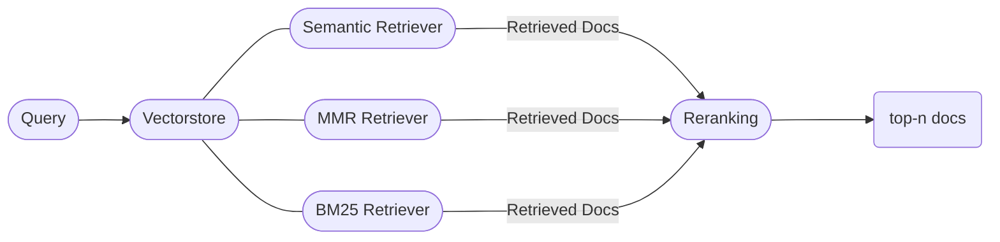
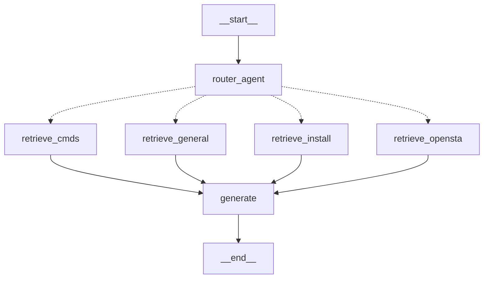

Hi again! I'm [Palaniappan R](https://ucsc-ospo.github.io/author/palaniappan-r/), a GSoC contributor working on the OpenROAD chat assistant project under the mentorship of [Indira Iyer](https://ucsc-ospo.github.io/author/indira-iyer/) and [Jack Luar](https://ucsc-ospo.github.io/author/jack-luar/). My project aims to build an LLM-powered chat assistant designed to provide seamless access to existing online resources, thereby reducing support overhead. Over the past month, I've been collaborating with [Aviral Kaintura](https://ucsc-ospo.github.io/author/aviral-kaintura/), as our GSoC projects share a common goal.

### Progress
The retrieval architecture is at the heart of any retrieval-augmented generation (RAG) setup. Our current setup employs a hybrid-search technique, combining a traditional keyword search method with more advanced vector search methods. As illustrated in the diagram, we combine a simple semantic search, a Maximal Marginal Relevance (MMR) search and a text-based BM25 ranking technique to build our hybrid retriever.

Upon receiving a query, relevant documents are sourced from each retriever, resulting in a broad set of results. We feed these results into a cross-encoder re-ranker model to get the `top-n` documents with maximum relevance.

After building the retriever, we utilized the LangGraph framework to develop a stateful, multi-agent workflow tailored to our use case.
Our current dataset can be broadly classified into the following categories:
- OpenROAD Documentation
- OpenROAD-flow-scripts Documentation
- OpenSTA Documentation
- OpenROAD manpages

These data sources are embedded into separate FAISS vector databases using open-source embeddings models (we've been working on fine-tuning an embeddings model for better retrieval accuracy). The hybrid search retrievers are then applied to these vector databases, creating internal tools that can be queried by our LLM as needed. Each tool has access to different data sources in various domains. For instance, the `retrieve_cmds` tool selectively has access to information detailing the multiple commands in the OpenROAD framework, while the `retrieve_install` deals with installation-related documentation. As depicted in the flowchart, a routing LLM call classifies the input query and forwards it to the appropriate retriever tool. Relevant documents are then sent back to the LLM for response generation.

Please find instructions to set up and use our chatbot [here](https://github.com/The-OpenROAD-Project/ORAssistant).

### Future Plans

In the upcoming weeks, we aim to enhance our dataset by incorporating actionable information filtered from GitHub issues and discussions. We’ll be adding support to keep track of the conversation history as well. 

Stay tuned for more updates!

