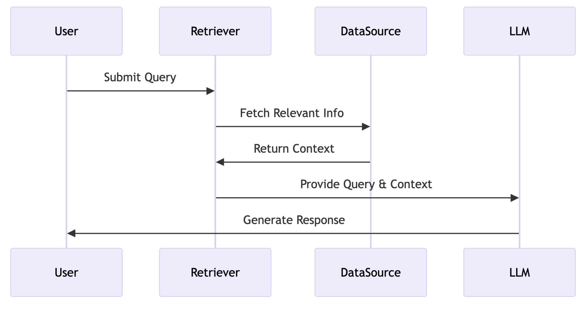
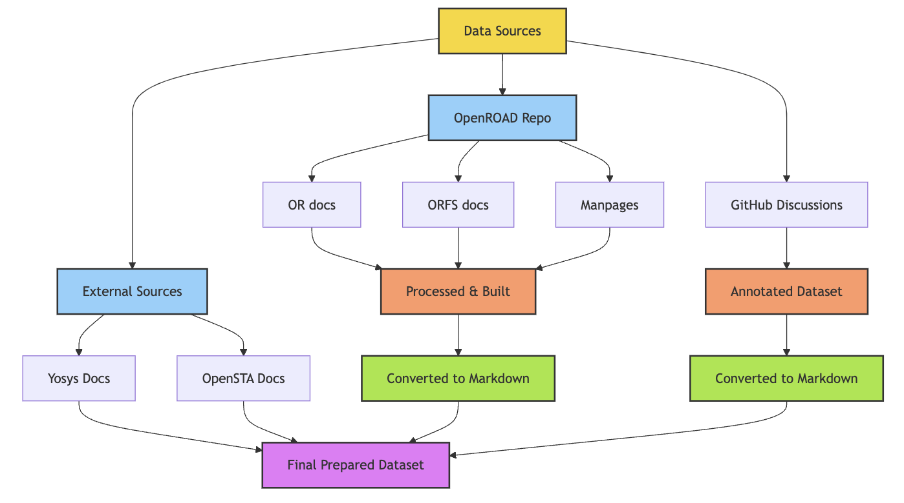
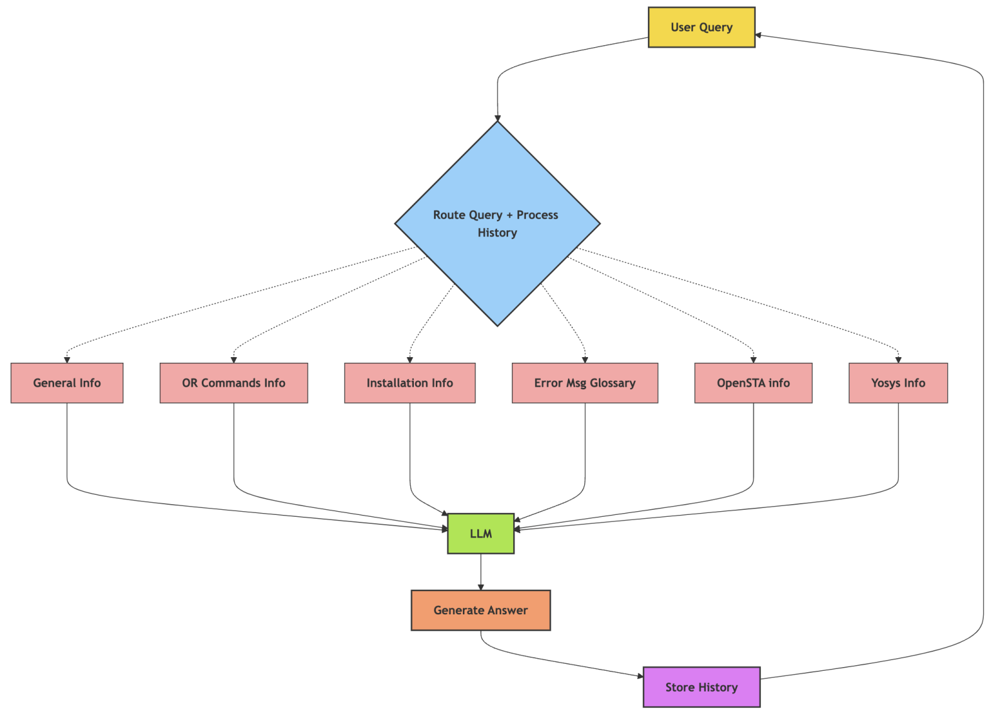
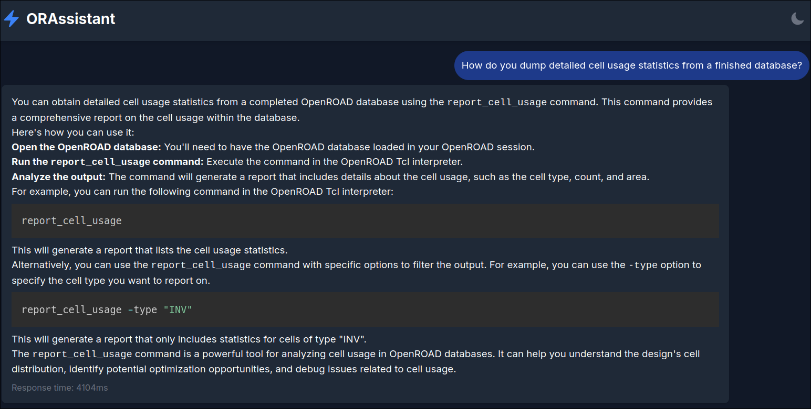

## Introduction

Hello! I'm {}, an undergraduate student at BITS Pilani, India. Over the past few months, I've been working as a GSoC contributor on the [LLM Assistant for OpenROAD - Model Architecture and Prototype](https://summerofcode.withgoogle.com/programs/2024/projects/DSo6kvA5) project, under the mentorship of {} and {}.  

The primary objective of my project is to improve the user experience within OpenROAD and OpenROAD-flow-scripts by utilizing Large Language Models(LLMs) to offer fast, relevant answers to FAQs and common issues. The ORAssistant chatbot aims to act as a first line of support, addressing basic queries in domains such as installation and command usage. Its goal is to resolve simple issues before they escalate to public forums, thereby reducing the number of support tickets on platforms like GitHub Issues.

## Architecture Overview

Retrieval-augmented-generation (RAG) is a technique that improves the q&a capabilities and reliability of LLMs by incorporating factual information from external sources. When a user submits a query, the RAG process begins by fetching relevant information from a knowledge base. The retrieved content, combined with the original query is the provided to the LLM to generate a relevant, informed response.

## The Knowledge Base

ORAssistant is designed to answer queries about all the major tools in the OR flow. The knowledge base primarily consists of official documentation from OpenROAD, OpenROAD-flow-scripts, and their respective manpages. Instead of scraping these primary sources from their websites, the docs are built to the desired markdown format directly from the respective GitHub repositories, using specific commit hashes for reproducibility. The knowledge base also includes documentation from other essential applications in the EDA flow, such as Yosys and OpenSTA. Additionally, it includes scraped and annotated conversational data from discussions on the OpenROAD and OpenROAD-flow-scripts GitHub pages.

The entire dataset building process has been automated, allowing for dynamic updates to accommodate any live changes.

## The Tool-Based Architecture

After experimenting with multiple RAG approaches, a tool-based setup proved to be the most effective solution. Data from various domains are embedded into vector databases, and hybrid search retriever functions are applied to these vector stores. These functions are organized as individual tools that can be called by the chatbot. To maintain context, each query is rephrased while considering the chat history. This ensures a more precise and context-rich query. Please refer to my previous [blog post]() for more information on the retrieval tools.

As depicted in the flowchart, a preliminary LLM call analyzes the input query, rephrases it based on the chat history and picks the appropriate tools for the rephrased query. Subsequently, documents are retrieved using the tool and sent to the LLM, which produces a relevant, context-aware response.

## Using ORAssistant

ORAssistant is currently hosted at this [link](https://orassistant.netlify.app/).

To set up out ORAssistant locally, find detailed instructions in the [GitHub Repo](). Both cloud based LLM providers (Gemini, VertexAI) and local options (Ollama) are supported.

Here's an example of ORAssistant in action,

## Future Plans

To further enhance the usability of ORAssistant, there are plans to add support for flow script generation. This will become possible after adding a dedicated script generation tool into the current tool-based workflow. Support for more tools in the EDA flow, such as KLayout will also be added in the near future.

Additionally, ORAssistant is planned to be integrated directly into OpenROAD's CLI and GUI interfaces.

As I near the end of my GSoC, I'd like to thank the GSoC Organizing Committee, UC OSPO and The OpenROAD Project for this incredible opportunity. I'm immensely grateful to {} and {} for their support and guidance throughout my GSoC journey. Thank You.