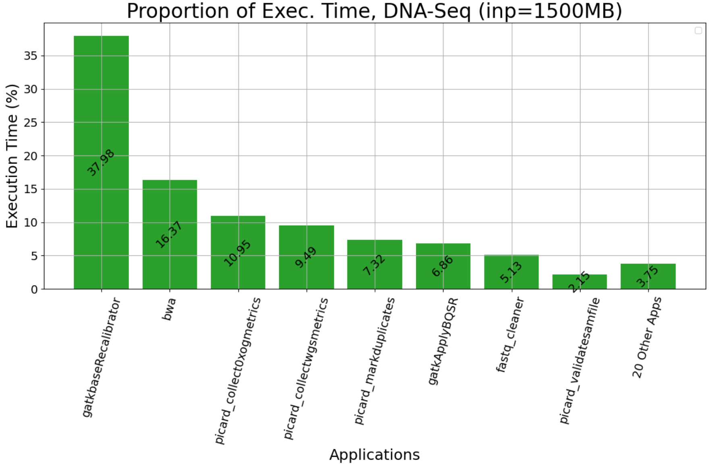
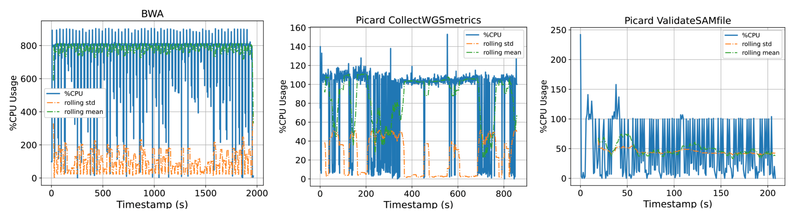

## Project Overview

Hi! I'm Martin Putra, and I'm working on the "Reproducible Performance Benchmarking for Genomics Workflows on HPC Cluster" project under the supervision of {}. We are building GenScale, a scalable benchmarking tool for genomics workfload which leverages industrial-grade cluster manager and monitoring systems. GenScale will allow us to generate performance data under a setup that is representative of large-scale production settings. Ultimately, we hope GenScale and the datasets it produces will catalyze engagement between the computer systems and bioinformatics community, thus accelerating the pace of discovery at both fields.

## Progress and Challenges
We have built a prototype using Kubernetes as cluster manager and Prometheus for monitoring systems. At its current state, the prototype can support an arbitrary number of compute nodes, owing to Kubernetes’ notable scaling capability. This provides a suitable environment for small- to mid-scale experiments. We leverage ChameleonCloud to provide the necessary computational and reproducibility infrastructure. The monitoring system supports cluster-level, node-level, and container-level metrics collection and failure detection. We integrated Grafana dashboards for visualizations. 

The prototype also supports the execution of user-defined workflows. During the design process, we considered integrating one of existing workflow execution systems, such as [cwltool](https://github.com/common-workflow-language/cwltool), [Nextflow](https://www.nextflow.io), or [Cromwell](https://github.com/broadinstitute/cromwell). Each system has its own pros and cons when placed within the context of how we envision GenScale. However, we ultimately decided to build our own workflow execution system in order to provide maximum flexibility for the capabilities we plan to add in the future. For example, we believe it will be interesting to study how hardware heterogeneity affects the performance of each application in the workflow (a well-known workflow scheduling problem). Studying the problem requires capability to schedule execution on specific machines. In addition, if we want to study contention, we may need to execute on machines which are currently running specific workflows, too. While there are ways to do them with existing workflow execution systems + Kubernetes stack, we believe it will be hugely simplified if we build our own workflow execution system. 

|  | 
|:--:| 
| **Figure 1.** Proportion of execution time for DNA Alignment applications, executed on Chameleon's *cascadelake_r* node with 1500MB paired-end input. **y-axis:** proportion of application's exec. time out of the whole workflow's exec. time, **x-axis:** top 10 applications accounting for 97% exec. time, sorted by proportion. Other applications are aggregated. |

We confirmed GenScale’s capability to produce useful data by executing a DNA alignment workflow and capturing its runtime resource usage. We use [Genomics Data Commons’ (GDC) DNA alignment workflow](https://github.com/NCI-GDC/gdc-dnaseq-cwl) as reference, which has a total of 27 applications ranging from quality check, read trimming, actual alignment, indexing, and various metrics collection. We wrote our own simplified version of the workflow by first analyzing the execution time & resource usage of each application, then we chose 10 applications which represents 97% of the workflow execution time. We took into account that containerization is the de-facto standard for workflow execution among the bioinformatics community. Thus, we packaged each application as its own separate container, then hosted their Dockerfiles & containers in a private Github Container Registry (GHCR). We plan to make them public in the future. Our monitoring system is able to show resource usage in real time. We also built sidecar containers which use Unix’s pidstats to generate a CSV of cores, memory, and storage utilization throughout each workflow’s execution. This will allow easier analysis and data sharing for GenScale’s users. 

|  | 
|:--:| 
| **Figure 2.** CPU utilization pattern of [BWA](https://github.com/lh3/bwa), [Picard's CollectWGSMetrics](https://gatk.broadinstitute.org/hc/en-us/articles/360037269351-CollectWgsMetrics-Picard), and [Picard's ValidateSamFile](https://gatk.broadinstitute.org/hc/en-us/articles/360036854731-ValidateSamFile-Picard) collected by *GenScale*. **y-axis**: *(num. cores) x 100%*, **x-axis**: time elapsed in seconds.   |

One technical challenge is in automating the creation of Kubernetes cluster and in keeping it alive. We believe GenScale’s users would be interested in the performance of workflows under dynamic cluster sizes, either due to intentional scaling or machine failures. While the current prototype supports creating a cluster with arbitrary nodes, there are still steps which require a reboot when adding nodes. This makes cluster creation and horizontal scaling not fully automated yet. Keeping a cluster alive is also expensive. Since we use ChameleonCloud as our testbed, we have a choice of either keeping the cluster alive at the cost of significant service units (SU) usage, or save SUs by terminating our leases at the cost of rebuilding the cluster from scratch later. We choose a middle ground by keeping only Kubernetes’ control plane alive. The approach works well so far. 

## Next Steps

For the remaining weeks, we plan to work on the second workflow, namely [RNA Alignment](https://github.com/NCI-GDC/gdc-rnaseq-cwl). We would also like to add simple user interfaces if time permits. Finally, we plan to package GenScale’s source code, container images, and sample benchmark results for the open-source community. We look forward to the second half of Summer of Reproducibility!  
