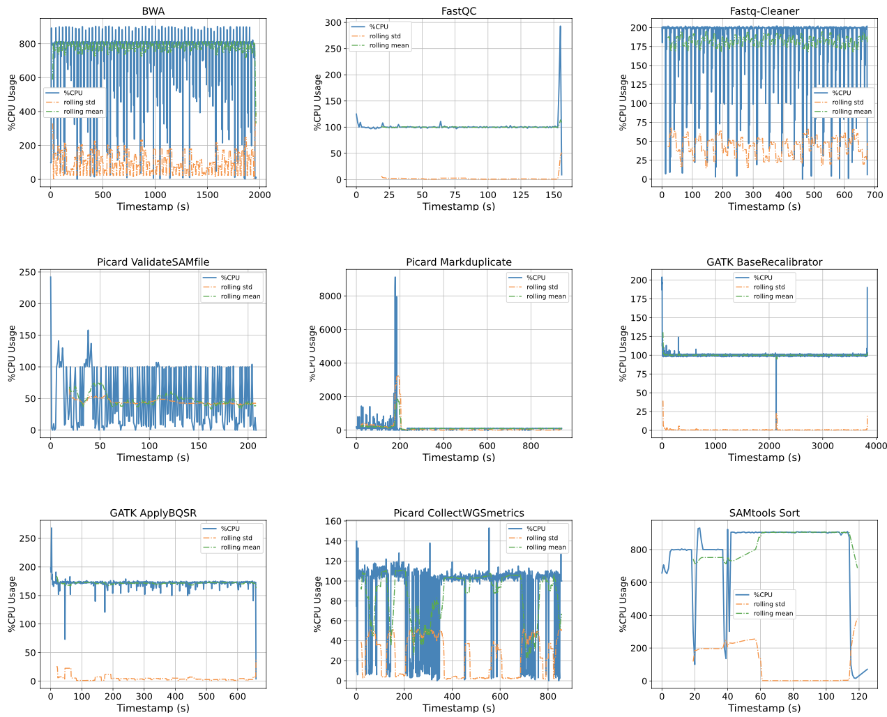

# Towards Scalable Performance Benchmarking of Genomics Workflows

## Project Background

Optimizing genomics workflows execution on a large-scale & heterogeneous cluster requires in-depth understanding of resource requirement and utilization pattern of each application in the workflows. Such information can be obtained by using a benchmarking tool. However, performance data generated by such tool should represent the scale of its target system, lest the design decisions made from it is misguided. My project aims to build *GenScale*, the first benchmarking tool which can rapidly generate genomics workload performance data at the scale representative of production systems.   

As Summer of Reproduciblity (SoR) 2024 comes to an end, I took the time to reflect on my time working on GenScale, the challenges I faced, and the future works & impacts I hope *GenScale* create for our community.

## Milestones & Challenges

The time I spent working on *GenScale* during SoR can be classified into three phases:

**1. Per-Application Container & Input Creation.**

Containerization is the current de-facto standard for genomics workflow execution, thus I designed *GenScale* to execute applications as containers. This requires me to package each application included in the benchmark as a container. I use state-of-art DNA-Seq & RNA-Seq alignment workflows as references for the list of applications & workflow structure. The container images & source files I created are publicy available in GitHub [(Deliverables #1)](#deliverables) 

I also prepare sample inputs for each application to ease the burden of users who do not have sufficient familiarity with genomics applications. The effort is not trivial, because in a workflow, the inputs for a certain step depend on the outputs of previous step(s). Simply speaking, to prepare inputs for the last application in a workflow, we need to get the outputs of applications executed before it, which also requires the outputs of another set of applications, and so on until we arrive at the beginning of workflow. This translates into significant manual labor of carefully tracing & collecting intermediate files from each step of the reference workflows. 

All inputs are hosted in a public Google Drive and ChameleonCloud object store [(Deliverables #2)](#deliverables). In total, I prepared containers and inputs for 7 popular genomics applications: BWA, FastQC, Fastq Cleaner, GATK, Picard, STAR, and Trimmomatic.  

|  | 
|:--:| 
| **Figure 1.** Production-grade softwares used in GenScale: Kubernetes for task orchestration, and Prometheus + Grafana for real-time resource monitoring. |

**2. Components Development.**

In this phase, *GenScale* main components were developed. *GenScale* consists of three components: (a) Workflow Manager, (b) Task Orchestrator, and (c) Resource Monitor. The Workflow Manager is built from scratch to allow high degree of freedom when scheduling workflows. I use industry-grade solutions for the other components, namely Kubernetes for orchestrating tasks / containers, and Prometheus + Grafana for real-time resource monitoring. My deliverables include semi-automatic installation scripts & easy-to-follow instructions to set up all three components. [(Deliverables #3)](#deliverables)

**3. Performance Data Generation.**

The last phase is to use *GenScale* prototype to generate performance data of each application. I focused on collecting data for three types of resources: compute (CPU utilization), memory (resident set size), and I/O (read & write operations over time). *GenScale* export these information into a single CSV file to facilitate easy analysis. My deliverables include performance data for DNA-Seq and RNA-Seq workflows. I also provide a sample Python Notebook which analyzes the CPU utilization pattern of each application in DNA-Seq workflow. [(Deliverables #4)](#deliverables)

|  | 
|:--:| 
| **Figure 2.** CPU utilization pattern of 9 applications in DNA-Seq Alignment workflow collected by *GenScale*. **y-axis**: *(num. cores) x 100%*, **x-axis**: time elapsed in seconds.   |

## Deliverables

This project's deliverables can be found in the following Github repo: [https://github.com/martinluttap/sor24-genscale/tree/main](https://github.com/martinluttap/sor24-genscale/tree/main). In summary, the deliverables include: 

1. Container Images
2. Input Dataset
3. Source Code
4. Performance Data & Sample Analysis Notebook

## Future Works, Broader Impacts

Understanding workload characteristics is a crucial step for designing efficient scheduling policy & resource management techniques. *GenScale* and the performance data it can generate might be a starting point for such effort. Furthermore, I hope *GenScale* will catalyze meaningful engagements between the computer systems community and bioinformatics community. I believe state-of-arts systems techniques can greatly aid the computing efforts among bioinformatics community. Similarly, domain-specific knowledge & problems within bioinformatics provide unique grounds for the systems community to further advance their field.  