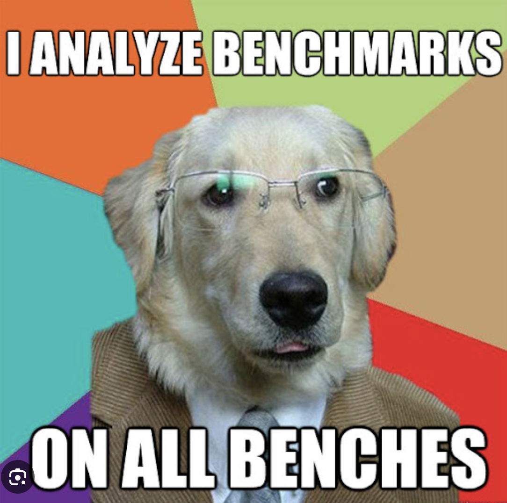

Hello! I'm [Ankit Kumar](https://ucsc-ospo.github.io/author/ankitkat042/), and although I'm a bit late with this introduction post due to a busy period filled with interviews and college formalities, I'm excited to share my journey with the OSRE 2025 program and the fascinating world of scientific data streaming.

## About Me

I'm currently pursuing my BTech degree at the Indraprastha Institute of Information Technology Delhi (IIIT Delhi) and am based in New Delhi, India. As I approach graduation, I'm thrilled to be working on a project that perfectly aligns with my interests in systems and networking.

My passion for technology has led me through various experiences:

- **Software Developer at CloudLabs**: I worked at a platform founded by [Dr. Sumit J Darak](https://faculty.iiitd.ac.in/~sumit/) that facilitates remote access to actual FPGA boards on a slot basis, making hardware experimentation accessible to students worldwide.

- **Data Mining Intern at [TaskTracker.in](https://tasktracker.in/)**: This experience gave me insights into large-scale data processing and analysis.

- **Undergraduate Researcher**: Currently working under [Dr. Mukulika Maity](https://faculty.iiitd.ac.in/~mukulika/) on benchmarking QUIC and TCP protocols across different environments including bare metal, virtual machines, and containers.

I chose this OSRE project because it represents an incredible opportunity to work with some of the best minds in the industry at Argonne National Laboratory (ANL) while diving deep into cutting-edge networking technologies.

## My Project: SciStream Performance Analysis

As part of the [SciStream project](/project/osre25/anl/scistream), I'm focusing on two critical aspects of high-performance scientific data streaming:

### 1. TCP/UDP Performace Benchmarking
I'm conducting comprehensive benchmarking of SSH and TLS tunnels using various open-source tools and parameters. This work is crucial for understanding how different protocols and their overhead impact the performance of real-time scientific data streaming. The goal is to provide researchers with evidence-based recommendations for moving/processing their high-speed data transfers without compromising performance.

### 2. QUIC Proxy Exploration
I'm exploring different QUIC proxy implementations to understand their potential advantages over traditional TCP+TLS proxies in scientific workflows. QUIC, the protocol that powers modern web applications like YouTube, offers promising features for scientific data streaming, but comprehensive benchmarking is needed to validate its benefits.

## Working with Cutting-Edge Testbeds

Currently, I'm conducting experiments using both the **[FABRIC testbed](https://portal.fabric-testbed.net/)** and **[ESnet testbed](https://www.es.net/)**. These platforms provide access to real high-speed network infrastructure, allowing me to test protocols and configurations under realistic conditions that mirror actual scientific computing environments.

## The Team Experience

These past two weeks have been incredibly rewarding, working alongside:
- **[Alain Zhang](https://www.linkedin.com/in/alain-zhang-672086205/)** - my project mate from UC San Diego, cool guy.
- **[Flavio Castro](https://www.linkedin.com/in/castroflavio/)**  - My project mentor and manager, goto person for my issues. currently at anl as a research development software engineer.
- **[Joaquin Chung](https://www.anl.gov/profile/joaquin-chung)** - Super mentor, brains behind the project. His guidance on the project is super valubale.
- **[Rajkumar Kettimuthu](https://www.anl.gov/profile/rajkumar-kettimuthu)** - Lead Scientist in our project whose comments on our paper critique are invaluable.
- **[Seena Vazifedunn](https://www.linkedin.com/in/seena-vazifedunn/)** - Graduate Research Assistant at University of Chicago. He asks very relevant and important questions during our report presentation and his feedbacks are very insightful.

The collaborative nature of this project has been fantastic, combining perspectives from different institutions and backgrounds to tackle complex networking challenges.

Stay tuned for updates!

---

*This work is part of the [SciStream project](/project/osre25/anl/scistream) at Argonne National Laboratory, reimagining how scientific data moves across modern research infrastructure.* 