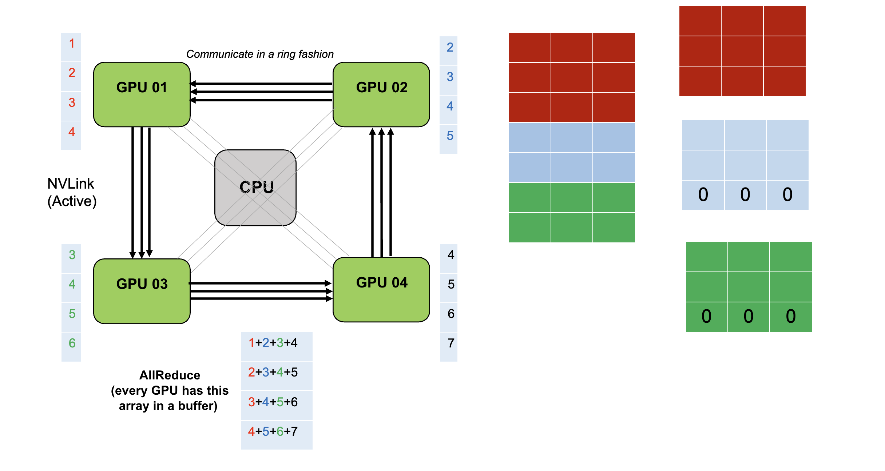
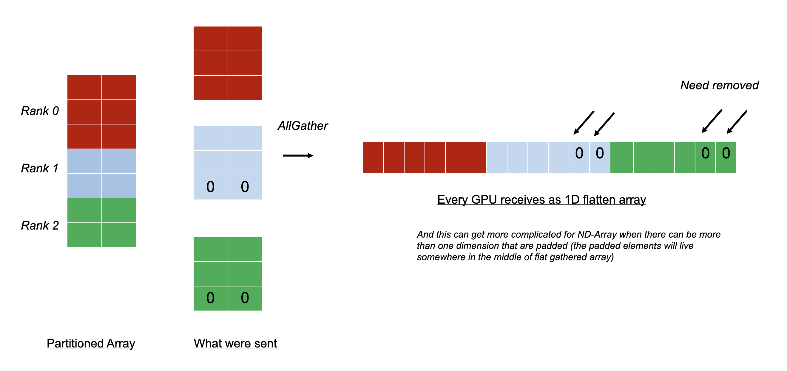

# Enabling NCCL GPU-GPU Communication in PyLops-MPI - Google Summer of Code Project (2025) - Part 1

Hello all! 👋 My name is Tharit, and I'm a computer science student at the University of Texas at Austin. This summer, I am fortunate to participate in the Google Summer of Code (GSoC) 2025 program, hosted by [UC OSPO](https://ucsc-ospo.github.io/) and the [PyLops](https://github.com/PyLops/pylops) team. My project focuses on enabling NCCL GPU-to-GPU communication in [PyLops-MPI](https://github.com/PyLops/pylops-mpi), under the guidance of mentors Matteo Ravasi and Yuxi Hong.

You might have come across this post if you're a PyLops user interested in scaling [PyLops-MPI](https://github.com/PyLops/pylops-mpi) with GPU/NCCL support, or if you're exploring GSoC projects and wondering what we are up to. Either way, I hope this post gives you useful insights.

## What is PyLops-MPI?

If you've worked with inverse problems, you've likely come across [PyLops](https://github.com/PyLops/pylops). It's a Python library that provides an extensive suite of linear operators and solvers. Operators are designed with a clear focus on the forward and adjoint pair (A and A.T) whilst solvers take operators and data to solve the associate inverse problem. In fields such as geophysics, astrophysics, or medical imaging,, inverse problem are solved routinely to [image the Earth, the space, or the human body from remote measurements](https://www.ae.utexas.edu/news/inverse-problem-solving-bui-than). In all cases,  real-life problems tend to consume a lot of computing and require a lot of memory. PyLops allows users to express these problems in an abstract manner that is reminiscent of the underlying equations whilst not compromising on efficiency.

[PyLops-MPI](https://github.com/PyLops/pylops-mpi) is the distributed extension of PyLops, introduced during [GSoC 2023](https://summerofcode.withgoogle.com/archive/2023/projects/eNJTJO25). It enables users to scale their computations over CPU and GPU clusters via MPI. However, up until now, even GPU-based communications were routed through MPI, introducing potential performance bottlenecks.

## The Goal of the Project
Our goal is to take PyLops-MPI to the next level by enabling GPU-to-GPU collective communications directly using NVIDIA NCCL. This allows full utilization of high-bandwidth interconnects like [NVLink](https://www.nvidia.com/en-us/data-center/nvlink/), and avoids unnecessary memory transfers through the host CPU.
This blog marks the midpoint of the program (week 6 of 12), and I’d like to reflect on the progress so far, challenges faced, and what's coming next.

## What is a Collective Communication anyway? 
In PyLops-MPI, distributed computations require nodes to exchange information, for example, during gradient computations or reductions in iterative solvers. A naive implementation (useful for a thought experiment) would involve each node taking turns broadcasting data, which can be quite slow.
NVIDIA’s NCCL abstracts away the complexity of topology-aware communication. For example, in the image below, if GPUs are most effective by communicating in a ring fashion for all-reduce operation, NCCL will automatically pick that layout and not use GPU 01-GPU 04 and GPU 02-GPU 03 communication links.

<p align="center">
  
</p>

*Example of a compute node with 4 GPUs attached, directly connected to each other with NVLink*

## What we achieved, so far
It is probably best to tell stories through the sequence of pull requests.

### Core Changes in DistributedArray ([PR #130](https://github.com/PyLops/pylops-mpi/pull/130))
This PR introduces NCCL support into the `DistributedArray` class. The design allows users to optionally pass both a `NcclCommunicator` and a `MPI.Comm`. By doing so, small control data (e.g., shape, dtype) is still exchanged via MPI, leveraging Python's flexibility and minimizing performance impact. As you will see, this decision to keep two communicators turns out to be a good call.
This is how the `__init__` method of `DistributedArray` looks like with the new addition in bold:

```python
    def __init__(self, global_shape: Union[Tuple, Integral],
                 base_comm: Optional[MPI.Comm] = MPI.COMM_WORLD,
                 base_comm_nccl: Optional[NcclCommunicatorType] = None, # Added to this line
                 partition: Partition = Partition.SCATTER, axis: int = 0,
                 local_shapes: Optional[List[Union[Tuple, Integral]]] = None,
                 mask: Optional[List[Integral]] = None)
```

### The CuPy's NCCL API 
NCCL's API ([mirroring its C++ origins](https://docs.nvidia.com/deeplearning/nccl/user-guide/docs/api/colls.html)) is minimalistic, requiring manual memory management. One prominent example is the implementation of `allGather()` Previously, using `mpi4py` we could leverage the Python dynamic typing nature (everything is an object, so one just sends the object). This means `mpi4py` allows different ranks to send different sizes of arrays. NCCL requires every rank in the communicator to send the same size. To work around this, we implemented padding and reshaping logic in multi-dimensional arrays. NCCL treats arrays as contiguous byte streams, so padding must be handled carefully [^1].

Moreover, we had to accommodate NCCL’s lower-level API, lacking conveniences like communicator’s split variants. Internally, we introduced unified abstractions such as `_allgather()`, `_allreduce()`, `send()`, `recv()`. etc to `DistributedArray` and modified the communication model to work seamlessly whether MPI or NCCL is used. By doing this, other developers can focus on developing new operators (that suit their needs), and abstract away the existence of different communicators.
<p align="center">
  
</p>

*Example of a challenge coming from having an unevenly distributed array*

### Keep things small: Dependency management ([PR #132](https://github.com/PyLops/pylops-mpi/pull/132) and [PR #135](https://github.com/PyLops/pylops-mpi/pull/135))
Despite adding this new capability, we are fully aware that not every user has access to a cluster of GPU and therefore we don’t make NCCL and CuPy mandatory dependencies. The first time someoneinstalls and experiments with PyLops-MPI is likely to run it on a single-node desktop. And we don’t want to introduce such complexity early on. This means that our code has to accommodate “optional dependency” or have a “protected import”. If we have `import cupy as cp` at the beginning of `DistributedArray`, users without GPU will encounter an error before doing anything useful at all.
In other words, our library should import CuPy and NCCL automatically when both the system enables it and users also ask for it. The pattern looks like [this]((https://github.com/PyLops/pylops-mpi/blob/main/pylops_mpi/utils/deps.py)):

```python
nccl_test = util.find_spec("cupy") is not None and int(os.getenv("NCCL_PYLOPS_MPI", 1)) == 1
if nccl_test:
     # try import CuPy and then check for NCCL
     if nccl is available:
	# success
     else:
      # unable to import but the package is installed
else:
   # package is not installed or the environment variable disables it
# Finally, set nccl_enabled flag for other module to use for protected import
```
This helps preserve PyLops-MPI’s minimal base installation. This required carefully isolating imports and adapting the module resolution logic using a backend dispatching mechanism.
This is something I never thought of or took it into consideration before.

### The Basic Operator with NCCL [PR 137](https://github.com/PyLops/pylops-mpi/pull/137)
We chose `MPIVStack` as the first operator to implement NCCL support due to its simplicity. Several design choices emerged:

#### Implicit Communicator Propagation
We updated forward and adjoint calls to propagate the `base_comm_nccl` from input to output automatically. This way, if `x` is NCCL-enabled, then `y = A @ x` or `A.H @ x` will also be NCCL-enabled. This avoids mismatches and keeps operator pipelines consistent.

Interestingly, the operator itself did not need to explicitly take base_comm_nccl as an argument, reducing complexity for developers extending PyLops-MPI. This point is contrary to our initial expectation. The operator does not have to take `base_comm_nccl` like `DistributedArray` did. This is good news. This reduces the potential that other developers may have to deal with different cases of communication when adding new operators.

#### Optional Dual-Communicator Design
 As with DistributedArray, the ability to pass both an MPI communicator and an NCCL communicator proved to be a sound decision. By maintaining NCCL as an optional backend, we gain fine-grained control over which communication paths use NCCL versus MPI. This flexibility allowed us to optimize performance-critical paths while retaining MPI for control messages and small metadata transfers.

 In particular, in the communication of ghost cells, which are used for computation around the boundary, like in derivative calculation, small metadata, such as cell_fronts (typically lists of rank-sized integers) continues to be efficiently transmitted via MPI. These metadata are needed for send/receiver buffer allocations. This leverages Python's object serialization model (`list[int]`) without incurring GPU synchronization costs. But the actual cell array itself is communicated with NCCL since these arrays can be large.

## What’s Next?
Aside from enabling NCCL support for the remaining operators and their full test coverage, some more exciting upcoming updates are
* Complex-number type support for NCCL
* Benchmarking results on a real HPC system

Stay tuned for Part 2, and thanks for reading!

[^1]: For the best performance mpi4py would require the buffer memory allocation as well. The mpi4py package provides two interface: buffered and non-bufferred. Currently PyLops-MPI takes the non-buffered approach. This suggest a room of optimization.