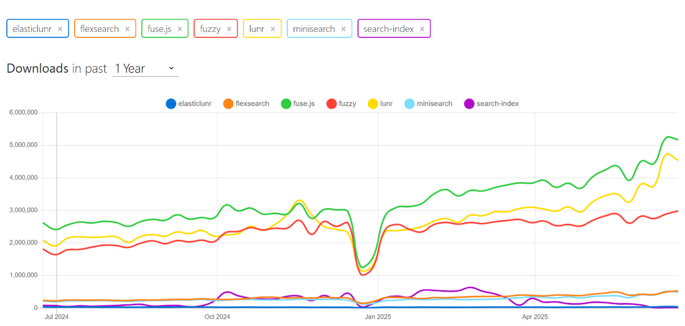
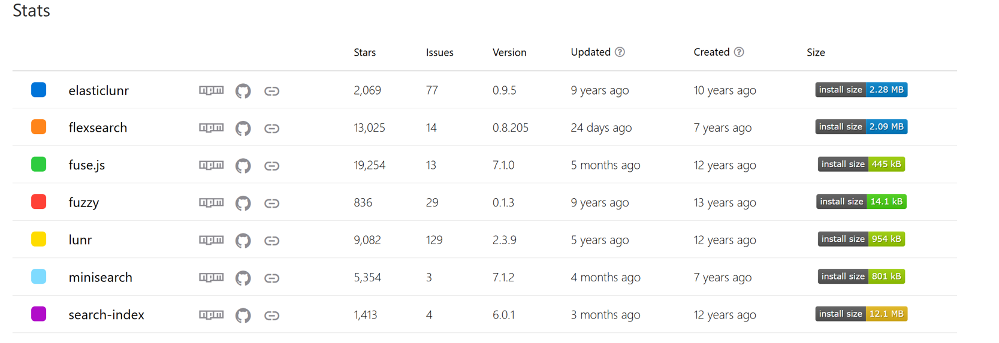
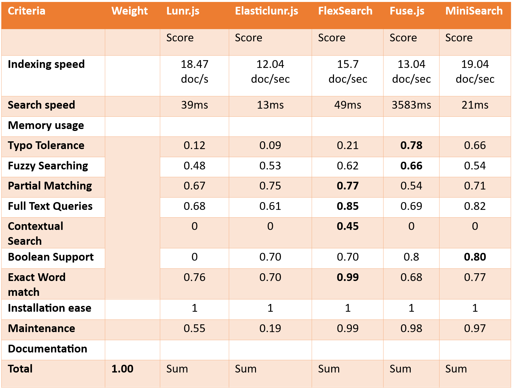
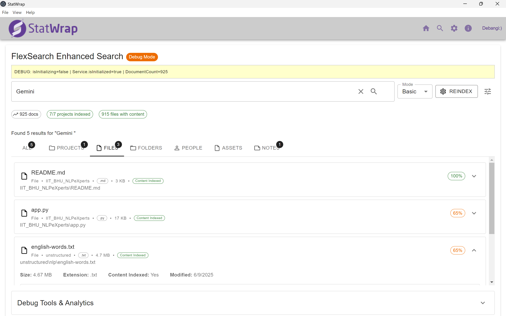
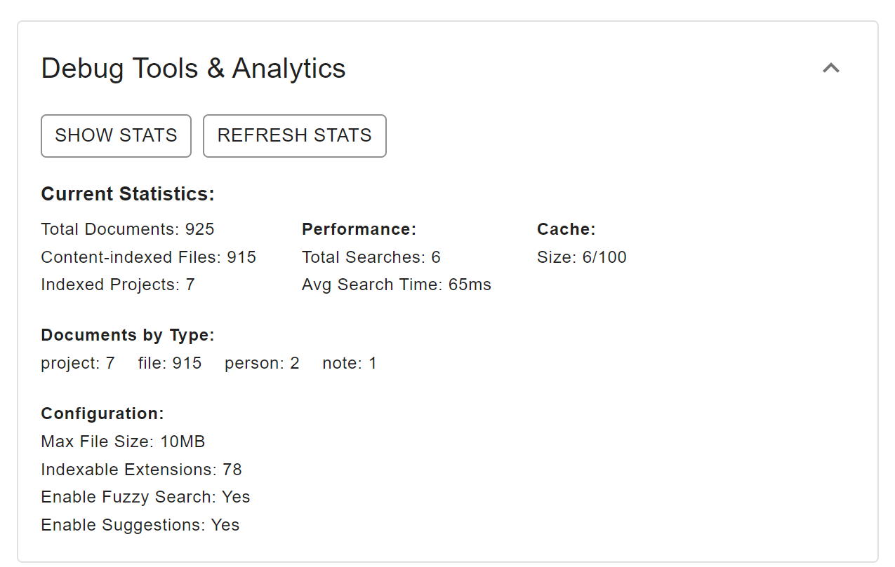

## Introduction

Hello everyone!  
I am Debangi Ghosh from India, an undergraduate student at the Indian Institute of Technology (IIT) BHU, Varanasi. As part of the [StatWrap: Cross-Project Searching and Classification using Local Indexing](/project/osre25/northwestern/statwrap/) project, my [proposal](https://drive.google.com/file/d/1dxyBP2oMJwYDCKyIWzr465zNmm6UWtnI/view?usp=sharing), under the mentorship of {}, focuses on developing a full-text search service within the StatWrap user interface. This involves evaluating different search libraries and implementing a classification system to distinguish between active and past projects.

## **About the Project**

As part of the project, I am working on enhancing the usability of StatWrap by enabling efficient cross-project search capabilities. The goal is to make it easier for investigators to discover relevant projects, notes, and assets—across both current and archived work—using information that is either user-entered or passively collected by StatWrap.

Given the sensitivity of the data involved, one of the key requirements is that all indexing and search operations must be performed locally. To address this, my responsibilities include:

* **Evaluating open-source search libraries** suitable for local indexing and retrieval  
* **Building the full-text search functionality** directly into the StatWrap UI to allow seamless querying across projects  
* **Ensuring reliability** through the development of unit tests and comprehensive system testing  
* **Implementing a classification system** to label projects as “Active,” “Pinned,” or “Past” within the user interface  

This project offers a great opportunity to work at the intersection of software development, information retrieval, and user-centric design—while contributing to research reproducibility and collaboration within scientific workflows.

## Progress

It has been more than six weeks since the project began, and significant progress has been made. Here's a breakdown:

### 1. **Descriptive Comparison of Open-Source Libraries**  
Compared various open-source search libraries based on evaluation criteria such as **indexing speed, search speed, memory usage, typo tolerance, fuzzy searching, partial matching, full-text queries, contextual search, Boolean support, exact word match, installation ease, maintenance, documentation**, and **developer experience**.

### 2. **The Libraries**

- **Lunr.js**  
  A small, client-side full-text search engine that mimics Solr capabilities.  
  - Field-based search, boosting  
  - Supports TF-IDF, inverted index  
  - No built-in fuzzy search (only basic wildcards)  
  - Can serialize/deserialize index  
  - Not designed for large datasets  
  - Moderate memory usage and indexing speed  
  - Good documentation  
  - **Best for**: Static websites or SPAs needing simple in-browser search

- **ElasticLunr.js**  
  A lightweight, more flexible alternative to Lunr.js.  
  - Dynamic index (add/remove docs)  
  - Field-based and weighted search  
  - No advanced fuzzy matching  
  - Faster and more customizable than Lunr  
  - Smaller footprint  
  - Easy to use and maintain  
  - **Best for**: Developers wanting Lunr-like features with simpler customization

- **Fuse.js**  
  A fuzzy search library ideal for small to medium datasets.  
  - Fuzzy search with typo tolerance  
  - Deep key/path searching  
  - No need to build index  
  - Highly configurable (threshold, distance, etc.)  
  - Linear scan = slower on large datasets  
  - Not full-text search (scoring-based match)  
  - Extremely easy to set up and use  
  - **Best for**: Fuzzy search in small in-memory arrays (e.g., auto-suggest, dropdown filters)

- **FlexSearch**  
  A blazing-fast, modular search engine with advanced indexing options.  
  - Extremely fast search and indexing  
  - Supports phonetic, typo-tolerant, and partial matching  
  - Asynchronous support  
  - Multi-language + Unicode-friendly  
  - Low memory footprint  
  - Configuration can be complex for beginners  
  - **Best for**: High-performance search in large/multilingual datasets

- **MiniSearch**  
  A small, full-text search engine with balanced performance and simplicity.  
  - Fast indexing and searching  
  - Fuzzy search, stemming, stop words  
  - Field boosting and prefix search  
  - Compact, can serialize index  
  - Clean and modern API  
  - Lightweight and easy to maintain  
  - **Best for**: Balanced, in-browser full-text search for moderate datasets

- **Search-Index**  
  A persistent, full-featured search engine for Node.js and browsers.  
  - Persistent storage with LevelDB  
  - Real-time indexing  
  - Fielded queries, faceting, filtering  
  - Advanced queries (Boolean, range, etc.)  
  - Slightly heavier setup  
  - Good for offline/local-first apps  
  - Browser usage more complex than others  
  - **Best for**: Node.js apps, **not directly compatible with the Electron + React environment of StatWrap**

### 3. Developer Experience and Maintenance  
We analyzed the download trends of the search libraries using npm trends, and also reviewed their maintenance statistics to assess how frequently they are updated.

  

### 4. Comparative Analysis After Testing  
Each search library was benchmarked against a predefined set of queries based on the same evaluation criteria.  
We are yet to finalize the weights for each criterion, which will be done during the end-term evaluation.

### 5. The User Interface  

  

The user interface includes options to search using three search modes (Basic, Advanced, Boolean operators) with configurable parameters. Results are sorted based on relevance score (highest first), and also grouped by category.

### 6. Overall Functioning

- **Indexing Workflow**  
  - Projects are processed sequentially  
  - Metadata, files, people, and notes are indexed (larger files are queued for later)  
  - Uses a "brute-force" recursive approach to walk through project directories  
    - Skips directories like `node_modules`, `.git`, `.statwrap`  
    - Identifies eligible text files for indexing  
    - Logs progress every 10 files  

- **Document Creation Logic**  
  - Reads file content as UTF-8 text  
  - Builds searchable documents with filename, content, and metadata  
  - Auto-generates tags based on content and file type  
  - Adds documents to the search index and document store  
  - Handles errors gracefully with debug logging  

- **Search Functionality**  
  - Uses field-weighted search  
  - Enriches results with document metadata  
  - Supports filtering by type or project  
  - Groups results by category (files, projects, people, etc.)  
  - Implements caching for improved performance  
  - Search statistics are generated to monitor performance  

## Challenges and End-Term Goals

- **In-memory Indexing Metadata Storing**  
  Most JavaScript search libraries (like Fuse.js, Lunr, MiniSearch) store indexes entirely in memory, which can become problematic for large-scale datasets. A key challenge is designing a scalable solution that allows for disk persistence or lazy loading to prevent memory overflows.

- **Deciding the Weights Accordingly**  
  An important challenge is tuning the relevance scoring by assigning appropriate weights to different aspects of the search, such as exact word matches, prefix matches, and typo tolerance. For instance, we prefer exact matches to be ranked higher than fuzzy or partial matches.

- **Implementing the Selected Library**  
  Once a library is selected (based on speed, features, and compatibility with Electron + React), the next challenge is integrating it into StatWrap efficiently—ensuring local indexing, accurate search results, and smooth performance even with large projects.

- **Classifying Active and Past Projects in the User Interface**  
  To improve navigation and search scoping, we plan to introduce three project sections in the interface: **Pinned**, **Active**, and **Past** projects. This classification will help users prioritize relevant content while enabling smarter indexing strategies.

Stay tuned for the next blog!
