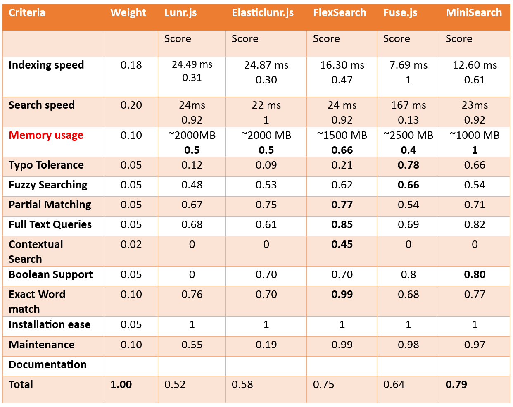
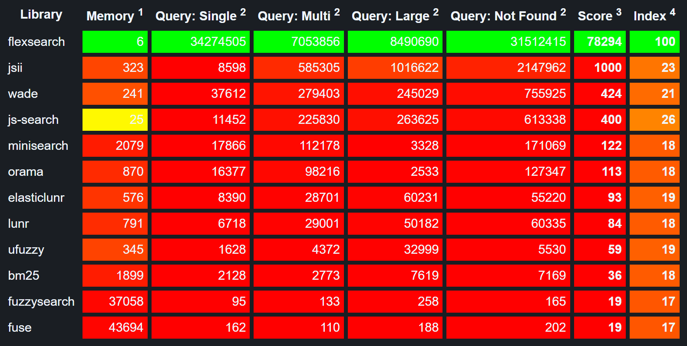
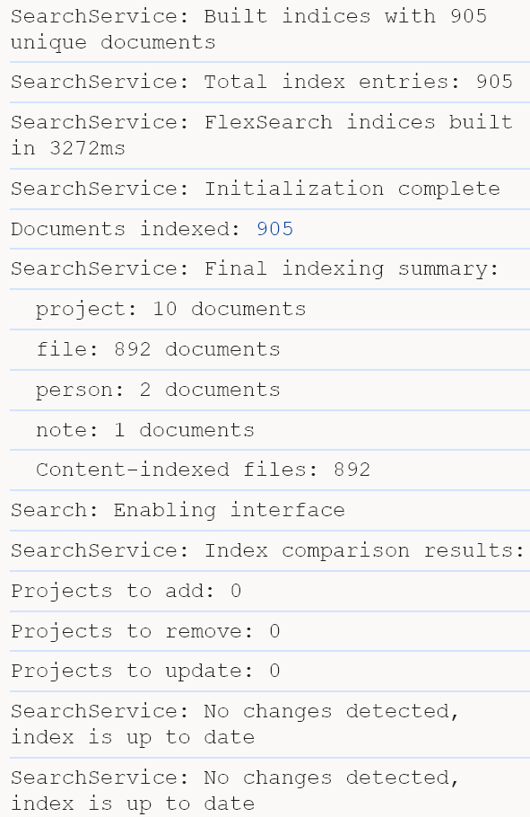
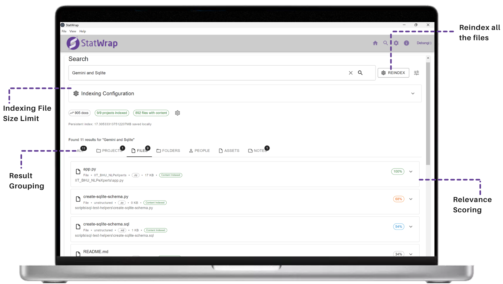
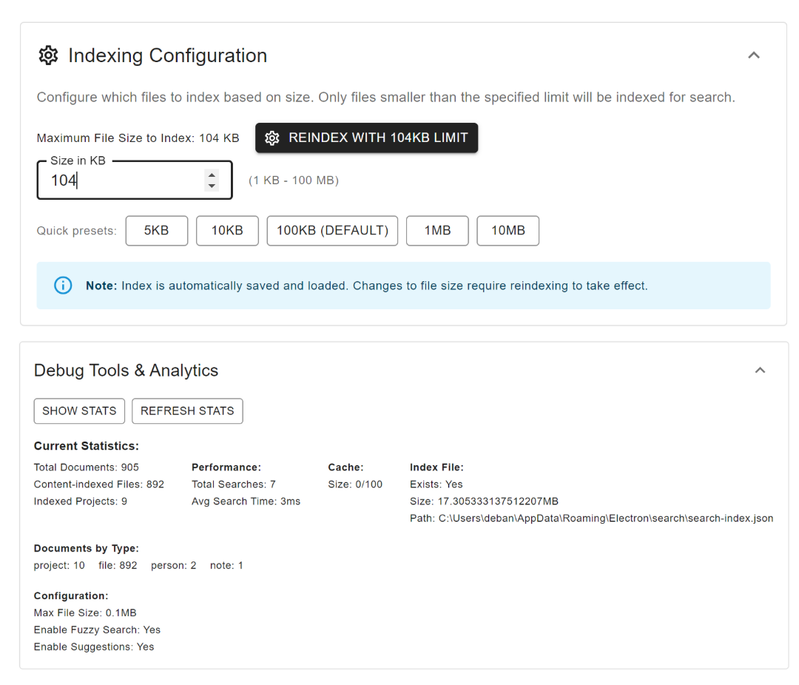
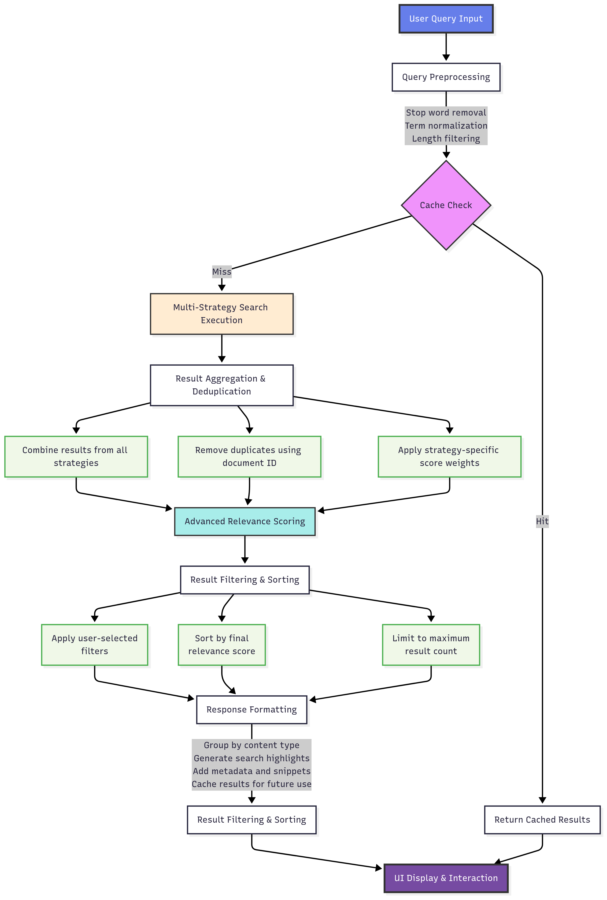
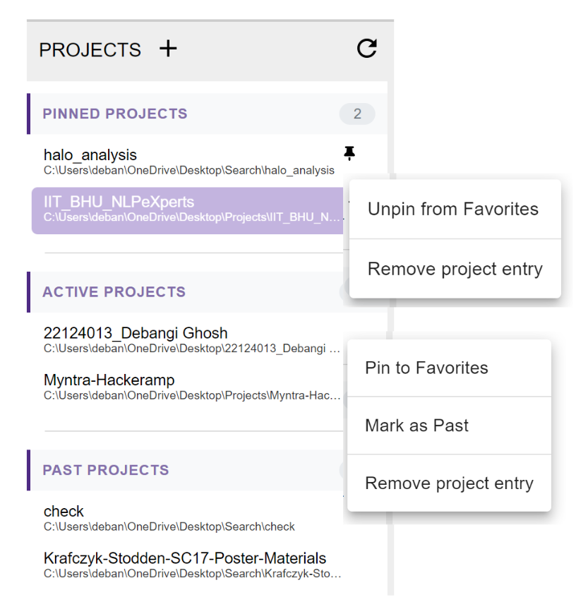
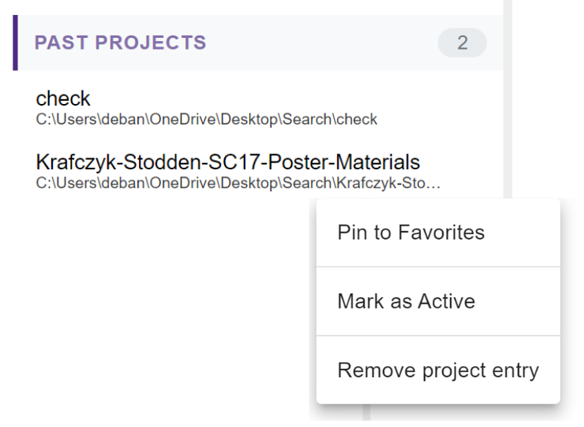

# **Introduction**

Hello everyone!  
I am Debangi Ghosh from India, an undergraduate student at the Indian Institute of Technology (IIT) BHU, Varanasi. As part of the [StatWrap: Cross-Project Searching and Classification using Local Indexing](/project/osre25/northwestern/statwrap/) project, my [proposal](https://drive.google.com/file/d/1dxyBP2oMJwYDCKyIWzr465zNmm6UWtnI/view?usp=sharing), under the mentorship of {}, focuses on developing a full-text search service within the StatWrap user interface. This involves evaluating different search libraries and implementing a classification system to distinguish between active and past projects.

# **About the Project**

As part of the project, I am working on enhancing the usability of StatWrap by enabling efficient cross-project search capabilities. The goal is to make it easier for researchers to discover relevant projects, notes, and assets across both current and archived work, using information that is either user-entered or passively collected by StatWrap.

Given the sensitivity of the data involved, one of the key requirements is that all indexing and search operations must be performed locally. To address this, my responsibilities include:

* **Evaluating open-source search libraries** suitable for local indexing and retrieval  
* **Building the full-text search functionality** directly into the StatWrap UI to allow seamless querying across projects  
* **Ensuring reliability** through the development of unit tests and comprehensive system testing  
* **Implementing a classification system** to label projects as “Active,” “Pinned,” or “Past” within the user interface  

This project offers a great opportunity to work at the intersection of software development, information retrieval, and user-centric design—while contributing to research reproducibility and collaboration within scientific workflows.

# **Deliverables**

The project has reached the end of its scope after 12 weeks of work. Here's a breakdown:

## **1. Descriptive Comparison of Open-Source Libraries**  
Compared various open-source search libraries based on evaluation criteria such as **indexing speed, search speed, memory usage, typo tolerance, fuzzy searching, partial matching, full-text queries, contextual search, Boolean support, exact word match, installation ease, maintenance, documentation**, and **developer experience**. Decided upon the weights to assign to each of the features and point out the best library to use. According to our weights assigned,

These results are after tuning the hyperparameters to give the best set of results
For huge data, FlexSearch has the least memory usage, followed by MiniSearch. The examples we used were limited, so Minisearch had the better memory usage results.
Along with the research and evaluation, I looked upon the Performance Benchmark of Full-Text-Search Libraries (Stress Test), available [here](https://nextapps-de.github.io/flexsearch/)

The benchmark was measured in terms per seconds, higher values are better (except the test "Memory"). The memory value refers to the amount of memory which was additionally allocated during search.

FlexSearch performs queries up to 1,000,000 times faster compared to other libraries by also providing powerful search capabilities like multi-field search (document search), phonetic transformations, partial matching, tag-search, result highlighting or suggestions.
Bigger workloads are scalable through workers to perform any updates or queries to the index in parallel through dedicated balanced threads.

## **2. FlexSearch Features**  

#### 1. **Persistent Indexing with Automatic Loading**
- **Index persistence**: Search index automatically saves to disk and loads on startup
- **Fast restoration**: Rebuilds FlexSearch indices from saved document store without re-scanning files
- **Incremental updates**: Detects project changes and updates only modified content
- **Background processing**: Index updates happen asynchronously without blocking the User Interface.

#### 2. **Multi-Document Type Support**
- **Unified search**: Single search interface for projects, files, people, notes, and assets
- **Type-specific indices**: Separate FlexSearch indices optimized for each document type
- **Cross-reference capabilities**: Documents can reference and link to each other
- **Flexible schema**: Each document type has tailored fields for optimal search performance

#### 3. **Intelligent File Content Indexing**
- **Configurable file size limits**: Admin-controlled maximum file size for content indexing
- **Smart file detection**: Automatically identifies text files by extension and filename patterns
- **Content extraction**: Full-text indexing with snippet generation for search results
- **Performance optimization**: Skips binary files and respects size constraints to maintain speed

#### 4. **Advanced Query Processing**
- **Multi-strategy search**: Combines exact matches, fuzzy search, partial matches, and contextual search
- **Query preprocessing**: Removes stop words and applies linguistic filters
- **Relevance scoring**: Custom scoring algorithm considering multiple factors:
  - Exact phrase matches (highest weight)
  - Individual word matches
  - Term frequency with logarithmic capping
  - Position-based scoring (earlier matches rank higher)
  - Proximity bonuses for terms appearing near each other
  - Completeness penalties for missing query terms

#### 5. **Real-Time Search Suggestions**
- **Autocomplete support**: Dynamic suggestions based on indexed document titles
- **Search history**: Maintains recent searches for quick re-execution
- **Debounced input**: Prevents excessive API calls during typing
- **Contextual suggestions**: Suggestions adapt based on current filters and context

#### 6. **Comprehensive Filtering System**
- **Type filtering**: Filter by document type (projects, files, people, etc.)
- **Project scoping**: Limit searches to specific projects
- **File type filtering**: Filter files by extension
- **Advanced search panel**: Collapsible interface for power users
- **Filter persistence**: Maintains filter state across searches

#### 7. **Performance Monitoring & Analytics**
- **Real-time metrics**: Track search times, cache hit rates, and index statistics
- **Performance dashboard**: Visual indicators for system health
- **Cache management**: LRU cache with configurable size and TTL
- **Search analytics**: Historical data on search patterns and performance

#### 8. **Index Management Tools**
- **Export/Import functionality**: Backup and restore search indices
- **Full reindexing**: Complete index rebuild with progress tracking
- **Index deletion**: Clean slate functionality for troubleshooting
- **File size adjustment**: Modify indexing constraints and rebuild affected content
- **Index statistics**: Detailed breakdown of indexed content by type and project

#### 9. **Robust Error Handling & Resilience**
- **Graceful degradation**: System continues operating even with partial index corruption
- **File system error handling**: Handles missing files, permission issues, and path changes
- **Memory management**: Prevents memory leaks during large indexing operations
- **Recovery mechanisms**: Automatic fallback to basic search if advanced features fail

#### 10. **User Experience Enhancements**
- **Keyboard shortcuts**: Ctrl+K to focus search, Escape to clear
- **Result highlighting**: Visual emphasis on matching terms in results
- **Expandable results**: Drill down into detailed information for each result
- **Loading states**: Clear feedback during indexing and search operations
- **Responsive tabs**: Organized results by type with badge counts

## **3. The User interface**  

## **4. Complete Search Execution Pipeline**

## **5. Classification of Active and Past Projects**

A classification system is added within the User Interface similar to **"Add to Favorites"** option. A new project added by default moves to **"Active"** section, unless explicitely marked as **"Past"**. Similarly, when a project is unpinned from Favorites, it goes to "Active" Section.

# **Conclusion and future Scope**

Building a comprehensive search system requires careful attention to performance, user experience, and maintainability. FlexSearch provided the foundation, but the real value came from thoughtful implementation of persistent indexing, advanced scoring, and robust error handling. The result is a search system that feels instant to users while handling complex queries across diverse document types.

The key to success was treating search not as a single feature, but as a complete subsystem with its own data management, performance monitoring, and user interface considerations. By investing in these supporting systems, the search functionality became a central, reliable part of the application that users can depend on.

The future scope would include:
1. Using a database (for example, SQLite), instead of  JSON, which is better for this use case than JSON due to better and efficient query performance and atomic (CRUD)  operations.
2. Integrating any suggestions from my mentors, as well as improvements we feel are necessary.
3. Developing unit tests for further functionalities and improvements.

