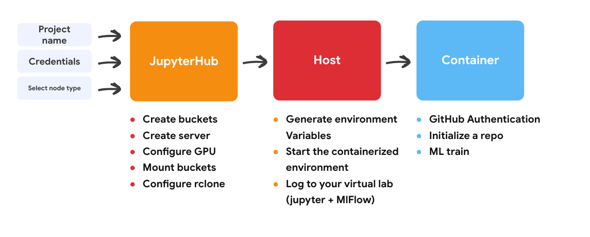
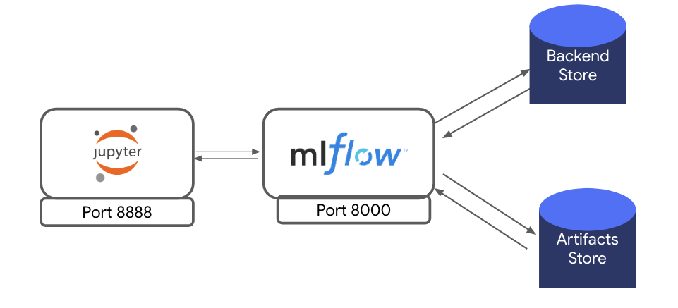
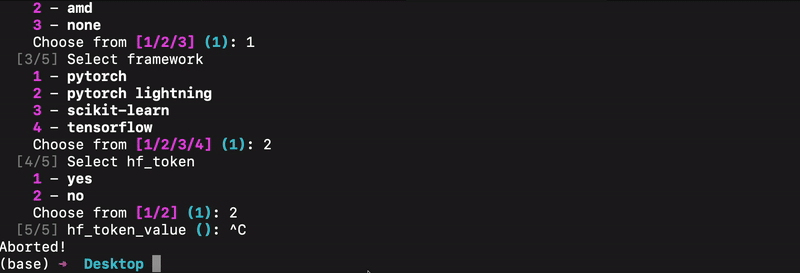
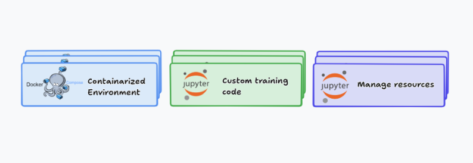

### Refresher about the Project 
Hi everyone! for the last month I have been working with my mentors Professor [Fraida Fund](https://ucsc-ospo.github.io/author/fraida-fund/), and [Mohamed Saeed](https://ucsc-ospo.github.io/author/mohamed-saeed/) on our Project [Applying MLOps to overcome reproducibility barriers in machine learning research](https://ucsc-ospo.github.io/project/osre25/nyu/mlops/) As a refresher, our goal is to build a template generator for a reproducible machine learning training workflows at the Chameleon testbed. We want to provide our users with the necessary environment configuration in a handy way. so they won't be overwhelmed with all the intricate details of setting the environment. This will allow for validation and further development of their setup.

--- 

### What we have done so far



The current workflow begins in JupyterHub, where the user provides basic details such as project name, site, and node type. the notebooks handle key setup tasks, like creating storage buckets, provisioning and configuring a server with GPU support, and mounting buckets locally via rclone. Once the host environment is ready, the user will SSH that machine, generates the necessary variables via a script and launches a containerized virtual lab that integrates Jupyter and MLflow. Inside the container, users authenticate with GitHub, connect or initialize their repositories, and can immediately begin training models, with all metrics, artifacts, and environment details logged for reproducibility.  

The progress on the project so far is as follows:

#### We finalized the selection of frameworks and storage options.



Artifacts are now logged directly from the MLflow server to the Chameleon object store, without relying on a database backend or an intermediate MinIO S3 layer.
 
#### Different jupyter lab images for each framework.
We’ve started with the top ML frameworks — PyTorch Lightning, Keras/TensorFlow, and Scikit-Learn. Each framework now has its own image, which will later be tailored to the user’s selection.

#### Github CLI and Hugging Face integration inside the container. 
The Jupyter container now integrates both the GitHub CLI and Hugging Face authentication. Users can manage their code repositories via GitHub CLI commands and authenticate with Hugging Face tokens to download/upload models and datasets. This eliminates the need for manual credential setup and streamlines ML experimentation within the environment.


#### Custom Logging Utility  
To ensure robust tracking of code versioning and environment details, we added a custom logging utility.  
These logs are stored alongside metrics and model artifacts in MLflow, ensuring every experiment is fully documented and reproducible.  summary of the functionalities:

---

##### `log_git()` — Captures Code Versioning  
Uses Git commands (via subprocess) to log:  
- Current branch name  
- Commit hash  
- Repository status (clean or dirty)  

**Example Output:**  
```text
commit: a7c3e9d
branch: main
status: dirty (1 file modified)
# and git diff output 
```


##### `log_python()`— Tracks the Python Environment

- Platform information + Python environment info (version)
- Exports a full pip freeze list to a .txt file

- Saved as an MLflow artifact to guarantee exact package version reproducibility

Example Output (pip freeze extract):
```txt 
numpy==1.26.4
pandas==2.2.1
scikit-learn==1.4.2
torch==2.2.0
```

##### `log_gpu()` - Records GPU Information

- Detects available GPU devices

- Collects details using NVIDIA’s pynvml or AMD’s ROCm tools

- Logs:

 - GPU name

 - Driver version

 - CUDA/ROCm version

 - Captures gpu-type-smi output for deeper inspection

---

These utilities ensure that each run can be traced back with:

- The exact code version

- The full Python environment

- The hardware details used

---

### Initial customizable template

We’ve prototyped an initial customizable template using Cookiecutter. it provides an interactive CLI, users provide some key project details (e.g., project name, frameworks, GPU type and integrations if any). Cookiecutter then generates a ready-to-use project structure with pre-configured integrations, reducing manual setup and ensuring consistency across environments.




The user will have notebooks to communicate with chameleon testbed resources, containerized environment and custom training scripts to plug their code.


### What’s Next

- **Template Generation via Config + interactive widgets**  
  We are exploring different ways to generate experiment templates using configuration files and interactive widgets in jupyter notebooks. This would let users quickly customize logging setups and considered to be more user-friendly.  

- **AMD-Compatible Images**  
  Extend support by building and testing Docker images optimized for AMD GPUs. Up to now, our development efforts has focused on NVIDIA GPUs using CUDA-based images

- **End-to-End Lifecycle Example**  
  Provide a larger example demonstrating the entire ML workflow:  
  - Data preparation  
  - Training with GPU logging  
  - Tracking metrics, artifacts, and environment info in MLflow  
  - Model evaluation and logging  
  - Reproducing results on different hardware backends  


Working on this project so far has been both challenging and eye-opening. I’ve seen how many moving parts need to come together for a smooth workflow. The support from my mentors has been key in helping me turning challenges into real progress.  

Thank you for following along — I’m looking forward to sharing more concrete results soon.