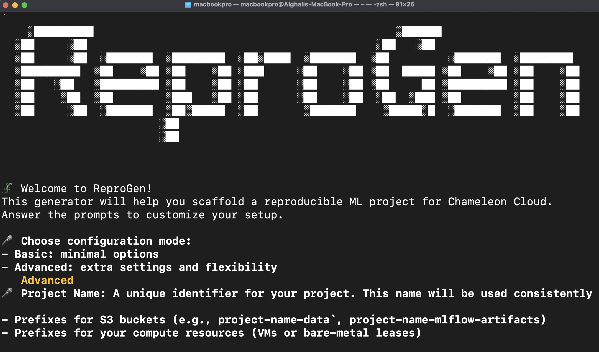
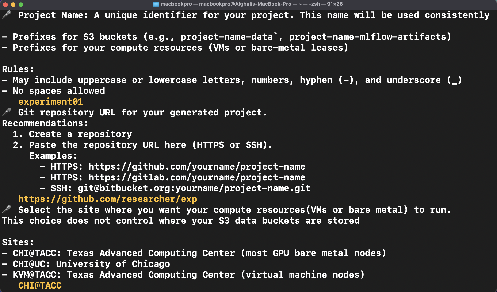

# Final Report: Applying MLOps to Overcome Reproducibility Barriers in ML

## Background

Hello! I’m Ahmed Alghali, and this is my final report the project [**Applying MLOps to Overcome Reproducibility Barriers in ML**](https://ucsc-ospo.github.io/project/osre25/nyu/mlops/) under the mentorship of Professor [Fraida Fund](https://ucsc-ospo.github.io/author/fraida-fund/) and [Mohamed Saeed](https://ucsc-ospo.github.io/author/mohamed-saeed/).

This project aims to address the **reproducibility problem** in machine learning—both in core ML research and in applications to other areas of science.

The focus is on making large-scale ML experiments **reproducible on [Chameleon Cloud](https://www.chameleoncloud.org/)**. To do this; we developed [**ReproGen**](https://github.com/A7med7x7/ReproGen), a template generator that produces ready-to-use, reproducible ML training workflows. The goal: is to make the cloud easy   for researchers setting up experiments without the worry about the complexity involved in stitching everything together. 

---

## Progress Since Mid-Report

### Migration from Cookiecutter to Copier

we initially used [Cookiecutter](https://www.cookiecutter.io/) for template generation as a templating engine, but it lacked features we were interested in (e.g., conditional questions). we switched to [Copier](https://copier.readthedocs.io/en/stable/), which provides more flexibility and better matches our use case.

### Support for Multiple Setup Modes

We now offer **two setup modes**, designed to serve both beginners and users who want advanced options/customization:

- **Basic Mode** – minimal prompts (project name, repository link, framework).
    
- **Advanced Mode** – detailed control (compute site, GPU type, CUDA version, storage site, etc.).
    

this ensures accessibility for new users, while still enabling fine-grained control for users.

### Automated Credential Generation

previously, users had to manually generate application credentials (via Horizon OpenStack UI). now, we provide scripts that can generate two types of credentials programmatically—**Swift** and **EC2**—using **Chameleon JupyterHub credentials** with `python-chi` and the `openstack-sdk` client.

### Automatic README.md Generation

each generated project includes a **customized README.md**, containing setup guidance and commands tailored to the user’s configuration.

### Bug Fixes and UX Enhancements

Alongside major features, we implemented numerous smaller changes and fixes to improve the reliability and user experience of the tool.

---

## Deliverables

- [**ReproGen GitHub Repository**](https://github.com/A7med7x7/ReproGen): source code for the template generator.
    
- [**mlflow-replay branch**](https://github.com/A7med7x7/ReproGen/tree/mlflow-replay): explore a past experiment, artifacts, and logged insights.
    
- [**LLM-Demo branch**](https://github.com/A7med7x7/ReproGen/tree/training-demo): hands-on demo to track fine-tuning of an LLM using infrastructure generated by ReproGen.

---

## Next Steps

1. **Compatibility Matrix**
    
    - the tool and the generated setup both depend on software dependencies that required paying attention to compatibility. in all level Hardware, OS, Drivers, Computing Platforms, core and 3rd-party libraries. writing a documentation as a start to help future debugging and adding pieces without breaking what is there. .
        
2. **Maintain Docker Images**

	so far we have a cpu and GPU docker images for multiple most frequently used framework. 
	- **CPU based image**:  for data science workload (Scikit-Learn)
	- **GPU-Nvidia Variant**: for Deep Learning workload on Nvidia Machines (Pytorch, Lightning, TensorFlow)
	- **GPU-AMD Variant**: for Deep Learning workload on AMD Machines (Pytorch, Lightning, TensorFlow)
	adding more variants for more frameworks + Enhancing the experience of the existing images is recommended.  

        

---

## Reflection

When I first joined SoR 2025, I had a problem crystallizing the idea of how I can practically achieve reproducibility and package a tool that would maximizes the chance of reproducing experiment build using it.  throughout the journey my mentors took me under their wings and helped me to understand the **reproducibility challenges in ML**, my Mentor Professor [Fraida Fund](https://ucsc-ospo.github.io/author/fraida-fund/) wrote materials that saved me a lot of time to familiarize my self with the [testbed](chameleoncloud.org),important Linux tools and commands, and even getting to have hand on practice how [large model training](https://teaching-on-testbeds.github.io/mltrain-chi/) happen with MLflow tracking server system is done in the cloud. and [Mohamed Saeed](https://ucsc-ospo.github.io/author/mohamed-saeed/). who took the time reviewing my presentation pushing me to do my best. I'm forever thankful in the way they shaped the project and my personal growth. this hands-on experience help me viewing **MLOps , cloud APIs, and workflow design** in different lenses, and I’m proud to have contributed a tool that can simplify help reproducible research for others.