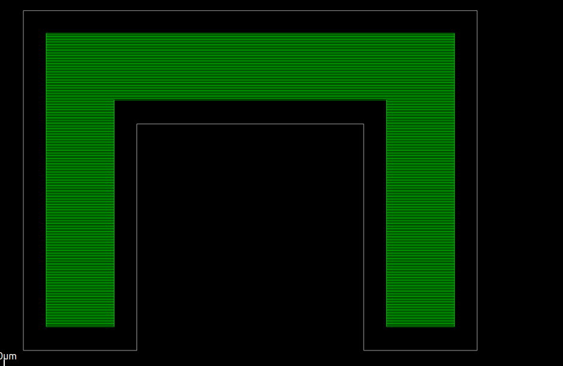

# Mid-term Progress: Enabling Rectilinear Floorplanning in OpenROAD

Hello! I'm excited to share my mid-term progress on implementing **rectilinear (polygonal) die support** in OpenROAD's floorplanning flow as part of Google Summer of Code 2025. Under the guidance of my mentors Eder Monteiro and Augusto Berndt, we've made significant strides in extending OpenROAD to handle non-rectangular die shapes.

Here's a link to my original [proposal](https://summerofcode.withgoogle.com/programs/2025/projects/mcv3Hbgk)

## Project Overview

My project focuses on extending OpenROAD's floorplanning capabilities to support rectilinear die shapes. This enhancement is crucial for modern VLSI design flows involving advanced packaging, 2.5D/3D ICs, and irregular chiplet-based designs where non-rectangular dies are increasingly common.

The core challenge is maintaining robustness and backward compatibility while introducing this major new feature that touches multiple aspects of the design flow.

## Progress Made

### 1. **Tcl Frontend modification and Input Parsing**

Successfully extended the Tcl interface to accept rectilinear die specifications:
- The `initialize_floorplan` command can now accept a list of coordinates specifying a polygon and automatically trigger the rectilinear floorplanning flow.
- Added robust input validation for rectilinear coordinates
- Ensured backward compatibility with existing rectangular floorplan flows

### 2. **Die creation and Validation**

- Leveraged the internal structure `odb::Polygon` to store the vertices of the shape.
- Implemented polygon validation to ensure shapes are valid rectilinear polygons
- Added proper error handling and user feedback for invalid polygon inputs

### 3. **Row Generation for rectilinear Dies - Major Milestone**

The most significant achievement has been implementing the `make_polygon_rows` functionality, which generates standard cell rows that conform to the rectilinear die boundaries. This was one of the most challenging aspects of the project. To solve this, we developed an efficient scanline-based approach to fill rectilinear areas with rows by clipping the row lengths according the the boundary of the shape supplied.

### 4. **Testing and Validation**

Tests were added to the regression suite and were used to successfully test the entire `initialize_floorplan` flow. 
The changes made were merged into OpenROAD successfully. [PR Link](https://github.com/The-OpenROAD-Project/OpenROAD/pull/7893)

## makeRows demo :

One of our test cases involved generating rows for a **U-shaped die**. Here is a snapshot from the OpenROAD gui displaying perfectly laid out rows:

## Next Steps

I am currently working on the pin placer (`ppl`) module and extending it to support rectilinear floorplans. This requires a careful re-evaluation of each step, including the cost function used to optimize pin placement.

